<div align="center">

# PharmaITChat

### The IT landscape around pharma, tracked, tagged and answered with a local LLM, a vector store and a Neo4j vendor-intelligence graph

PharmaITChat watches the IT and security scene around the **top 60 pharma and medtech companies** (customers, by headquarters theater and size rank), their remaining peers and the vendors that shape their tech stack: **114 named entities**, collected nightly, deduplicated across sources, tagged by a 27B model and stored in a knowledge base you can ask questions of, in a browser or on Telegram. On top of that it keeps a **vendor-intelligence graph**: who is installed where, which vendor stands where in each segment, what happened at each account lately, and why each account has the needs it has. "What is Dell doing best at Roche?" is answered from that graph, incumbency first, with a deterministic win-likelihood ranking per segment.

**Every model call happens on this machine.** Chat, embeddings, nightly tagging, retrieval, storage, need-evidence extraction. No cloud LLM, no API key for the model, no per-token bill, and no question, answer or document handed to a cloud model. What goes out is the news the system fetches, the web searches it runs (see [Everything local](#everything-local-on-one-machine)) and the Telegram messages it sends back.

**The first unattended night (2026-09-21):** 1,165 items fetched, 57 collapsed by cross-source dedupe, 250 tagged and stored, 2 failed feeds, 0 anomalies, 42 minutes, and not a word on Telegram, because nothing went wrong. Since then the same run also rebuilds the vendor graph from what it stored.

[](https://nodejs.org)
[](https://www.typescriptlang.org)
[](https://expressjs.com)
<br/>
[](https://ollama.com)
[](https://github.com/ml-explore/mlx-lm)
[](https://github.com/jundot/omlx)
[](#four-interchangeable-stacks)
[](#benchmarks)
<br/>
[](#the-watchlist)
[](https://www.trychroma.com)
[](#the-vendor-intelligence-graph)
[](#the-watchlist)
<br/>
[](#hermes-agent-on-telegram)
[](#hermes-agent-on-telegram)
[](#the-mcp-server-and-the-model-gateway)
<br/>
[](https://github.com/daseinlabs/open-jev)
[](#workflows)
[](#the-self-healing-loop)
[](#setup)

[](#testing)
[](#testing)
[](#everything-local-on-one-machine)
[](#64k-context)
[](#switching-from-the-web-ui)
[](#graph-sources-and-the-rebuild)
[](#win-likelihood-ranking)
[](#need-evidence)
[](#dates-on-every-source)
[](#the-system-one-scorer)
[](#hermes-agent-on-telegram)

[Workflows](#workflows) · [Stacks](#four-interchangeable-stacks) · [Watchlist](#the-watchlist) · [Chat](#chat-retrieval-and-the-knowledge-base) · [Dates](#dates-on-every-source) · [Vendor graph](#the-vendor-intelligence-graph) · [Need evidence](#need-evidence) · [History](#install-base-history) · [Telegram](#hermes-agent-on-telegram) · [Setup](#setup) · [Commands](#commands) · [API](#api-reference)

</div>

---

## Contents

- [Everything local, on one machine](#everything-local-on-one-machine)
- [Highlights](#highlights)
- [System at a glance](#system-at-a-glance)
- [Workflows](#workflows)
- [Four interchangeable stacks](#four-interchangeable-stacks)
- [Benchmarks](#benchmarks)
- [The watchlist](#the-watchlist)
- [Your role](#your-role)
- [Digests](#digests)
- [Chat, retrieval and the knowledge base](#chat-retrieval-and-the-knowledge-base)
- [Dates on every source](#dates-on-every-source)
- [The vendor-intelligence graph](#the-vendor-intelligence-graph)
  - [What's in the graph](#whats-in-the-graph)
  - [Graph sources and the rebuild](#graph-sources-and-the-rebuild)
  - [The accounts file](#the-accounts-file)
  - [competitive_position](#competitive_position)
  - [Win-likelihood ranking](#win-likelihood-ranking)
  - [The graph block in the web chat](#the-graph-block-in-the-web-chat)
  - [Need evidence](#need-evidence)
  - [Install-base history](#install-base-history)
- [Artifact export](#artifact-export)
- [Hermes Agent on Telegram](#hermes-agent-on-telegram)
- [The MCP server and the model gateway](#the-mcp-server-and-the-model-gateway)
- [Setup](#setup)
- [Commands](#commands)
- [Scripts reference](#scripts-reference)
- [Architecture](#architecture)
- [API reference](#api-reference)
- [Monitoring and feedback](#monitoring-and-feedback)
- [Configuration](#configuration)
- [Project structure](#project-structure)
- [Testing](#testing)
- [Troubleshooting](#troubleshooting)

---

## Everything local, on one machine

The whole system runs on one local box with 48 GB of unified memory: no cloud tenancy, no inference bill, no rate limit. A 27B Qwen model answers the chat, embeds the documents, tags every item the watchlist collects, proposes need evidence and drives the Telegram assistant. No question, answer or stored document is handed to a cloud model. The one exception to "nothing leaves" is web search: see below.

| What | Where it runs |
|---|---|
| Chat and reasoning | Local 27B model, on Ollama, MLX, oMLX or Splash |
| Embeddings | Local Qwen3-Embedding 0.6B, on the same stack (Splash borrows MLX's embedder) |
| Nightly entity/domain tagging | The same local chat model, one item at a time |
| Need-evidence extraction | The same local chat model, run by hand, proposals reviewed by you |
| Vector store, item store, graph | ChromaDB, SQLite and Neo4j on localhost |
| Vendor graph rebuild | No model at all: parsed files plus `watchlist.db`, one Neo4j transaction |
| Answer scoring (System One) | Local Gemma 3 4B (4-bit) on open-jev, beside the 27B |
| Web search | Chat: Google News RSS search. Self-healing loop and Hermes: your own SearXNG on localhost, which forwards the **search queries** to the Brave Search API |

Outbound traffic is limited to what the system goes out to *get* and the one channel it answers on: RSS and Atom feeds, Google News RSS, SEC EDGAR, URLs you explicitly add to the knowledge base, web search, and Telegram. The search queries themselves leave the machine: chat's optional web search sends the question to Google News RSS, and the self-healing loop's queries (written by the local model from a knowledge gap) go through SearXNG, which runs locally but only as a proxy, to Brave's Search API under your own key (SearXNG's page-scraping engines are switched off). Web search can be switched off in the chat UI; the self-healing loop always searches. There is no `.env` file: tokens live in `data/run/` at mode 600 and reach the process through the environment.

Account intelligence never leaves the machine and never enters git: `config/accounts.local.yaml` (who is installed where, and since when), `config/need-evidence.local.yaml` (why each account has its needs) and `config/install-history.local.yaml` (install-base changes proposed from news) are all gitignored.

---

## Highlights

| | Feature | What it does |
|---|---|---|
| 🏠 | **Local 27B LLM** | Qwen3.8 27B (4-bit) for chat, tagging and extraction, Qwen3-Embedding 0.6B (8-bit), 64K context, zero cloud calls |
| 🔀 | **Four interchangeable stacks** | Ollama ⇄ MLX ⇄ oMLX ⇄ Splash by one script or from the web UI, Telegram-confirmed, with per-stack indexes and automatic rollback |
| 👁️ | **Entity watchlist** | 114 watched entities (60 customers, 9 peers, 45 IT vendors) across 114 RSS feeds, 49 EDGAR CIKs and 188 entity-less topic queries |
| 🌙 | **Unattended nightly run** | 02:30: fetch, dedupe *before* the model, tag by entity and IT domain, store in SQLite and ChromaDB, rebuild the vendor graph, alert only on failure |
| 🕸️ | **Vendor-intelligence graph** | Neo4j graph of vendors, segments, products, accounts, needs and evidence, rebuilt deterministically from five sources in one transaction, on any stack |
| 🎯 | **Incumbency-first answers** | `competitive_position` resolves who holds each account segment first: defend, displace, greenfield or unknown, never guessed |
| 🏅 | **Win-likelihood ranking** | Per account segment, deterministic rules, every entry with its reasons; a declared install-base trigger opens a segment held by a rival |
| 📰 | **Account events** | Watchlist items become Evidence nodes; each segment shows the account's newest news there, each account its account-wide news |
| 📑 | **Need evidence** | The 27B proposes cited reasons why each account has each need from the legacy documents; you approve each one; only approved entries reach the graph |
| 📅 | **Dated sources** | Every chunk carries a date and how it is known (published, retrieved, document); the chat prompt starts with today's date |
| 🔎 | **Hybrid retrieval** | ChromaDB, an in-memory vector + keyword index, the Neo4j graph and live news, queried in parallel |
| 🛡️ | **Embedding-parity guard** | A stack that shares another's index must prove its embeddings match (cosine ≥ 0.9999) or the switch is refused |
| 🤖 | **Telegram assistant** | Hermes Agent on the same local model: 20 of the 21 MCP tools, 7 scheduled jobs, a network-less Docker sandbox |
| 🧰 | **MCP server** | `pharmaitchat-mcp` exposes the knowledge base and the graph to any MCP client over Streamable HTTP, with compacted payloads |
| 🔌 | **Model gateway** | OpenAI-compatible `/v1` on whichever stack is active, so any agent can borrow the local model |
| 🩹 | **Self-healing knowledge** | Unanswered in-scope questions trigger an n8n workflow that researches, ingests and re-checks the gap |
| ⚖️ | **System One scorer** | A local 4B model beside the 27B: skips clearly irrelevant pages before the 27B reads them, and shadows every chat answer and gap resolution |
| 📄 | **Artifact export** | Account briefs, incumbency matrices and vendor comparisons as xlsx, pdf or pptx, internal or external audience, async jobs |
| 🎙️ | **Voice input** | Local speech-to-text with whisper.cpp; HTTPS mode for iPad and phone microphones |
| ⏱️ | **Built-in benchmark** | Reproducible Ollama vs MLX vs oMLX vs Splash comparison with retrieval overlap and a blind A/B review page |
| ✅ | **Tests against fakes only** | 123 Jest suites (115 app, 8 MCP) plus 28 Python tests for the Telegram plugin; none touches a real model server, ChromaDB, Neo4j, Docker, launchd or Telegram |

---

## System at a glance

Every box below runs on the same Mac. Solid arrows are requests; dotted arrows are background or best-effort paths.

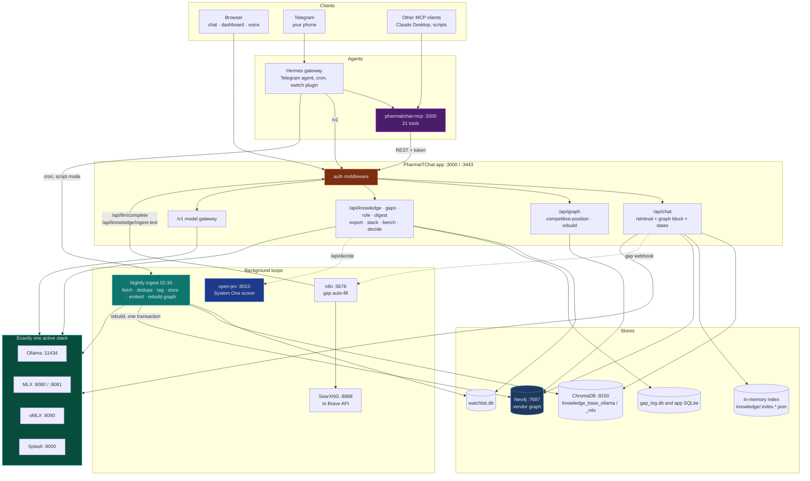

| Layer | Pieces | Where it lives |
|---|---|---|
| Surfaces | Web chat, dashboard, `/api/*`, `/v1`, MCP, Telegram | `public/`, `dashboard/`, `src/api/`, `mcp/`, `hermes/` |
| Models | One of four stacks, plus the open-jev scorer | `src/config/llm-stacks.ts`, `src/services/llm-client.ts`, `scripts/switch-stack.sh` |
| Knowledge | Curated documents, raw documents, two vector indexes | `knowledge/`, `data/raw_documents/`, ChromaDB, `knowledge/.index.*.json` |
| News | The watchlist pipeline and its SQLite store | `src/services/watchlist-*.ts`, `config/watchlist.yaml`, `data/watchlist.db` |
| Vendor intelligence | Briefs, needs map, accounts, need evidence, watchlist evidence → Neo4j | `knowledge/vendors/`, `config/needs.yaml`, `config/*.local.yaml`, `src/services/vendor-graph-rebuild.ts` |
| Self-healing | Gap detector, n8n workflow, SearXNG, resolution check | `src/services/gap-*.ts`, `n8n/`, `config/searxng/` |
| Machine profile | Every endpoint and memory limit | `config/host.yaml`, `src/platform/host-config.ts`, `scripts/lib/host.sh` |

---

## Workflows

Everything that runs on its own, what starts it, and whether it is live on this machine today.

| Workflow | Started by | Runs in | Status |
|---|---|---|---|
| [Chat turn and gap detection](#chat-turn-and-gap-detection) | Every chat message | App | Live |
| [Gap auto-fill v2](#gap-auto-fill-v2) · `n8n/knowledge_gap_workflow_v2.json` | Webhook from the gap detector | n8n (18 nodes) | **Live**, active |
| [Nightly watchlist ingest and graph rebuild](#the-nightly-run) | 02:30 daily | Hermes, script mode | Live |
| [KB canaries](#kb-canaries) · `config/kb-canaries.yaml` | 05:00 daily | Hermes, script mode | Live |
| [Digest agent](#digests) · `scripts/digest.ts` | Asked in chat or Telegram · Mondays 07:30 (weekly) · Tue–Fri 07:30 (briefing) | App · Hermes, script mode | Live |
| [Hermes scheduled jobs](#hermes-scheduled-jobs) | Cron, 3 agent jobs + 4 script jobs | Hermes | Live |
| [Stack switch](#stack-switch) | Web UI request | App + Telegram + Hermes plugin | Live |
| [Need-evidence extraction](#need-evidence) · `scripts/extract-need-evidence.ts` | You, by hand | Your shell, active stack | One-off, resumable |
| [Install-history extraction](#install-base-history) · `scripts/extract-install-history.ts` | You, by hand | Your shell, active stack | Resumable per document |
| [Chunk-date backfill](#dates-on-every-source) · `scripts/backfill-chunk-dates.ts` | You, by hand | Your shell, ChromaDB | One-off, idempotent |
| [Gap auto-fill v1](#gap-auto-fill-v1) · `n8n/knowledge_gap_workflow.json` | Webhook | n8n (13 nodes) | Kept for reference, not imported |

### Chat turn and gap detection

The answer streams first; everything after the `done` event runs in the background and never delays the user.

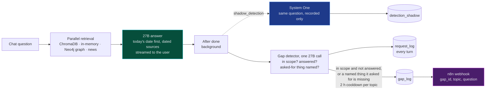

### Gap auto-fill v2

The live self-healing workflow. Every model step calls the app, so it runs on the active stack; the two failure paths fall back instead of stopping.

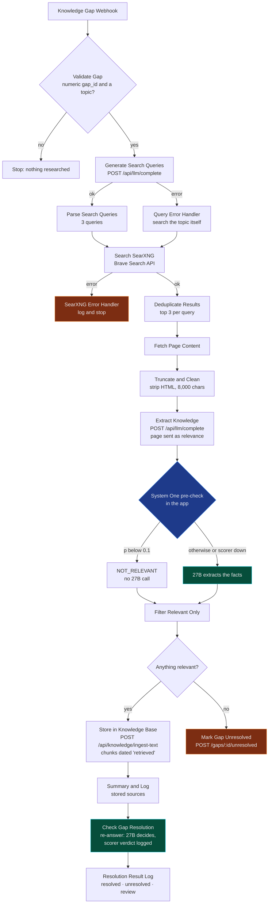

Deploying a change to the JSON: back up the live workflow, `launchctl bootout` the n8n job, `n8n import:workflow`, `n8n publish:workflow`, `launchctl bootstrap`. Editing the file alone changes nothing.

### KB canaries

A daily check that the knowledge base still answers what it is known to hold. `config/kb-canaries.yaml` lists 8 questions with the facts each answer must contain, e.g. Merck 2017 → "NotPetya" and "1.4 billion", and Roche Kaiseraugst MES → "Rockwell", a fact the gap loop stored. A canary passes when the chat retrieved at least one chunk and the answer contains one term from every expected group. A failing canary is asked once more before it counts. The check is plain string matching: a model grading answers would follow its prompt's wording, as the scorer measurements showed.

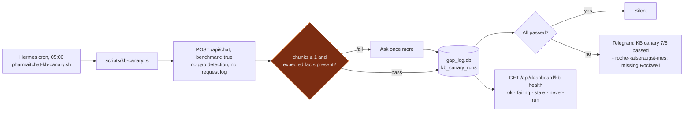

Run it by hand with `npx tsx scripts/kb-canary.ts` (add `--no-store` to leave no row, `--app-url` and `--config` to point it elsewhere). Each run's per-canary lines are kept in `data/logs/kb-canary-<date>.log`. It replaced the n8n KB health monitor (2026-09-29). That workflow was never activated, and would not have worked: it sent no API token, read the streamed chat reply as JSON, ran its test chats through gap detection, and kept reports only in memory.

### Gap auto-fill v1

The first version, kept in the repo for reference and never imported here. It stores what it finds but never re-checks the gap and has no "nothing relevant" branch, which is what v2 added.

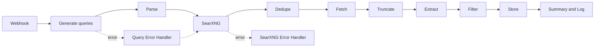

### Hermes scheduled jobs

Hermes' cron runs these on the local 27B and reports on Telegram. Scheduled runs use a write-limited MCP server (no `start_reindex`, no `add_knowledge`, no `my_role`, no `create_image`) and get no web, memory, terminal or file tools. Four of the seven jobs are script mode: no agent step, just a script whose stdout is the message.

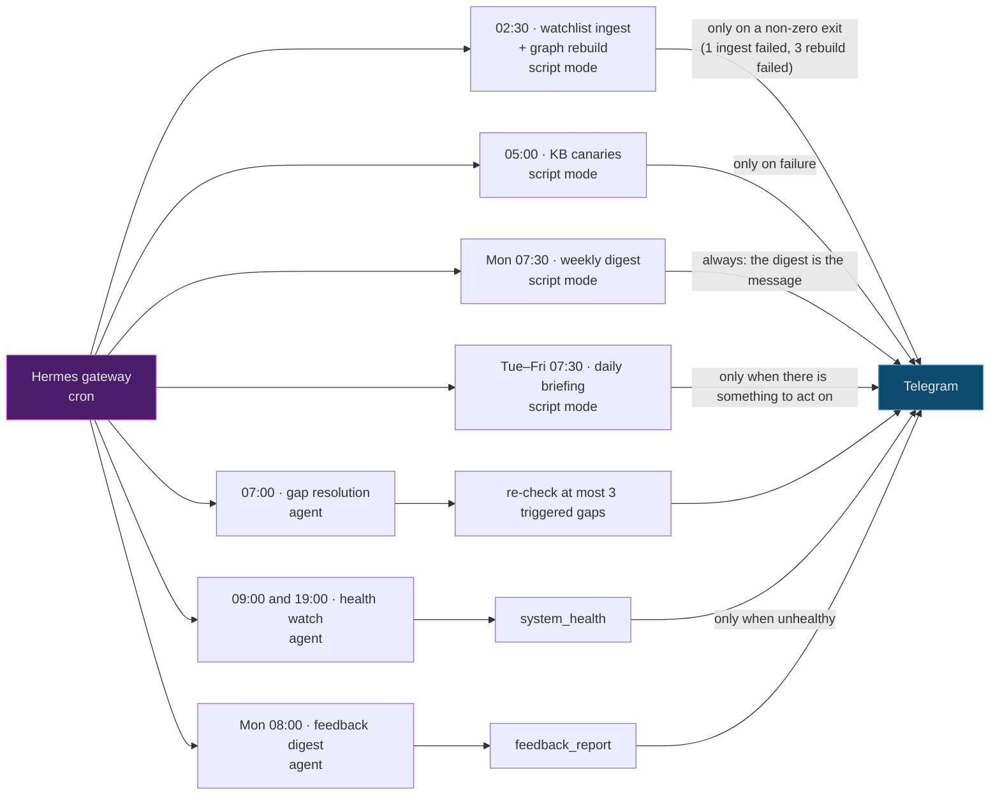

The nightly ingest itself is diagrammed under [The nightly run](#the-nightly-run).

### Stack switch

A switch requested in the browser only happens after a tap on Telegram.

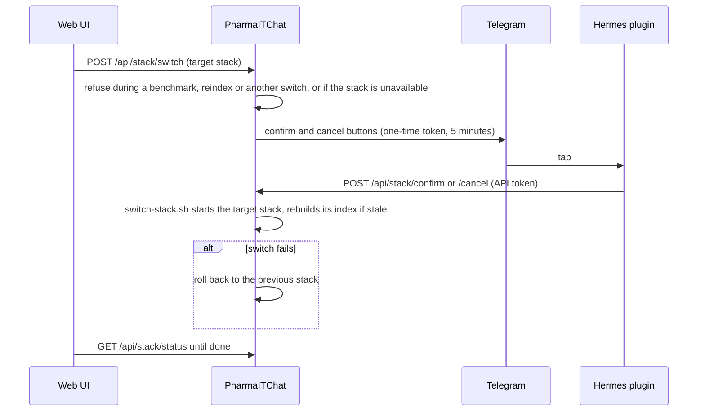

The switch's own lifecycle, as `src/services/stack-switch.ts` tracks it:

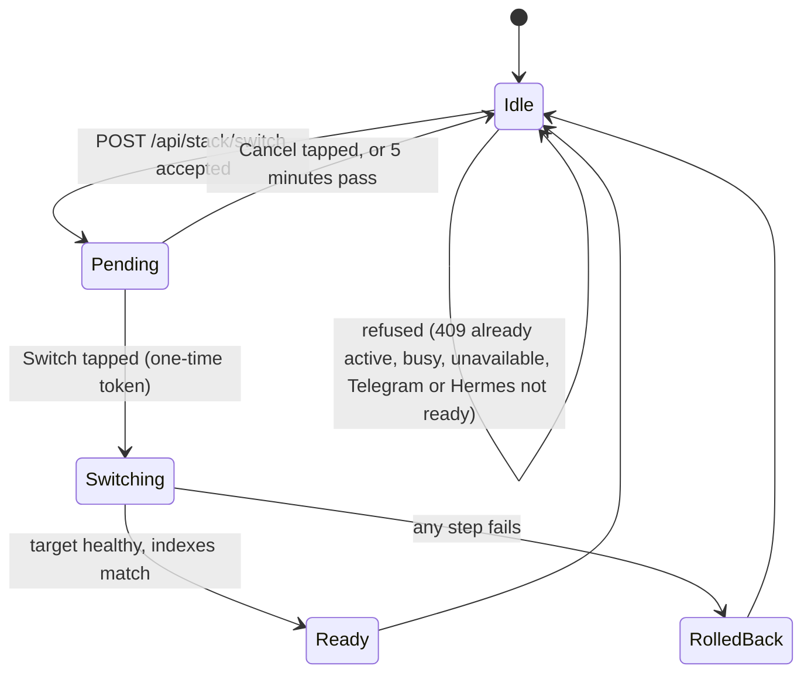

---

## Four interchangeable stacks

Every local model call (chat and embeddings alike) runs on **exactly one** stack. Ollama, MLX and oMLX run the same chat model at matching 4-bit quantization; Splash serves its own build of the same Qwen3.8 27B model. There is no silent fallback: if the active stack is down, requests fail with a clear error.

**Splash serves no embeddings of its own.** It exposes `/v1/chat/completions` but there is no `/v1/embeddings` endpoint at all. It borrows the MLX embedding server on `:8081` and shares the MLX stack's ChromaDB collection and on-disk index, the same arrangement oMLX uses.

| | 🦙 Ollama stack | 🍎 MLX stack | 🧬 oMLX stack | 💦 Splash stack |
|---|---|---|---|---|
| **Chat model** | `qwen3.8-pharma` (Qwen3.8 27B Q4_K_M, 64K context) | `mlx-community/Qwen3.8-27B-4bit` via `mlx_lm.server` | `mlx-community--Qwen3.8-27B-4bit` (oMLX's discovery ids use double dashes) | `incoai/Qwen3.8-27B-Splash`, 65536-token context |
| **Embedding model** | `qwen3-embedding:0.6b-q8_0` | `mlx-community/Qwen3-Embedding-0.6B-8bit` via `python/mlx-embed-server.py` | `mlx-community--Qwen3-Embedding-0.6B-8bit` | **none**, borrows the MLX embedding server |
| **Ports** | `:11434` | `:8080` chat, `:8081` embeddings | `:8090`, one server for chat and embeddings | `:8000` chat; `:8081` embeddings (the MLX server) |
| **ChromaDB collection** | `knowledge_base_ollama` | `knowledge_base_mlx` | `knowledge_base_mlx` (shared with the MLX stack) | `knowledge_base_mlx` (shared with the MLX stack) |
| **In-memory index** | `knowledge/.index.ollama.json` | `knowledge/.index.mlx.json` | `knowledge/.index.mlx.json` (shared) | `knowledge/.index.mlx.json` (shared) |
| **Prompt cache** | one shared cache, evicted by the next caller | several caches, capped at 4 GiB (`resources.mlx_chat.prompt_cache_bytes`) | one paged SSD cache, capped by `resources.omlx.ssd_cache_max_gb` (20 GB); survives an app restart | managed by the Splash server itself |
| **Thinking** | off by default; off/low/medium/high per chat, via `reasoning_effort` | off by default; on/off per chat, via `chat_template_kwargs.enable_thinking` | off by default; on/off per chat, via `chat_template_kwargs.enable_thinking` | off by default (also server-side with `--default-reasoning-effort none`); off/low/medium/high per chat |
| **Graph rebuild** | ✅ no model needed | ✅ no model needed | ✅ no model needed | ✅ no model needed |
| **Need-evidence extraction** | ✅ | ✅ | ✅ | ✅ |

Splash has the steepest hardware bar of the four: **Apple M3 or newer, macOS 26.4 or later, 36 GB unified memory minimum (48 GB recommended)**. Its model, `incoai/Qwen3.8-27B-Splash`, is a 17.4 GB download under Apache-2.0 and **not gated**: no access token is needed to pull it. The engine itself comes from Homebrew (`brew install incoai/tap/splash`), whose Metal kernels are **precompiled**; a source checkout would compile them on first start and need full Xcode. `switch-stack.sh` prefers the Homebrew binary.

```bash
scripts/switch-stack.sh mlx          # stop the other stacks, start MLX, restart the app (rolls back on failure)
scripts/switch-stack.sh omlx         # third stack, port 8090: one server for chat and embeddings,
                                     # shares the MLX index, restores long prompts from SSD after a restart
scripts/switch-stack.sh splash       # fourth stack, port 8000: chat only, borrows the MLX embedding
                                     # server on :8081 and shares its index, like omlx does
scripts/switch-stack.sh ollama       # and back
scripts/switch-stack.sh status       # active stack, ports, OLLAMA_NUM_PARALLEL and index counts
scripts/switch-stack.sh availability # read-only: which stacks can start, and why not
scripts/switch-stack.sh ensure-stack ollama   # start a stack and its indexes without starting the app
scripts/switch-stack.sh chat-endpoint mlx     # print "<url> <model>" the stack serves chat on
scripts/switch-stack.sh prepare      # one-time model downloads; also installs the oMLX venv and Splash (Homebrew)
scripts/switch-stack.sh telegram     # store the Telegram credentials used to confirm UI-driven switches
scripts/switch-stack.sh ollama-ctx   # recreate qwen3.8-pharma if its context differs from the Modelfile
```

The active stack is recorded in `data/run/active-stack`. `switch-stack.sh <stack>` hands the app back to the `com.pharmaitchat.stack` launchd job (`launchctl kickstart -k`) when that job is installed; without it, it starts the app in the background (log in `data/logs/app.log`), so `npm run dev` right after a switch fails on port 3000.

### Switching from the web UI

The chat header has a stack selector next to the model selector. Choosing a different stack does not switch immediately: PharmaITChat sends a Telegram message with **Switch** and **Cancel** buttons, valid for 5 minutes. Tapping Switch starts it, tapping Cancel or ignoring the message reverts the selector. The tap goes through the Hermes gateway (the `pharmaitchat-switch` plugin), which calls the app on localhost, so the phone never has to reach the server at all. The UI then follows the switch (stopping, starting, warming up, checking indexes) and shows the new stack with how long it took: `OMLX stack ready (96 s)`. Telegram gets a completion message with the same line.

The switch route itself needs no token, because approval comes from tapping the Telegram button. Store the credentials once:

```bash
scripts/switch-stack.sh telegram         # prompts for the bot token and your chat id, stores them at mode 600
```

Without them the selector is disabled and says so. The Hermes gateway must also be running on this machine with the `pharmaitchat-switch` plugin installed (`scripts/hermes-setup.sh install-plugin`), or the selector is disabled and says why. A stack that cannot start (`scripts/switch-stack.sh availability`: models missing, or Splash unable to build its engine) shows as `(unavailable)` and is refused before any Telegram message is sent. A split, two-machine Hermes setup can't confirm switches this way; use `scripts/switch-stack.sh` there instead. A switch is refused while another switch is pending confirmation or already in progress, while a benchmark or a reindex is running, or when the requested stack is already active.

### The embedding-parity guard

The oMLX stack shares the MLX index and ChromaDB collection because their embeddings are identical (cosine 1.000000). Every oMLX start re-checks that against `__tests__/fixtures/embedding-reference.json` and **refuses to serve below a cosine of 0.9999**. Without the check, an oMLX upgrade that quietly changed the embedding would write vectors into `knowledge_base_mlx` that no longer match the ones already there, and searches would return the wrong documents with no error at all. The probe turns a silent corruption into a refused switch.

Every index also records its stack, embedding model and dimension (1024), plus a completeness marker written only when a rebuild ran to the end (`src/services/index-guard.ts`). Search on a mismatched, incomplete or rebuilding index is refused rather than answered with meaningless matches.

### Memory limits

MLX keeps every freed GPU buffer for reuse and sets no cap of its own, and the defaults of `mlx_lm.server` work on 8 prompts and 32 replies at once. On one 48 GB Mac, under varied real inputs, each of the three MLX processes grew to about 36 GB by itself; together they pushed the 27B into swap until it froze or ran out of GPU memory. Each is now capped from `config/host.yaml` `resources`, measured on the same real inputs before and after:

| Process | Cap | Uncapped | Capped |
|---|---|---|---|
| 27B chat (`:8080`) | 2 GiB buffer cache, 1 prompt / 2 replies at a time, 4 GiB prompt cache | 6 concurrent 7.5k-token requests: all failed, GPU out of memory at 36 GB | all 6 answered, 27 GB peak, same total time |
| jev scorer (`:8010`) | 1 GiB | 36 GB within 30 page checks | 4.2 GB, same latency |
| Embedder (`:8081`) | 512 MiB | 36 GB within 90 embeddings | 1.5 GB, slightly faster |

Because the 27B now takes one prompt at a time, a health probe can queue behind a long request: `/api/health` and the watchdog read GPU load (`ioreg` "Device Utilization %") when their probe times out, and a server keeping the GPU ≥ 30% busy is reported `busy` (healthy), not wedged.

### 64K context

`ollama/qwen3.8-pharma.Modelfile` sets `num_ctx 65536` and MLX is started with a capped prompt cache. The model is a hybrid architecture: only 16 of its 64 layers keep a KV cache, so 64K costs about 4 GB instead of the 1 GB a 16K context used. Ollama's OpenAI API cannot set the context per request, so one shared size keeps a single copy of the model loaded. Keep `OLLAMA_NUM_PARALLEL` at 1: each parallel slot allocates its own 64K context.

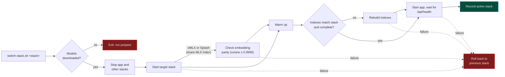

**One client, four stacks.** `src/services/llm-client.ts` talks to all four through the OpenAI-compatible `/v1/chat/completions` API (and `/v1/embeddings` on the three that serve it); `src/config/llm-stacks.ts` only swaps base URLs, model names and the "thinking off" knob (`reasoning_effort: "none"` for Ollama and Splash, `chat_template_kwargs.enable_thinking: false` for MLX and oMLX). The chat's thinking switch offers whatever levels the active stack supports (`src/services/thinking.ts`). Indexes are rebuilt from `knowledge/` and `data/raw_documents/`, where uploads, ingested text and collected articles are saved first, so a rebuild never depends on a source still being online. Everything follows the active stack: n8n calls `POST /api/llm/complete`, agents call `/v1/chat/completions`, the nightly ingest and the need-evidence extraction use whatever `data/run/active-stack` says.

---

## Benchmarks

### RAG answers (the web chat workload)

Ollama, MLX and oMLX measured on the same day, **2026-09-19** (Splash on 2026-09-29, see below), on the **same workstation-class machine**: one local box, 48 GB unified memory. Full pipeline through `POST /api/chat`: 23 questions from `bench/questions.json`, one cold run each after a warm-up question outside the set, temperature 0, no web search, `max_tokens` 1024, background LLM jobs paused. The stacks were switched between runs on that one machine (macOS 26.4); only the stack changed, and nothing else ran while a run was in flight.

| Metric (median) | 🦙 Ollama | 🍎 MLX | ⚡ oMLX | 💦 Splash |
|---|---:|---:|---:|---:|
| Time to first token | 19.1 s | 18.4 s | 17.5 s | **12.1 s** |
| Decode speed | 12.4 tok/s | 13.2 tok/s | 15.2 tok/s | **40.1 tok/s** |
| Total time per answer | 99.6 s | 92.3 s | 82.5 s | **36.0 s** |
| Query embedding | 31 ms | **19 ms** | 21 ms | 30 ms |
| Retrieval | 76 ms | **44 ms** | 68 ms | **44 ms** |
| Peak system memory used | 42,845 MB | **37,409 MB** | 41,009 MB | 43,712 MB |
| Model process memory | 28,459 MB | 16,184 MB | 17,119 MB | 6,552 MB* |
| Answers hitting the 1024-token cap | 15 / 23 | 11 / 23 | 10 / 23 | 11 / 23 |
| Failed runs | 0 / 23 | 0 / 23 | 0 / 23 | 0 / 23 |
| Version | Ollama 0.34.0 | mlx 0.32.2, mlx-lm 0.31.3 | oMLX 0.7.0.dev3 | Splash 1.1.0 (Homebrew) |

**Among the three measured on 2026-09-19, oMLX generates fastest**: 23% quicker decode than Ollama and 15% quicker than MLX, which compounds into a 17% shorter answer than Ollama end to end. **MLX stays leanest**: lowest peak memory and the fastest retrieval, because its embedding server is a separate process rather than sharing one with chat as oMLX does. Ollama's memory figure is honest now that the sampler follows its `llama-server` children: it genuinely holds the most.

The oMLX and MLX rows come from the *same* ChromaDB collection and the same on-disk index: the two stacks share them, so these numbers compare generation, not two different corpora.

**Splash answers 2.5× faster than the next stack**: 36 s per answer against oMLX's 82.5 s and MLX's 92.3 s, from a decode speed of 40 tok/s; it pairs the 27B with a trained draft model that proposes tokens ahead (speculative decoding). It was measured on **2026-09-29**, ten days after the others, on the same machine; MLX was re-run the same day and matched its 2026-09-19 numbers within 1% (13.1 tok/s, 92.3 s), so the columns compare. The cost is memory: the highest peak system use of the four (43.7 GB). \*Splash maps its weights from disk and keeps GPU memory outside the process, so its process figure undercounts; compare the system row. Splash serves chat only and borrows MLX's embedding server, hence the same retrieval.

### Long prompts (the agent workload)

Measured 2026-09-17 on the same machine, through `/v1` with a 16.7K-token prompt, streamed, sent cold and then again with the same prefix.

| Metric | 🦙 Ollama | 🍎 MLX | ⚡ oMLX | 💦 Splash |
|---|---:|---:|---:|---:|
| Cold time to first token | 156.3 s | 141.2 s | 149.6 s | **130.7 s**† |
| Warm time to first token, same prefix | 5.8 s | 0.8 s | 7.1 s | **0.5 s** |
| Same prompt after restarting the model server | ≈156 s | ≈141 s | **12.6 s** | ≈133 s |
| Decode | 11.3–11.6 tok/s | 11.5–12.4 tok/s | 11.4–12.1 tok/s | **25–43 tok/s** |
| Memory pressure | normal, 41% free | normal, 40% free | normal, 39% free | normal, 49–50% free |

The oMLX column was measured on 2026-09-18 during its trial, on the same machine and the same 16.7K-token prompt. **Restart recovery is the one axis where it is in a different class**: its SSD prefix cache restored 16,384 tokens and recomputed only 368, turning a 149.6 s cold prefill into 12.6 s (`Prefix cache restore … source=paged cached=16384 suffix=368`). The cache costs about 4.3 GB under `~/.omlx`, capped by `resources.omlx.ssd_cache_max_gb` (default 20).

The Splash column was measured on 2026-09-29 (Homebrew 1.1.0) with a rebuilt prompt of the same size (16,817–16,960 tokens from `knowledge/`, since the original prompt text was not kept). †The first long prompt after switching to Splash took 196.9 s; later cold prompts, including a different uncached one, took 130.7–132.6 s, so the one-off extra is a first-use cost, not its steady state. Splash's SSD prompt cache (`--max-cache-disk`) is off by default, so a restart costs a full cold prefill.

Prefill is the cost, at roughly 104–118 tok/s. Caching works on all of them: appending a tool result to a conversation keeps the cached prefix, and a 14.6K-token prompt that cost 140.6 s cold came back in 10.9 s once about 1K tokens were appended. On Ollama the cache is shared, so a web chat between two agent steps evicts it.

**Reading it honestly**

- 🏁 Decode dominates. Embedding and retrieval differences are milliseconds against 36–100 s answers, so they barely move the total.
- ✂️ Many answers hit the 1024-token cap (15/23 Ollama, 11/23 MLX, 10/23 oMLX, 11/23 Splash). The cap is identical everywhere, so the comparison is fair, but the totals describe truncated answers, and a faster stack hits the cap in less time, which flatters its total slightly.
- 🧮 Ollama really does hold the most memory (28.5 GB of model process). An earlier run reported 59 MB because the sampler missed Ollama 0.34's `llama-server` child processes; that is fixed, and this table is the corrected measurement.
- 🐍 oMLX is alpha software pinned at one commit, roughly seven months old and largely one maintainer's work. Fast is not the same as safe.
- 🔁 Single cold runs on one machine. Treat the percentages as a signal, not a verdict.

<details>
<summary><b>Reproduce the benchmark</b></summary>

<br/>

```bash
scripts/switch-stack.sh ollama && npx tsx scripts/benchmark-stack.ts
scripts/switch-stack.sh mlx    && npx tsx scripts/benchmark-stack.ts
scripts/switch-stack.sh omlx   && npx tsx scripts/benchmark-stack.ts
scripts/switch-stack.sh splash && npx tsx scripts/benchmark-stack.ts
npx tsx scripts/compare-benchmarks.ts data/benchmarks/ollama-<time>.json data/benchmarks/mlx-<time>.json
```

`compare-benchmarks.ts` takes two runs at a time, so compare the pairs you care about. Benchmark mode makes `/v1` return `503`, which takes the Telegram agent offline for the duration: check `~/.hermes/cron/jobs.json` for the next scheduled run before starting, or it fails with `HTTP 503: Benchmark in progress`.

`benchmark-stack.ts` accepts `--runs`, `--app` and `--questions`. Benchmark mode (`/api/bench/start`, a 15-minute lease) pauses background LLM jobs; chat requests with `benchmark: true` use temperature 0, skip web search, skip the active role and cap answers at 1024 tokens. `/v1` and `/api/llm/complete` return `503` while it runs. The comparison reports TTFT, decode speed, embedding and retrieval time, peak memory, retrieval overlap, and writes a blind A/B review page with stack labels hidden.

Embedding parity check (stacks run one after the other):

```bash
LLM_PROVIDER=ollama npx tsx scripts/embedding-parity.ts save data/benchmarks/parity-ollama.json
LLM_PROVIDER=mlx    npx tsx scripts/embedding-parity.ts save data/benchmarks/parity-mlx.json
npx tsx scripts/embedding-parity.ts compare data/benchmarks/parity-ollama.json data/benchmarks/parity-mlx.json
```

The question set has 23 questions: 11 vendor, 5 threat, 2 regulation, 2 pharma, and 3 deliberately not covered by the knowledge base.

</details>

---

## The watchlist

Most news tooling watches *topics*. PharmaITChat watches **named entities**: the top 60 pharma and medtech customers, the remaining peers they are measured against, and the IT and security vendors that sell into them. Every item is attributed to the entities it is about and the IT domains it touches, so "what has Novartis done in cloud this month" is a query over structured tags, not a keyword search. Since the vendor graph reads the same store, every tagged item about a graph vendor or account also becomes graph evidence after the next rebuild.

| | Count | Who |
|---|---:|---|
| **Customers** | 60 | The top 60 pharma, medtech and life-science companies, each with a headquarters theater and a size rank (table below) |
| **Peers** | 9 | Generics makers still measured against: Dr. Reddy's, Hikma, Stada, Zentiva, Celltrion, Samsung Bioepis, Biocon, Amneal, Aurobindo |
| **IT vendors** | 45 | Grouped by the domain they sell into; networking and end-user computing added 2026-09-30 (Arista, HP Inc., Omnissa, Citrix, plus Nutanix) |
| **Total watched entities** | **114** | |
| **RSS/Atom feeds** | 114 | Every customer has a Google News IT query (digital transformation, AI, CIO, data center, cloud, SAP, IT infrastructure, last 30 days), plus company feeds where they exist |
| **EDGAR CIKs** | 49 | SEC filings, rate-limited to one shared 10 req/s gate |
| **IR pages** | 29 | Configured and researched, collection disabled at run level (see below) |
| **Entity-less topic queries** | 188 | Google News queries covering the same ground with no named subject |


### Customers by theater and size

The 60 customers carry `theater` (headquarters: Americas, EMEA, APAC) and `size: {rank, year, basis}` in `config/watchlist.yaml`. Ranks are approximate, from the latest full fiscal year (FY2024 healthcare revenue; conglomerates on their healthcare business), and change every year: update the ranks and the `year` together. The parser refuses an unknown theater, a malformed size or two customers sharing a rank.

```bash
npm run watchlist -- status      # prints "Customers by theater (size rank, 2025)" before the per-entity counts
```

**Americas (26)**

| Rank | Customer | Watchlist id |
|---:|---|---|
| 1 | Johnson & Johnson | `jnj` |
| 3 | Merck & Co | `msd` |
| 4 | Pfizer | `pfizer` |
| 5 | AbbVie | `abbvie` |
| 8 | Bristol Myers Squibb | `bms` |
| 9 | Eli Lilly | `lilly` |
| 11 | Thermo Fisher Scientific | `thermo-fisher` |
| 12 | Abbott | `abbott` |
| 15 | Amgen | `amgen` |
| 19 | Gilead Sciences | `gilead` |
| 22 | Danaher | `danaher` |
| 24 | Stryker | `stryker` |
| 26 | Becton Dickinson | `bd` |
| 27 | GE HealthCare | `ge-healthcare` |
| 29 | Boston Scientific | `boston-scientific` |
| 33 | Viatris | `viatris` |
| 34 | Regeneron | `regeneron` |
| 37 | Vertex Pharmaceuticals | `vertex` |
| 38 | Baxter | `baxter` |
| 42 | Biogen | `biogen` |
| 44 | Intuitive Surgical | `intuitive-surgical` |
| 46 | Zimmer Biomet | `zimmer-biomet` |
| 50 | Organon | `organon` |
| 54 | Edwards Lifesciences | `edwards` |
| 57 | ResMed | `resmed` |
| 58 | Hologic | `hologic` |

**EMEA (23)**

| Rank | Customer | Watchlist id |
|---:|---|---|
| 2 | Roche | `roche` |
| 6 | AstraZeneca | `astrazeneca` |
| 7 | Novartis | `novartis` |
| 10 | Sanofi | `sanofi` |
| 13 | Novo Nordisk | `novo-nordisk` |
| 14 | GSK | `gsk` |
| 16 | Medtronic | `medtronic` |
| 18 | Boehringer Ingelheim | `boehringer-ingelheim` |
| 20 | Bayer | `bayer` |
| 21 | Siemens Healthineers | `siemens-healthineers` |
| 23 | Merck KGaA | `merck-kgaa` |
| 25 | Fresenius Medical Care | `fresenius-medical-care` |
| 28 | Philips | `philips` |
| 30 | Teva | `teva` |
| 39 | Sandoz | `sandoz` |
| 40 | B. Braun | `b-braun` |
| 41 | Alcon | `alcon` |
| 43 | Fresenius Kabi | `fresenius-kabi` |
| 45 | Grifols | `grifols` |
| 47 | UCB | `ucb` |
| 49 | Servier | `servier` |
| 53 | Smith & Nephew | `smith-nephew` |
| 59 | Ipsen | `ipsen` |

**APAC (11)**

| Rank | Customer | Watchlist id |
|---:|---|---|
| 17 | Takeda | `takeda` |
| 31 | CSL | `csl` |
| 32 | Otsuka | `otsuka` |
| 35 | Astellas | `astellas` |
| 36 | Daiichi Sankyo | `daiichi-sankyo` |
| 48 | Terumo | `terumo` |
| 51 | Sun Pharma | `sun-pharma` |
| 52 | Olympus | `olympus` |
| 55 | Eisai | `eisai` |
| 56 | Mindray | `mindray` |
| 60 | Jiangsu Hengrui | `jiangsu-hengrui` |

Each customer also has an entry in `config/accounts.local.yaml` (needs and incumbents to fill in; until then every segment reads `unknown`). On 2026-10-03 the new IT queries for Hologic, B. Braun, UCB, Ipsen, Terumo, Olympus and Mindray returned no items in their 30-day window; the queries are valid and fill in as news appears.

Twelve IT domains carry the tagging vocabulary: `cyber`, `ai`, `cloud`, `infrastructure`, `rnd_it`, `mfg_it`, `sap`, `data`, `storage`, `backup`, and since 2026-09-30 `networking` and `euc` (end-user computing), split out of `infrastructure` so each line you sell shows up on its own. Items stored before then keep their old tags. Measured before shipping (50 stored items re-tagged with the old and new prompt on Splash): 6 of 20 infrastructure items moved to `networking` or `euc` (PCs, network articles), none of 10 untagged items picked up a new tag, and the other ten domains agreed on 445 of 450 item-domain pairs. The vocabulary is **closed**: an entity id or domain the model invents rather than picks is dropped at the tagger boundary and again at the storage boundary, never stored.

Each item also gets a **signal** (`it_move`, `corporate`, `cyber`, `financial`, or none) and an **importance** (1–5). The signal travels into the graph's Evidence nodes and the chat's event lines; importance drives digest selection.

### The nightly run

At **02:30** a Hermes cron job runs one pass in `--no-agent` script mode: no LLM agent step, just `hermes/scripts/pharmaitchat-watchlist-ingest.sh`, which runs `npx tsx scripts/watchlist.ts ingest` and keeps the whole output in `data/logs/watchlist-ingest-<date>.log`. Silent on a normal night; a Telegram message with the last 20 lines only when the exit code is not 0.

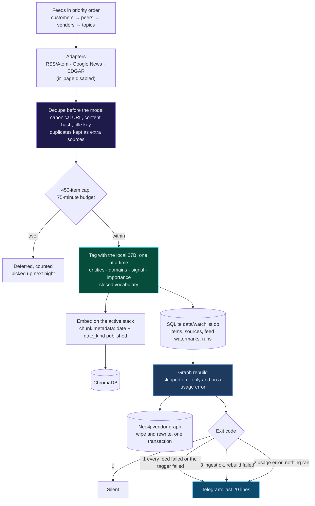

| Exit | Meaning | Graph | Telegram (via the Hermes wrapper) |
|---:|---|---|---|
| 0 | Ingest ran, rebuild succeeded | Rebuilt from tonight's `watchlist.db` | Nothing |
| 1 | Every attempted feed failed, or the tagger failed at least once (model down, out of memory, unparseable JSON) | Rebuilt anyway: the rebuild runs before the exit checks; its line is in the log | `watchlist ingest failed (exit 1):` plus the last 20 lines |
| 2 | Usage error (bad flag, unknown `--only` id) caught before anything ran | Untouched | The error line |
| 3 | Ingest succeeded, only the graph rebuild failed | **Previous graph kept**: the rebuild is one transaction, so a failure rolls back | `graph rebuild failed: <reason>` in the last 20 lines |

**Dedupe happens before the model.** The same press release legitimately arrives through a company's IR RSS, through Google News and through EDGAR. Collapsing those three into one item costs a few store lookups; tagging them three times would cost three model calls. Every duplicate is recorded as an extra source on the surviving item rather than thrown away.

Four more properties hold the run together:

- **Tagging is sequential.** The local model serves one request at a time, so concurrency here would only queue behind itself.
- **A feed never takes the run down.** An adapter, tagger or store error is caught per feed: the failure is recorded, the feed's watermark is *not* advanced (so the next run re-fetches what this one missed) and the run moves on.
- **The run stops itself before anything else does.** A 450-item cap and a 75-minute wall-clock budget (raised from 250 / 45 on 2026-10-03, when the customers grew to 60) keep it inside Hermes' three-hour script timeout. Items past the cap are counted as deferred, not dropped, and the next run picks them up. A feed that has never been seen is backfilled 30 days, not from the beginning of time.
- **The graph mirrors the store.** After every pass that ran (failed feeds included), the CLI rebuilds the vendor graph through the store it already holds open, then closes the Neo4j driver so the Hermes job can exit. A `--only` pass is a debugging run and leaves the graph alone. A manual `POST /api/graph/rebuild` during the nightly run is not locked out across processes; Neo4j serialises the two write transactions and at worst one fails and reports.

### The first unattended run

Night of **2026-09-21, 02:30–03:12 CEST** (run id 3), start to finish with nobody watching:

| | |
|---|---:|
| Items fetched | 1,165 |
| Collapsed by cross-source dedupe | 57 |
| Tagged and stored | 250 |
| Deferred by the 250-item cap | 858 |
| Stopped by the time budget | 0 |
| Failed feeds | 2 |
| Anomalies | 0 |
| Wall clock | 42 minutes |

Cap-bound and comfortably inside the budget. Disabling the `ir_page` adapter cut failures from 10 to 2 and anomalies from 14 to 0 in the same run, and cross-source dedupe went from 3 to 57 once EDGAR and Google News overlapped the IR feeds properly. That run predates the graph rebuild step.

### Working with it

[`config/watchlist.yaml`](config/watchlist.yaml) is the single definition of who is watched and what topics run with no named entity. Editing that file is how an entity, feed or topic is added or retired; nothing else changes. A syntax error in it costs the night its topic list and nothing more; it can no longer take the server down at boot.

```bash
npm run watchlist -- verify-feeds                      # fetch every configured feed once, report what parses
npm run watchlist -- ingest [--limit N] [--since ISO] [--only id,id]
npm run watchlist -- status [--days N]                 # last run's stats and per-entity counts, read-only
```

| Command | What it does |
|---|---|
| `verify-feeds` | Fetches every configured RSS/Atom feed once and reports which parse cleanly, writing nothing. EDGAR CIKs and IR pages are skipped with a reason: they are not RSS and would always report a spurious failure |
| `ingest` | One nightly pass, then a graph rebuild. `--only` runs just the named entities' feeds and skips the rebuild (an unknown id is rejected with exit 2 rather than silently running zero feeds); `--since` overrides every feed's own watermark; `--limit` overrides the per-run cap. Prints which stack it tagged with, the run's counts and the rebuild report; exit codes in the table above |
| `status` | The last recorded run's stats plus per-entity item counts over a trailing window (default 7 days) |

`ingest` resolves the stack exactly as the rest of the app does: `LLM_PROVIDER` if set, otherwise `data/run/active-stack` (written by `scripts/switch-stack.sh`), falling back to `ollama`.

Installing the schedule copies `hermes/scripts/pharmaitchat-watchlist-ingest.sh` into `~/.hermes/scripts/` with the repo's absolute path baked in, and creates the job with `--script … --no-agent --deliver local --failure-deliver telegram`:

```bash
scripts/hermes-setup.sh install-cron
```

### What is not built yet

Stated plainly, because a README that implies otherwise wastes the reader's time:

- **Monthly and quarterly digests, `search_watchlist` and `compare_entities`** from the [design spec](docs/superpowers/specs/2026-09-20-it-scene-watchlist-design.md) are not built; the [digest agent](#digests) covers any period on request and sends the weekly one.
- **IR-page collection is disabled.** The adapter scanned hundreds of links per entity and recognised zero dates on 14 of 29 pages, for 4 stored items in a whole run: noise at a scale that masks real failures. It is switched off at the run level (`DISABLED_FEED_KINDS` in `src/services/watchlist-ingest.ts`), not deleted: every `ir_page` URL and the research behind it stays in the config.
- **One misdated feed.** On 2026-10-02 `watchlist.db` held one item dated 2026-11-03. The graph rebuild skips future-dated items (more than one day ahead) and counts them in its report; the adapter itself is not fixed.
- **Every entity has an active feed** since 2026-09-30: the 13 that had none (nine peers, four vendors) got a Google News search feed. Peers use the customers' IT scope (name plus digital transformation, AI, CIO, data center, cloud migration, SAP or IT infrastructure), so Hikma and Zentiva are empty until they make IT news rather than filling up with share-price stories; vendors get their own disambiguated query ("Tulip Interfaces", Körber plus pharma/MES/Werum, Anthropic plus pharma/healthcare).

---

## Your role

Every answer and every digest is framed by **who is asking**: your title and company, the accounts you cover, and the lines you sell (storage, servers, networking, backup, end-user computing, security). There is no selector. You set it by chatting, in the web chat or on Telegram:

| You say | What happens |
|---|---|
| "I am the Dell GAM for Roche, Novartis and Sandoz" | A new role: it keeps what you said and asks only for what is missing (the lines you sell, a focus), then saves it and makes it active |
| "I'm now HLS principal at Everpure" | Starts another role the same way, even in the middle of answering questions for the first |
| "switch to my Dell role" | Makes a saved role active and shows its details |
| "add Lonza to my accounts, I don't sell networking" | Edits the active role and says what changed |
| "what is my role?" | Shows the active role |

One role is active for both the web chat and Telegram. While it is, the chat model is told who you are and to answer for that seller: what the news means for your accounts, and your company's products first. The role (who you are) is separate from the [accounts file](#the-accounts-file) (who is installed at each account): the role frames the prose, the accounts file feeds the graph.

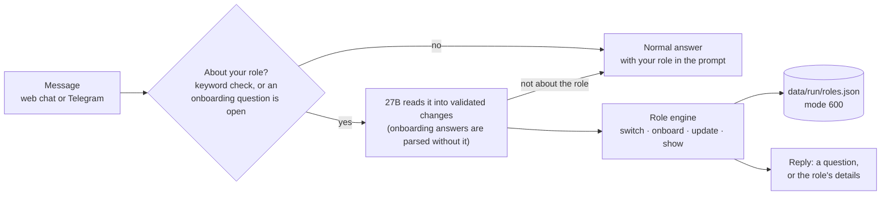

- **Home theater** (2026-10-04): a role can name the theater where its strategic influence sits ("my home theater is EMEA", or read from a title such as "HLS Principal, EMEA", which also covers roles saved before the field existed; the model may only change it when the message mentions a theater). The summary shows it, and the chat prompt tells the 27B to lead with accounts headquartered there. It is made for a seller paid on every deal in the sector whose influence is regional: all accounts stay in scope, the home theater leads.
- **A question is never an answer.** On 2026-10-02 "How should we approach novartis ?" typed while onboarding was waiting for a company was saved as the company, the role's accounts matched nothing, and the digests had no accounts to cover. A message that reads as a question (ends with "?", or starts with how / what / which / should / tell me …) is now answered normally, and the onboarding stays open with what it already has: the next plain answer still fills the pending field. At the free-text focus step only a question mark makes it a question; "cancel" still cancels.
- **The model never holds the state.** It turns a free-form message into a checked set of changes (portfolio values limited to the six lines); the engine decides what to ask or save. Answers to an onboarding question are parsed without the model, so they are instant.
- **An ordinary question costs nothing extra.** Only messages that look like role talk ("I am … at …", "my accounts", "switch to …") reach the model, and one that turns out not to be about the role goes on to the normal answer.
- **Measured live** (Splash, 2026-09-30): the Dell role came out of one sentence plus two answers; switching, editing and "what is my role?" each took 3–4 s; ordinary questions were never caught.
- **On Telegram** Hermes passes such messages to the `my_role` tool verbatim and relays the reply. Scheduled Hermes jobs cannot call it.
- **Benchmarks and the KB canaries** skip roles entirely, so their answers stay comparable.

## Digests

"Make me a digest of what happened this week" goes to the **digest agent**, not to the normal 5-chunk answer, in the web chat and on Telegram (`make_digest`). Every Monday at 07:30 Hermes sends last week's digest to Telegram by itself. Each digest is written for [your role](#your-role) and ends with **action items**: one per line you sell, tied to an account, turning the news into a next step.

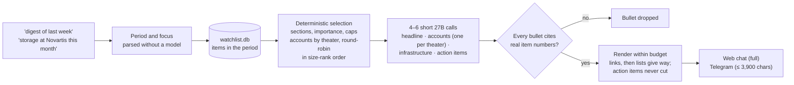

| Section | What goes in |
|---|---|
| Headline | 3–4 bullets on the period's most important items for your role |
| Your accounts | One bullet per account, items taken round-robin so a busy account cannot crowd out the others. When the accounts span theaters (with no role: all 60 customers), three blocks, **Your accounts · Americas / EMEA / APAC**, up to 4 items and 3 bullets each, the biggest account by size rank first in every round |
| Infrastructure scene | Storage, servers, networking and backup news: competitor moves, launches, supply and pricing signals |
| Pharma industry · Cyber · AI, cloud & data · R&D and manufacturing IT | The top items as a plain list, with links |
| Action items | One per portfolio line: account, next step, which of your company's product families to lead with |
| Footer | Items in the period, accounts the watchlist does not follow, feeds failing 3+ nights running |

- **Selection is code, prose is the model's.** Which items go in is decided over the item store; the model writes about the items it is handed, and a bullet that cites no real item number is dropped. A failed model call leaves that section as a plain item list.
- **Period and focus come from your wording**: "this week" (7 days), "last week" (Monday to Sunday), "yesterday", "this month", "last month", "last 10 days", "since Monday"; a company or a domain word ("storage", "cyber", "manufacturing") narrows it; "my accounts" keeps only your accounts and their peers; "Americas", "EMEA" or "APAC" keeps only the accounts headquartered there, and leaves other theaters' customer news out of every section unless the item also names a customer from the theater asked for ("digest EMEA last week", "briefing APAC").
- **Measured** (Splash, 2026-09-30, Dell GAM role): 35 items, 3,151 characters, 88 s over four calls; last week's digest from the script in 50 s. The first run gave all eight account slots to Roche (25 items against Novartis' 3 and Sandoz' 2) and cut the action items at the Telegram limit; both are fixed and tested.
- **Theaters, not one long list** (2026-10-03): with 60 customers and no role, the old 8-slot accounts section went to whichever accounts came first in round-robin. Grouped, each theater gets its own short 27B call (300 tokens, 3 bullets weekly, 2 in the briefing) and its own heading. Under the Telegram budget, links and lists give way first, then theaters drop to 2 bullets and then 1, never 0. Accounts in one theater only (a Roche / Novartis / Sandoz role) keep the single "Your accounts" block. On live data with a stand-in model, last week's digest came to 3,851 characters and yesterday's briefing to 3,754.
- **Home theater first, double room** (2026-10-04): when the role names a home theater, that block comes first with up to 6 items and 4 bullets (3 in the briefing); each other theater gets 3 items and 2 bullets (1). Under the Telegram budget the other theaters drop to 1 bullet before the home theater loses any, and none drops out: the seller is paid on them too. Without a home theater nothing changes.

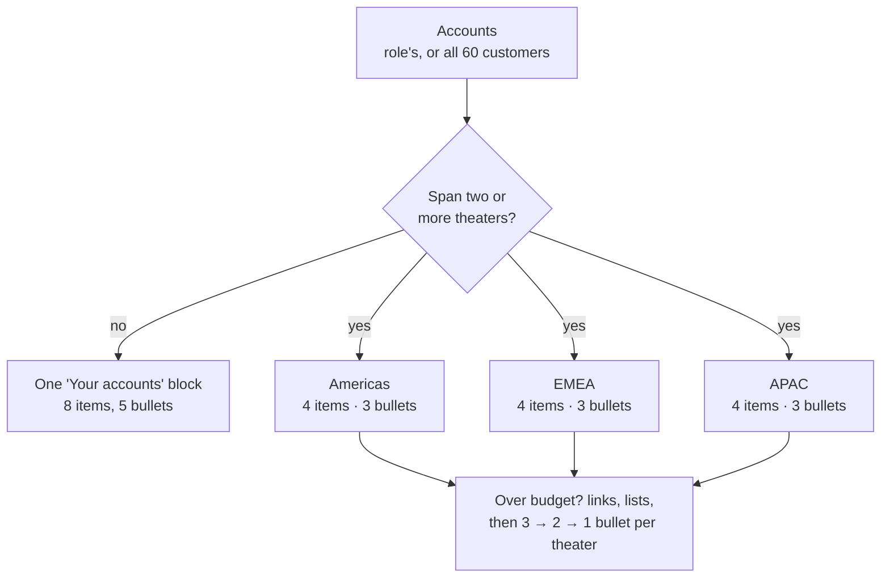

- **Action items are prompts, not facts**: they name product families from the model's own knowledge, which can be out of date.

**Weekday briefing** (Tuesday to Friday, 07:30): yesterday's news about your accounts, with the account bullets and action items only. It is sent only when at least one real action item survives: importance-1 account items (the tagger's "barely relevant", where mis-tagged stories sit) are left out, and bullets that say "no action" or "unrelated" are dropped. Tested live on 2026-09-30, yesterday's only "Roche" item was a mis-tagged financial-analyst story, and the first version turned it into six "No action" lines; now that day is silent.

### By email

The weekly digest and the weekday briefing can also come by email, next to Telegram. Telegram cuts a message at 4,096 characters, so it keeps the 3,900-character render. The email gets the **whole** digest from the same prose, with no second model call: HTML with headings, bold, clickable item links and a plain-text fallback.

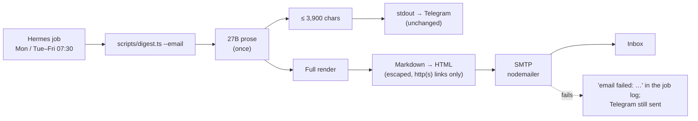

| Piece | Where | Notes |
|---|---|---|
| Recipient, sender, SMTP server | `config/email.local.yaml` (gitignored; copy `config/email.example.yaml`) | Without it email is off, and the job log says so |
| SMTP password | `data/run/smtp-password`, mode 600 | For Gmail, an **app password** (Google Account → Security → App passwords). Refused if others can read it |
| Test send | `npx tsx scripts/digest.ts --email-only --request "digest of last week"` | Emails without printing for Telegram; exits 1 when it cannot send |
| Result of each run | `data/logs/weekly-digest-<date>.log`, `daily-briefing-<date>.log` | `email: sent to …`, `email: off (…)` or `email failed: …` |

- **Send-only.** Nothing reads a mailbox (Hermes' own email channel would poll the inbox and send plain text cut to the Telegram length, which is why it is not used).
- **Quiet days stay quiet**: a briefing with nothing actionable sends neither a Telegram message nor an email.
- **The only part that leaves the machine is the delivery**, like Telegram. Every model call stays local.

Run either by hand: `npx tsx scripts/digest.ts --request "digest of last week"` or `--request "briefing of yesterday" --briefing` (`--budget N` changes the character budget, default 3,900). The script runs the digest agent in-process rather than through HTTP, because Node's `fetch` gives up after 300 s. Each scheduled run is kept in `data/logs/weekly-digest-<date>.log` or `daily-briefing-<date>.log`.

---

## Chat, retrieval and the knowledge base

Ask a question in the browser at `http://localhost:3000` (or by voice, or on Telegram) and four retrieval paths run in parallel before the model sees anything. The prompt the model receives starts with today's date, and every knowledge chunk in it is introduced by its source and date.

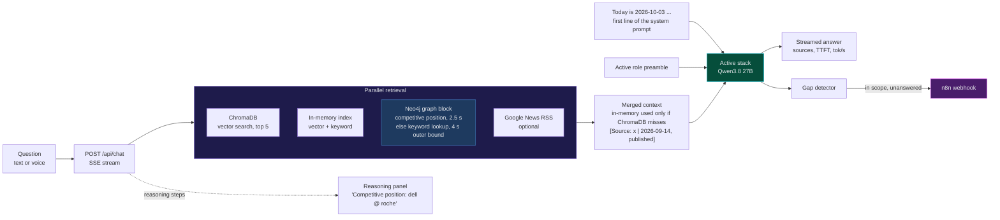

The reasoning panel shows each step live ("Searching knowledge graph…", "Competitive position: dell @ roche", "Found 3 entities in knowledge graph", "Searching the web for: …") and collapses when the first answer token arrives. Every answer carries a `response_id` for feedback and names the documents it used. Typing `/names` toggles whether answers name specific companies in incident discussions. How the graph block is chosen and what it contains is under [The graph block in the web chat](#the-graph-block-in-the-web-chat).

### The knowledge base

`knowledge/` ships **40 curated documents** at its top level (36 Markdown, 2 DOCX, 2 PDF) plus **6 vendor briefs** in `knowledge/vendors/` (Dell and HPE, each in storage-block, storage-file and storage-object), grown by uploads, the n8n research loop and the watchlist's nightly ingest. On 2026-10-03 the MLX collection (`knowledge_base_mlx`, shared by MLX, oMLX and Splash) held 11,114 chunks and the Ollama collection 7,372, every one carrying a date (see [Dates on every source](#dates-on-every-source)).

| Area | Examples |
|---|---|
| 🏢 Vendor intelligence | Dell, Pure Storage, NetApp, HPE, VAST Data, WEKA, NVIDIA, SAP, ServiceNow, Snowflake, Databricks, Splunk / Sentinel / CrowdStrike, endpoint and identity security, Bug Bounty Switzerland (14 `vendor-*.md` write-ups); two Everpure PDFs |
| 📋 Vendor briefs | `knowledge/vendors/<vendor>-<segment>.md`: frontmatter with position, confidence, as-of date, products, competitors, rationale and sources; the graph's only source of positions |
| 💊 Pharma industry | Business and science basics, regulation, Phase 3 pipeline 2025–26, top 20 by revenue / market cap / reputation, manufacturing plants, Basel biotech hub, news 2024–25 |
| 🛡️ Cyber threats | Major pharma attacks, attacks by year, attack types, systems compromised, costs and remediation, IT/OT threats 2025, threat landscape |
| 🏥 Account papers | `roche cyber resilience v2.docx`, `novartis cyber resilience v2.docx` |

Uploads accept `.txt`, `.md`, `.pdf`, `.csv`, `.json`, `.docx`, `.pptx` and `.ppt`. Everything ingested is saved to `data/raw_documents/` first, so an index can always be rebuilt from source. Uploads and ingested text never write to the graph: the vendor graph is built only from parsed, closed-vocabulary sources (see [Graph sources](#graph-sources-and-the-rebuild)). `scripts/remove-source.ts <source>` takes one source back out of the raw documents, the in-memory index and ChromaDB (dry run unless `--apply`).

### The self-healing loop

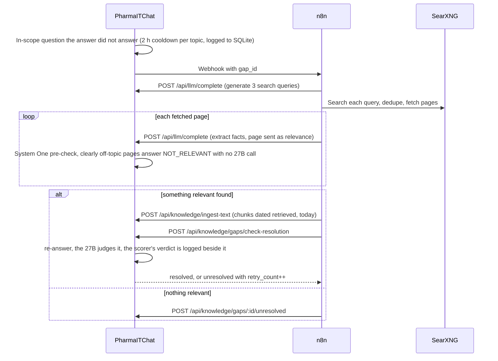

The KB health check is no longer an n8n workflow: see [KB canaries](#kb-canaries).

| File | Nodes | Purpose |
|---|---:|---|
| `n8n/knowledge_gap_workflow_v2.json` | 18 | Gap auto-fill with resolution check (live) |
| `n8n/knowledge_gap_workflow.json` | 13 | Gap auto-fill, v1 (reference only) |

All LLM steps call `POST /api/llm/complete`, so they run on the active stack. See [`n8n/README.md`](n8n/README.md).

### The System One scorer

Every judgment in the loop above ("did the chat answer the question?", "does the re-answer close the gap?") costs a full 27B call. [open-jev](https://github.com/daseinlabs/open-jev) serves Gemma 3 4B (4-bit, ~3 GB, `127.0.0.1:8010`) as a *System One* scorer: it answers a typed yes/no question with a probability in under a second, and the app reaches it through `/api/decide` (`config/decide.yaml` holds the model name, a 15 s timeout and the thresholds, 0.85 resolved and 0.5 unresolved).

**It decides one thing: which fetched pages are not worth the 27B's time.** Before the gap workflow's 27B extraction, the app asks it whether a page is about the gap's topic; below `page_relevance_skip_below` (0.1) the page is answered `NOT_RELEVANT` with no 27B call. The 27B used to discard about two thirds of the pages it read. On 34 pages from real gap runs, this skips 9 of the 26 the 27B discarded and none of the 8 it kept (lowest kept: 0.915). Any scorer failure extracts the page as before.

**Everywhere else it only watches.** In gap resolution the 27B still decides and the scorer's verdict is logged beside it (`[Gap Resolution] 27B X, scorer Y`); on every chat turn, with `shadow_detection: true`, both verdicts go to the `detection_shadow` table. Chat works the same with the scorer down.

Before a scorer is trusted, it is measured against the 27B:

| Tool | Measures |
|---|---|
| `scripts/replay-gap-decisions.ts` | The 60 open gaps (mostly non-answers): does the scorer catch a missed answer? |
| `scripts/replay-detection.ts` | Past confident questions, answers regenerated in benchmark mode: does it raise false alarms on good answers? |
| `scripts/shadow-report.ts` | Live agreement on real chat turns |
| `scripts/replay-page-relevance.ts` | Every page in n8n's gap-run history: which discarded pages it skips, and whether it would ever skip one the 27B kept |

Each replay takes `--question candidate.json` to try a new wording without touching production, and `--details` to list every disagreement. The wording matters more than anything else measured so far: on the same 60 gap answers, the first detection question agreed with the 27B 26.8% of the time and the current one 91.2%; the 16-bit model was replaced by the 4-bit one on the same kind of evidence. The same replays also showed where it does **not** work: on detection no wording tested both caught non-answers and spared good ones, so detection stays with the 27B. Setup: [Optional: System One scorer](#setup).

> [!NOTE]
> The standalone news agent (`src/services/news-agent.ts`) no longer scrubs anything. Its 188 topic queries now belong solely to the watchlist ingest, which already fetches every one of them with its own dedupe ladder; running both meant the same articles were embedded into the same collection twice a day. The job, its state file and its tool contract (`POST /api/agent/run`, the MCP `run_news_agent` tool) are kept and now report zero.

---

## Dates on every source

"Q2 earnings" means nothing without the year, and an answer can only relate a fact to the past if it knows when the fact was true. So every chunk the chat can retrieve, in ChromaDB and in the in-memory index, carries two metadata fields: **`date`** (`YYYY-MM-DD`) and **`date_kind`**, which says how that date is known. One module decides it for every writer: `src/services/chunk-date.ts`.

| `date_kind` | Meaning | Where it comes from |
|---|---|---|
| `published` | The source's own publication date | Watchlist items (`publishedAt`); raw documents whose metadata has `published_at`; archive sources named `news-YYYY-MM-DD` |
| `retrieved` | When the page was fetched; its own date is unknown | Gap-loop pages (`POST /api/knowledge/ingest-text`), URLs and text added with `POST /api/knowledge/add`, any raw document without a publication date (its `saved_at`) |
| `document` | When the knowledge file was last changed | Files in `knowledge/`: the day of the last git commit, else the file's mtime; a fresh upload is dated by the day it arrived |

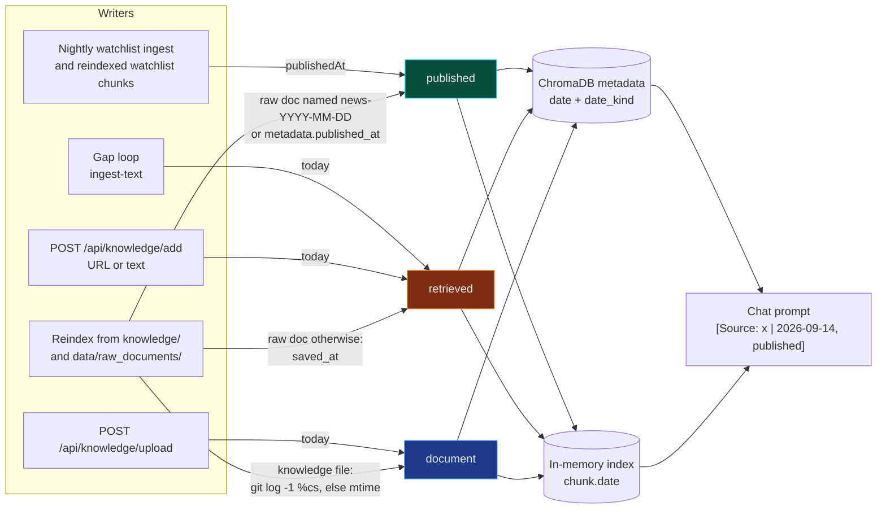

**What the model sees.** The system prompt's first line is generated per request:

```text
Today is 2026-10-03. Every source below carries a date: anchor relative periods (Q2, "last year", "recently") to the actual year, compare dated facts with each other and with today, and say when a fact may be outdated.
```

and every retrieved chunk is introduced as `[Source: <source> | <date>, <date_kind>]`, or `[Source: <source> | date unknown]` when no rule can date it. The graph block's event lines carry their own `publishedAt` date (`↳ 2026-09-14 [it_move] …`).

**Chunks stored before dates existed** are dated without re-embedding:

| Store | How old chunks get a date |
|---|---|
| In-memory index | At every app start, `fillLoadedChunkDates` resolves each undated chunk's source (knowledge file dates, raw documents, watchlist items) and saves the index if it changed (`N index chunks dated` in the log). Stamped dates are kept |
| ChromaDB | `npx tsx scripts/backfill-chunk-dates.ts` (dry run: counts per kind, already dated, undatable sources) and `--apply` (metadata-only update by id, pages of 1,000, every `knowledge_base_*` collection present). Idempotent: an already dated chunk is skipped |

The resolver order for an old chunk: a stamped `date` + `date_kind`, else its own `published_at`, else a `news-YYYY-MM-DD` source name, else the source looked up among knowledge files, raw documents and watchlist URLs. Anything left is reported as undatable and keeps `date unknown` in the prompt.

---

## The vendor-intelligence graph

The chat answers "what is new" from news. The graph answers **"where do I stand"**: for each of your accounts, which segments its needs put in play, who is installed there, how each vendor is positioned, what happened at that account lately, and why the account has the need in the first place. It lives in Neo4j, is written only by a deterministic rebuild (no model call, any stack), and is read by the MCP tool `competitive_position`, by `POST /api/graph/competitive-position` and by the web chat's graph block.

The design rests on one rule: **incumbency outweighs function and price.** The same competitive fact means opposite things depending on who already holds the account, so every answer resolves who is installed first, per segment, and refuses to guess when that is not recorded.

### What's in the graph

Six node labels and seven relationship types, all closed sets in `src/services/graph-schema.ts`. `writeGraphFacts` (`src/services/graph-writer.ts`) refuses any label, relationship type or vocabulary value outside them before a single write reaches Neo4j; the previous free-form graph had accumulated 174 relationship types against 20 declared.

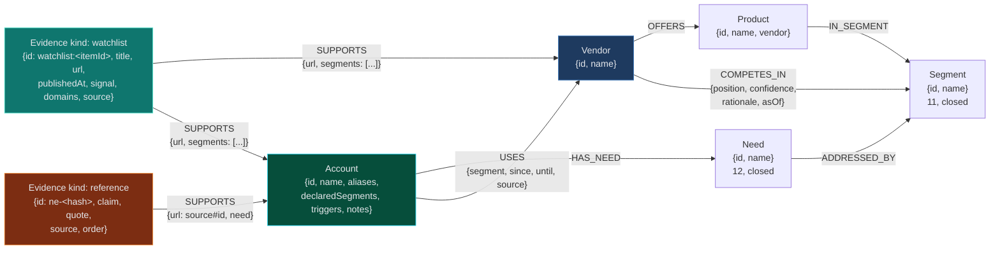

| Label | Written from | Properties | Notes |
|---|---|---|---|
| `Vendor` | Vendor briefs; every incumbent in the accounts file | `id`, `name` | An incumbent with no brief still gets a node: it is observed reality at the account, and it shows the research backlog. A competitor a brief merely names gets none |
| `Segment` | Briefs and `config/needs.yaml` | `id`, `name` | `compute-ai`, `compute-standard`, `storage-block`, `storage-file`, `storage-object`, `data-platform`, `data-protection`, `hci`, `networking`, `client`, `services` |
| `Product` | Briefs (`products:`) | `id`, `name`, `vendor` | A product is declared in exactly one brief, the segment it is sold as |
| `Account` | `config/accounts.local.yaml` | `id`, `name`, `aliases` (comma-joined), `declaredSegments` (comma-joined, empty-list segments included), `triggers` (JSON string, omitted when none), `historyConflicts` (JSON list, omitted when none), `notes` | `declaredSegments` is what tells "nobody installed" (`[]`) from "not known" (omitted) |
| `Need` | Accounts file and `config/needs.yaml` | `id`, `name` | `ai-factory`, `ai-data-platform`, `end-user-computing`, `cyber-resilience`, `multi-cloud`, `sap`, `gxp-compliance`, `rnd-compute`, `data-sovereignty`, `manufacturing-ot`, `cost-optimisation`, `sustainability` |
| `Evidence` (`kind: "watchlist"`) | `data/watchlist.db`, last 180 days | `id` (`watchlist:<itemId>`), `kind`, `title` (the URL when the item has none), `url`, `publishedAt` (`YYYY-MM-DD`), `signal`, `domains`, `source` | News about a graph vendor or account. Read as vendor news and account events |
| `Evidence` (`kind: "reference"`) | `config/need-evidence.local.yaml`, approved entries only | `id` (`ne-<10 hex>`), `kind`, `claim`, `quote`, `source`, `order` | A reason why an account has a need. Never read as news |

| Relationship | From → To | Properties (identity in **bold**) | Meaning |
|---|---|---|---|
| `OFFERS` | Vendor → Product | | The vendor sells the product |
| `IN_SEGMENT` | Product → Segment | | The segment the product is sold as |
| `COMPETES_IN` | Vendor → Segment | `position` (`leader` · `strong` · `present` · `absent`), `confidence` (`high` · `medium` · `low`), `rationale`, `asOf` | The vendor's curated standing there. Labels, not a market order |
| `HAS_NEED` | Account → Need | | The account declared this need |
| `ADDRESSED_BY` | Need → Segment | | The segments where a conversation about this need is worth having |
| `USES` | Account → Vendor | **`segment`**, **`since`**, **`until`**, `source` | Incumbency and its history, per segment: one edge per stint (identity segment + since + until), past stints included; only edges with `until = ""` are current |
| `SUPPORTS` | Evidence → Vendor or Account | **`url`**, plus `segments` (watchlist) or `need` (reference) | Watchlist: one edge per item and target; an item tagged with a vendor and an account gets two. Reference: `url` is `<source>#<entry id>` |

**Domains to segments.** The watchlist speaks in 12 IT domains, the graph in 11 segments; `SEGMENT_DOMAINS` in `src/services/graph-evidence.ts` is the only place they meet. A watchlist item's `segments` are derived once, at rebuild, from its domains:

| Segment | Domains that count as evidence for it |
|---|---|
| `compute-ai` | `ai`, `infrastructure` |
| `compute-standard` | `infrastructure` |
| `storage-block` · `storage-file` · `storage-object` | `storage` |
| `data-platform` | `data` |
| `data-protection` | `backup`, `cyber` |
| `hci` | `infrastructure` |
| `networking` | `networking` |
| `client` | `euc` |
| `services` | none |

An item whose domains map to no segment gets `segments: []`: it is account-wide (or vendor-wide) news, shown as an account's `general` events.

### Graph sources and the rebuild

The rebuild is the **only writer** of the graph. It reads five sources, validates all of them, and only then wipes and rewrites the graph inside **one Neo4j write transaction**: concurrent readers see the old graph until commit, and any failure leaves the previous graph untouched.

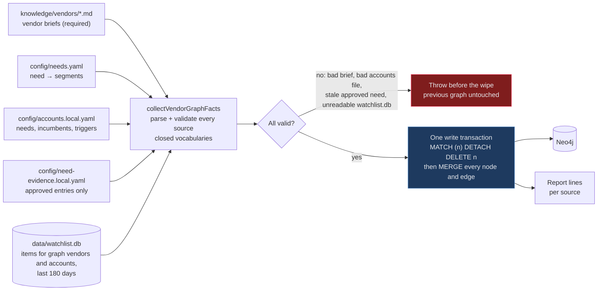

| # | Source | Required | Missing | Present but invalid | Report line |
|---:|---|---|---|---|---|
| 1 | `knowledge/vendors/*.md` | Yes | No positions at all | Throws (a rebuild without the brief would silently drop that vendor's position) | `<file>  <label> -> N nodes, M rels` per brief |
| 2 | `config/needs.yaml` | No | Skipped and reported | Throws | `needs.yaml -> N ADDRESSED_BY edges` |
| 3 | `config/accounts.local.yaml` | No | Skipped and reported; answers say "no accounts are declared" | Throws | `<id>.account  N needs, K segment(s) with a known incumbent -> M rels` |
| 4 | `config/need-evidence.local.yaml` | No | Skipped and reported | Throws, naming the entry | `need-evidence.local.yaml -> 12 approved (roche 5, novartis 4, sandoz 3), 31 proposed, 6 rejected` |
| 5 | `data/watchlist.db` | No | Skipped and reported | Throws | `watchlist.db -> N evidence for K vendors/accounts, F future-dated skipped` |

Rules for the watchlist source: only items tagged with an entity id that is a `Vendor` or `Account` **in this rebuild's facts**; published in the last **180 days** (`EVIDENCE_WINDOW_DAYS`); any signal, untagged included; an item published more than one day after the rebuild is **skipped and counted** (a feed once misdated an item a month ahead, which would have sat on top of every "newest" list). Evidence attaches to the vendors and accounts the other sources declared; it never introduces a node of its own.

Three ways to run it, all equivalent in what they write:

```bash
npx tsx scripts/rebuild-vendor-graph.ts                    # dry run: every source parsed and validated,
                                                           # counts what it would write, writes nothing
npx tsx scripts/rebuild-vendor-graph.ts --apply            # merge into the existing graph
npx tsx scripts/rebuild-vendor-graph.ts --apply --rebuild  # WIPE, then write, one transaction
npx tsx scripts/export-graph.ts [outfile]                  # read-only JSON dump; take one before a destructive change
```

`POST /api/graph/rebuild` does the same as `--apply --rebuild` (`409` while one is already running in the app). The [nightly ingest](#the-nightly-run) runs the same wipe-and-write after every pass and exits 3 when only the rebuild failed. Browse the result at http://localhost:7474.

> [!NOTE]
> `scripts/seed-neo4j-attacks.ts` is a legacy seed for the earlier attack-chain graph (ThreatActor, Attack, AttackVector). Those labels are outside the closed set, the rebuild wipes them, and nothing reads them any more except the chat's keyword fallback if you reseed.

### The accounts file

`config/accounts.local.yaml` models **install base** (what is deployed, per segment), deliberately not a CRM: no opportunities, stages, amounts, close dates or forecast. It is gitignored. Start from the example:

```bash
cp config/accounts.example.yaml config/accounts.local.yaml
```

```yaml
accounts:
  roche:
    name: Roche
    # Names the watchlist may report under; used to attach collected evidence.
    aliases: [Genentech, Chugai, Roche Diagnostics]
    # From the closed needs vocabulary.
    needs: [rnd-compute, gxp-compliance, cyber-resilience, data-sovereignty]
    # Who is installed, per segment. Values are LISTS.
    incumbents:
      storage-file: [netapp]
      storage-block: [dell, hpe]
      data-protection: [dell]
      compute-standard: [hpe]
      # compute-ai: unknown -- omitted rather than guessed
    # Install-base events that open a segment held by a rival.
    triggers:
      storage-block: "PowerMax arrays reach end of support 2027-03"
    notes: >
      Basel and Kaiseraugst plus Genentech in South San Francisco.

  novartis:
    name: Novartis
    aliases: [Sandoz]
    needs: [manufacturing-ot, gxp-compliance, cost-optimisation]
    incumbents:
      storage-block: [dell]
      compute-ai: []   # known: no AI compute installed yet
```

| Key | Type | Rules | Effect |
|---|---|---|---|
| `name` | string | | Display name, also matched in chat messages |
| `aliases` | list of strings | | Also matched in chat messages; names the watchlist may report under |
| `needs` | list | Closed set of 12 needs; anything else fails the rebuild | Which segments are in play, through `config/needs.yaml` |
| `incumbents.<segment>` | **list** of vendor ids | Segment from the closed set of 11. A bare key (`storage-block:`) or a scalar is **refused**: `<account>: incumbents.<segment> must be a list of vendors — [] if nobody is installed, or omit the segment if unknown` | `[vendor, …]` → defend/displace; `[]` → greenfield; omitted → unknown |
| `triggers.<segment>` | string | Segment from the closed set; non-empty; at most 200 characters; only on a segment with declared, non-empty incumbents | Opens a segment held by a rival in the ranking (`open` regime) |
| `notes` | free text | | Stored on the Account node; anything a brief cannot know |

**`[]` versus omitted** is the most important distinction in the file:

| You write | Graph | Mode for a vendor | Ranking regime |
|---|---|---|---|
| `storage-block: [dell]` | `USES {segment: storage-block}` to Dell; segment in `declaredSegments` | Dell: `defend`; anyone else: `displace` | `defend` (or `open` with a trigger) |
| `compute-ai: []` | No `USES`; segment in `declaredSegments` | `greenfield` | `greenfield` |
| *(segment omitted)* | No `USES`; segment not declared | `unknown` | `unknown`, no ranking |
| `storage-block:` (bare key) | Rebuild refused before the wipe | | |
| `storage-block: [{vendor: hds, since: 2026-03}, {vendor: dell, since: 2019, until: 2026-03}]` | Two `USES` edges, Dell's with `until`; only HDS is current | HDS: `defend`; Dell (now a rival): `displace` | `defend`; `history` shows the change |

A blank incumbent is better than a guessed one: guessing wrong flips an answer from defend to displace while sounding equally confident.

**Triggers** are facts about the installed base (end of support, a refresh due, a renewal date as a lifecycle fact), never an opportunity, stage or amount. Their validation messages:

| Problem | Message |
|---|---|
| Not a map | `<account>: triggers must be a map of segment to description` |
| Unknown segment | `<account>: triggers.<key> is not a segment (expected one of: …)` |
| Empty or not a string | `<account>: triggers.<segment> must be a non-empty description of the install-base event` |
| Over 200 characters | `<account>: triggers.<segment> is longer than 200 characters: an install-base fact fits one line` |
| Segment undeclared or `[]` | `<account>: triggers.<segment> opens a segment held by a rival; declare its incumbents first` |

Every error fails the rebuild **before** the wipe, so a typo never costs you the graph you had.

### competitive_position

"What is Dell doing best for my accounts?", "where do we stand at Roche?", "who wins storage-file at Novartis?". One tool answers all three: give at least one of `vendor`, `account` or `segment` (names, aliases and ids are accepted; an unknown one is an error that lists the known ones).

| Surface | How to call it |
|---|---|
| MCP | `competitive_position` with `{vendor?, account?, segment?}` |
| HTTP | `POST /api/graph/competitive-position` with the same body (token) |
| Web chat | Automatic when the message names one briefed vendor or one account (see [below](#the-graph-block-in-the-web-chat)) |

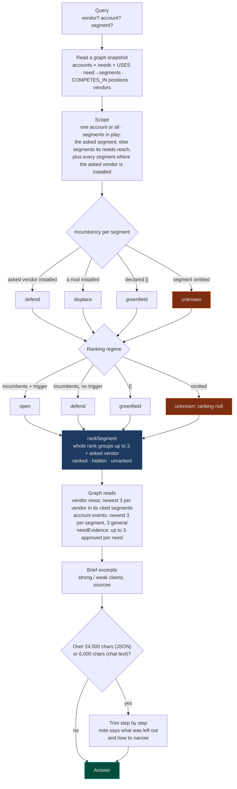

**Incumbency modes**, one per vendor per segment, each with the guidance line the answer carries in `modes`:

| Mode | When | Guidance in the answer |
|---|---|---|
| `defend` | The vendor is installed in that segment | the vendor is installed: defend and expand through roadmap, lifecycle and adjacent attach; function gaps are tolerable; the segment's events show lifecycle and roadmap moves |
| `displace` | A rival is installed | a rival is installed: displacing it needs a disqualifying weakness or a triggering event; look for one in the segment's events |
| `greenfield` | Declared `[]` | declared: nobody is installed, so function and price actually decide |
| `unknown` | Segment omitted from the accounts file | who is installed here is not recorded: find out before choosing defend, displace or greenfield |

**The answer**, field by field:

| Field | Content |
|---|---|
| `query` | The resolved `{vendor, account, segment}` (ids, `null` where not asked) |
| `modes` | Guidance per incumbency mode, only the modes that occur |
| `regimes` | Guidance per ranking regime, only the regimes that occur |
| `market` | Every `COMPETES_IN` position matching the asked vendor and/or segment |
| `accounts[]` | Per account: `account`, `name`, `needs`, `needEvidence`, `general`, `segments[]` |
| `accounts[].segments[]` | `segment`, `via` (the needs that put it in play), `incumbents`, `vendors[]` (`{vendor, mode, position}`, alphabetical), `regime`, `trigger`, `ranking`, `ranked`, `hidden?`, `unranked?`, `events` |
| `accounts[].needEvidence` | `{<need>: [{claim, quote, source}]}`, up to 3 approved entries per need in file order; needs without entries are absent |
| `accounts[].general` | Up to 3 newest account-wide watchlist items (`segments: []`): `{title, url, publishedAt, signal}` |
| `accounts[].segments[].events` | Up to 3 newest watchlist items supporting the account with that segment |
| `standings` | Per `vendor/segment` cited: `position`, `confidence`, `rationale`, `asOf`, `curated` (a brief file backs it), `strong`/`weak` claims from the brief, `sources` |
| `evidence` | Per vendor: newest 3 watchlist items whose segments overlap the vendor's cited segments; `[]` plus a note when none overlap, never unfiltered news |
| `notes` | Anything the reader must know: no accounts declared, an account with no needs, a vendor no brief places ("unknown, not absent"), unreadable triggers, what the budget trimmed |

**The budget.** The tool's JSON is capped at **24,000 characters** (`MAX_ANSWER_CHARS`, about 6k tokens: room in a 64K context for the question, the answer and the model's reasoning). Over it, supporting material is dropped step by step, cheapest first, until it fits; after each step the note `trimmed to fit the answer budget, left out: …. Narrow by vendor or account or segment for the full detail` is updated. Structure (accounts, segments, modes, positions, confidence, dates, `regime`, `trigger`, `ranking`) is never dropped.

| Order | JSON (`TRIM_STEPS`) | Chat text (`TEXT_TRIM_STEPS`) |
|---:|---|---|
| 1 | claim details | claim details |
| 2 | need-evidence quotes (claims kept) | need-evidence quotes |
| 3 | need evidence | need evidence |
| 4 | account events beyond 1 per segment and account | account events beyond 1 per segment and account |
| 5 | account events (all) | claims |
| 6 | claims | rationale beyond 200 characters |
| 7 | rationale beyond 200 characters | rationale, and sources beyond 2 per standing |
| 8 | rationale, and sources beyond 2 per standing | sources |
| 9 | sources | account events (all) |

The chat moves "all account events" to the end because an event is one short line in text, while claims and rationale are the bulk; measured as JSON, the URLs would have trimmed the events away first.

### Win-likelihood ranking

Positions alone are not a ranking: when the graph was designed, six of the eight vendors it looked at were Gartner Leaders, so a market order carries little signal. What *is* ranked is **win likelihood within one account and one segment**, where incumbency does most of the work. `src/services/segment-ranking.ts` computes it from the snapshot alone: pure, deterministic, no model call, same input, same order.

```mermaid
stateDiagram-v2
    direction LR
    [*] --> unknown: segment omitted
    [*] --> greenfield: declared []
    [*] --> defend: incumbents declared
    defend --> open: trigger declared on the segment
    unknown: unknown<br/>ranking null, find out who is installed
    greenfield: greenfield<br/>everyone by position
    defend: defend<br/>incumbents first, then rivals by position
    open: open<br/>everyone by position, incumbent wins ties
```

| Regime | Segment state | Order | Guidance in `regimes` |
|---|---|---|---|
| `unknown` | Not declared | `ranking: null` | no ranking until you record who is installed |
| `greenfield` | Declared `[]` | Everyone by position | nobody is installed: position decides |
| `defend` | Incumbents, no trigger | Incumbent group first (by position among themselves), then rivals by position | the incumbent keeps the segment unless a trigger is declared: rivals rank behind it |
| `open` | Incumbents and a declared trigger | Everyone by position; incumbency only breaks ties | a declared trigger opens the segment: position decides, incumbency only breaks ties |

- **Candidates**: the segment's incumbents plus every vendor with a `COMPETES_IN` position there, whatever the query; a Dell-only question still shows where Dell stands against its rivals. `absent` vendors are excluded unless installed.
- **Position order**: `leader` > `strong` > `present` > no brief > `absent` (incumbents only).
- **Competition ranks**: equal keys share a rank and the next rank skips (1, 1, 3). Nothing else breaks a tie, never alphabetical order; tied entries are listed by vendor id only for stable output.
- **What is shown**: whole rank groups while they fit in 3 entries (`RANKING_TOP`); a tied group that would pass 3 is left out entirely and counted in `hidden: [{rank, count}]`. The asked vendor is shown wherever it lands. `ranked` is the total number ranked.
- **`unranked`**: the asked vendor when no brief places it in the segment and it is not installed: shown, never ranked first on evidence it does not have.
- **Reasons**: exactly two per entry, from a fixed vocabulary: the role (`incumbent`, `rival`, or `nobody installed`) and the position (`leader/high`, …, or `no brief`).
- **Never trimmed**: rankings are structure. That is why triggers are capped at 200 characters and only the top groups are shown (a full list on a full graph was about 7k of untrimmable JSON).
- **Events never promote a vendor.** Only a declared trigger opens a segment: watchlist tagging is noisy (a EURETINA item once arrived tagged `it_move`).

Shape per segment:

```ts
type Regime = "unknown" | "greenfield" | "defend" | "open";
interface RankedVendor { vendor: string; rank: number; reasons: string[] }
// on every account segment:
regime: Regime;
trigger: string | null;
ranking: RankedVendor[] | null;                    // null exactly when regime is "unknown"
ranked: number;                                     // how many candidates were ranked
hidden?: Array<{ rank: number; count: number }>;    // tied vendors not listed, per rank
unranked?: string;                                  // the asked vendor with no brief and no install
```

The MCP tool's description tells agents to rank vendors only as `ranking` gives them, per account and segment, with its reasons, never from positions alone and never across accounts.

### The graph block in the web chat

When a chat message names **exactly one briefed vendor** (a vendor some brief positions) or **exactly one account**, the chat's graph context is the same `competitive_position` answer, rendered as text within **6,000 characters** (`CHAT_CONTEXT_CHARS`, about 1.5k tokens, since it shares the prompt with retrieval and live news). Otherwise, on any failure, or after **2.5 s** (`COMPETITIVE_TIMEOUT_MS`), it falls back to the keyword lookup over graph node names. The competitive path can only add to what the chat gets.

```mermaid
sequenceDiagram
    participant C as /api/chat
    participant G as chat-graph-context
    participant N as Neo4j
    C->>C: Neo4j reachable? extract keywords (may be none)
    C->>G: chatGraphContext(message, keywords)
    G->>N: read snapshot (vendors, accounts, aliases, positions)
    G->>G: match names as whole words, case and punctuation insensitive
    alt one briefed vendor or one account named
        G->>N: competitive_position reads (evidence, events, need evidence)
        G->>G: render text, fit 6,000 chars with TEXT_TRIM_STEPS, cut at a line if still over
        G-->>C: source competitive, label "dell @ roche"
        C->>C: reasoning step "Competitive position: dell @ roche"
    else nothing pinned down, an error, or 2.5 s passed
        G->>N: keyword lookup (node names, 2 hops)
        G-->>C: source keyword, or none
    end
```

Matching rules: names are compared as dash-padded slugs, so "Pure Storage's roadmap" matches `pure-storage`; watchlist aliases map to vendors only when the target is a graph vendor; a dimension named twice is left out ("Dell vs HPE at Roche" asks about Roche across vendors), so a match never guesses between two names; "dell at roche" works even though it yields no keywords.

What the block looks like (illustrative, from the example accounts file):

```text
[Graph Context: competitive position, vendor dell, account roche]
Incumbency modes:
- defend: the vendor is installed: defend and expand through roadmap, lifecycle and adjacent attach; ...
Roche (roche), needs: rnd-compute, gxp-compliance, cyber-resilience, data-sovereignty
  why cyber-resilience: Ransomware on a pharma peer halted production for weeks (cyber-pharma-major-attacks.md)
  general:
    ↳ 2026-09-20 [corporate] Roche opens new site ...
  storage-block (via cyber-resilience, data-sovereignty), installed: dell, hpe
    trigger: PowerMax arrays reach end of support 2027-03
    ranking (open): 1 dell (incumbent, leader/high) · 2 hpe (incumbent, strong/high)
    ↳ 2026-09-14 [it_move] Roche consolidates EU data centres
    dell: defend, position leader
  compute-ai (via rnd-compute), installed: nobody
    ranking: none, find out who is installed
    dell: unknown, position unknown
Standings:
- dell/storage-block: leader (high confidence, as of 2026-09-21). Block is where Dell's leadership claim ...
Recent news:
- dell: ... (2026-09-18) https://...
Notes:
- ...
```

Line by line: `why <need>:` comes from approved [need evidence](#need-evidence) (claim and source file name, quotes omitted); `general:` and `↳` lines are account events (`date [signal] title`, `untagged` when no signal); `trigger:` and `ranking (<regime>):` come from the ranking, with `2=` marking a shared rank, `+N more tied at R` from `hidden`, and `<vendor> (no brief, not ranked)` for `unranked`. When even the trimmed text is over 6,000 characters, it is cut at a line boundary with `… (cut to fit the chat context: ask about one vendor, account or segment for the rest)`.

### Need evidence

Each account declares needs (`cyber-resilience`, `gxp-compliance`, …) with no stated reason. Need evidence adds **reviewed, cited reasons why each account has each need**, mined from the legacy documents in `knowledge/` by the local 27B and approved by you one by one. Nothing unapproved reaches the graph, and the 27B never writes Neo4j: the rebuild stays the only writer.

```mermaid
stateDiagram-v2
    [*] --> proposed: 27B proposes, checks pass
    [*] --> dropped: check fails (counted in the run report)
    proposed --> approved: you edit status
    proposed --> rejected: you edit status
    approved --> rejected: you change your mind
    rejected --> approved: you change your mind
    approved --> InGraph: next graph rebuild
    InGraph: Evidence kind reference<br/>SUPPORTS with need, to the Account
    InGraph --> Answer: read by competitive_position and the chat
    approved --> Stale: account no longer declares the need
    Stale: rebuild refused before the wipe<br/>the error names the entry ids
    Stale --> rejected: you reject it
    Stale --> approved: you restore the need in accounts.local.yaml
    dropped --> [*]
```

**1. Extract** (one-off, by hand, on the active stack):

```bash
npx tsx scripts/extract-need-evidence.ts --only "knowledge/cyber-pharma-major-attacks.md" --dry-run   # 1-2 calls, writes nothing
npx tsx scripts/extract-need-evidence.ts                    # every eligible document, writes the proposals file
npx tsx scripts/extract-need-evidence.ts --status           # read-only: counts per account/need, next 10 to review
```

| Step | What happens |
|---|---|
| Preconditions | `config/accounts.local.yaml` must exist (else `declare accounts first: copy config/accounts.example.yaml to config/accounts.local.yaml`, exit 1); the active stack must answer its health check before the first call (else exit 1) |
| Documents | `knowledge/*.md`, `*.pdf`, `*.docx` at the top level (not `knowledge/vendors/`), minus vendor-authored material: every `vendor-*` file by name, and the files listed in `config/need-evidence.exclude` (one name per line, `#` comments; today the two Everpure PDFs). Vendor material says what products exist, never why an account has a need. With today's files that leaves 24 documents |
| Chunks | ~2,500-word windows split at paragraph boundaries; a longer paragraph is split by words |
| 27B call | One per chunk, temperature 0.1: the prompt lists each account with its declared needs and asks for at most 5 `{account, need, claim, quote}` entries as a JSON array, `[]` when nothing applies |
| Checks | Each proposal is dropped and counted unless: the account is one of yours (`unknown account`); the need is one that account declares (`undeclared need`); the claim is at most 200 characters (`claim too long`); the quote has at least 6 words (`quote too short`); the quote is found **verbatim** in the chunk after whitespace normalisation (`quote not in source`). The last is a guard against invented quotes, not a trust signal |
| Failures | A model error or unparseable reply skips its chunk (`chunks failed`); an unreadable document is left unrecorded and retried next run (`documents unreadable`) |
| Saving | After **every document**, merged with the file as it is on disk at that moment (your approvals made during a run win), written to a `.tmp` file and renamed, so a crash cannot truncate it |
| Resumable | The file records each processed document's content hash; unchanged documents are skipped on the next run |
| Report | `+ <id>  <account> / <need>  <claim>  — "<quote>" (<source>)` per new entry, then `N proposed, N unchanged documents skipped, N chunks failed, N documents unreadable, dropped: …` |

**2. Review** `config/need-evidence.local.yaml` (gitignored). Change only `status`, or delete entries:

```yaml
# Written by scripts/extract-need-evidence.ts. Change status to approved or
# rejected; only approved entries reach the graph. Re-runs never touch an
# entry that is already here, so your decisions stay.
sources:
  knowledge/cyber-pharma-major-attacks.md: 3f9a1c…
entries:
  - id: ne-7c41d2a9e0
    status: proposed            # proposed | approved | rejected
    account: roche
    need: cyber-resilience
    claim: "Ransomware on a pharma peer halted production for weeks"
    quote: "Merck's manufacturing operations were disrupted for several weeks by NotPetya."
    source: knowledge/cyber-pharma-major-attacks.md
    extracted: 2026-10-02
```

- **Your notes stay.** A run appends its new entries to the file as it is and refreshes `sources`; comments and extra fields on existing entries survive (both proposals files, since 2026-10-03). Comments inside `sources` do not.
- **A malformed file stops the run** with one line naming the file (`config/need-evidence.local.yaml: entries must be a list`, `entry 4 has no id`), instead of reading as empty. The same goes for `--only` without a file or naming no document; a bare name is read as `knowledge/<name>`.

Ids are stable: `ne-` plus the first 10 hex characters of a SHA-256 over account, need and the whitespace-normalised quote. A re-run that meets the same quote keeps the existing entry and its status; new quotes are appended as `proposed`.

**3. Rebuild** (dry run first, then apply):

```bash
npx tsx scripts/rebuild-vendor-graph.ts                    # shows "need-evidence.local.yaml -> N approved (...)"
npx tsx scripts/rebuild-vendor-graph.ts --apply --rebuild  # or POST /api/graph/rebuild, or wait for 02:30
```

Validation at rebuild, each failing **before the wipe** and naming the entry: duplicate ids; a status other than the three; a need outside the closed set; an empty claim or quote; an approved entry naming an unknown account; an approved entry whose need the account no longer declares (`roche no longer declares data-sovereignty: reject or re-approve ne-…`). Proposed and rejected entries are never checked against the accounts file and never written.

**4. Read.** Approved entries become `Evidence {kind: "reference", claim, quote, source, order}` with `SUPPORTS {url: "<source>#<id>", need}` to the account. `competitive_position` returns them as `needEvidence` (up to 3 per need, in file order); the chat prints `  why <need>: <claim> (<file name>)` under the account line. News queries match only `coalesce(e.kind, "watchlist") = "watchlist"`, so reference entries never appear as events or vendor news, and a graph built before `kind` existed still reads its news. Reference entries never influence the ranking: they justify needs, not vendors.

---

### Install-base history

`config/accounts.local.yaml` used to hold only who is installed **now**, and every rebuild rewrote the graph from it: change Novartis storage-block from `[dell]` to `[hds]` and the graph forgot Dell ever held it. "Dell just lost block to HDS" and "HDS has been there ten years" are different sales situations, so the install base now keeps its history.

```mermaid
flowchart LR
    AF["config/accounts.local.yaml<br/>dated incumbents<br/>(the truth for now)"] --> MERGE
    WL[("watchlist.db items")] --> PRE
    AR[("archive news<br/>news-YYYY-MM-DD")] --> PRE
    PRE["Prefilter, no model:<br/>names an account<br/>AND a graph vendor"] --> M27["27B: one change?<br/>installed / replaced / removed<br/>+ verbatim quote"]
    M27 --> CHK{"closed sets · quote ≥ 6 words<br/>and verbatim · date = item's own"}
    CHK -- dropped --> X["counted, never proposed"]
    CHK -- ok --> IH["config/install-history.local.yaml<br/>status: proposed"]
    IH -- "you set approved" --> MERGE["Rebuild: applyHistory<br/>file wins · news adds the past"]
    MERGE --> USES[("USES {segment, since, until, source}")]
    MERGE --> CONF["contradictions →<br/>Account.historyConflicts → answer notes"]
    USES --> ANS["competitive_position<br/>history per segment"]
```

#### Declaring history

Each segment's incumbents accept plain names and dated entries, mixed freely. Dates may be `YYYY`, `YYYY-MM` or `YYYY-MM-DD`:

```yaml
incumbents:
  storage-block:
    - hds                                          # current, date unknown
    - {vendor: hds, since: 2026-03}                 # current since March 2026
    - {vendor: dell, since: 2019, until: 2026-03}   # held it until March 2026
```

- **Current** means an entry without `until`; only current entries feed incumbency, so defend/displace/greenfield, triggers and the ranking behave exactly as before.
- A vendor may appear more than once (held it, lost it, won it back); each stint stays its own edge.
- `[]` plus past entries is a declared-empty segment with history.
- Refused before the wipe, naming account and segment: a malformed date, `since` after `until`, an `until` in the future (an announced end belongs in [triggers](#the-accounts-file)), an unknown key, an entry without `vendor`.

#### News proposals

```bash
npx tsx scripts/extract-install-history.ts --dry-run   # proposals printed, nothing written
npx tsx scripts/extract-install-history.ts             # writes config/install-history.local.yaml
npx tsx scripts/extract-install-history.ts --status    # read-only: counts, next 10 to review
```

Candidates are watchlist items tagged with one of your accounts plus archive news, kept only if they name an account (or alias) **and** a graph vendor (the briefs' and your accounts file's ids, plus the watchlist names of the same entity). One 27B call per candidate; the run resumes per document and saves after each one. Approve entries by setting `status: approved`.

On 2026-10-03, 1 of 7,330 items named both an account and a vendor: install-base news is rare in what the watchlist collects, so declared history is the main source today.

#### How approved news merges

| Approved entry | Effect |
|---|---|
| `installed Y` on D | Y current in your file without `since` → `since: D`; Y not current → a past stint from D, end unknown (`until: "?"`) |
| `replaced X by Y` on D | X gets a past stint `until: D`; Y as `installed` |
| `removed X` on D | X gets a past stint `until: D` |
| News says X left, your file lists X as current | **Your file wins**; the answer carries a note: `approved news says x left <segment> on D; accounts.local.yaml still lists it as current` |

An approved entry naming an unknown account or vendor fails the rebuild before the wipe.

#### What the answer shows

- Each account segment carries `history` (who held it, newest first, current stints first) with each stint's `source` (`declared` or `news:<url>`).
- **Default:** changes from the last 18 months; `olderChanges` counts the rest. **Full:** every stint, with `history: "full"` (MCP parameter, `POST /api/graph/competitive-position` body), or in the chat when the question uses history wording ("history", "over time", "previously", "before that", "used to", "since when", "who had").
- Chat lines under a segment: `changed: hds 2026-03–now (declared) · dell 2019–2026-03 (declared) · +1 older`, or `history: …` in full mode.
- History is context, not a rule: regimes and ranking are unchanged. It is trimmable under the answer budget (beyond the newest row first, all of it last).

## Artifact export

The same data, as a document: `POST /api/export` (or the MCP tool `create_artifact`) produces an account brief, an incumbency matrix or a vendor comparison as **xlsx, pdf or pptx**, narrated by the local model and rendered locally (`exceljs`, `pdf-lib`, `pptxgenjs`). A deck can take minutes behind one local model server, so every export is an asynchronous job: the request returns a job id at once and you poll it.

```mermaid
stateDiagram-v2
    direction LR
    [*] --> queued: POST /api/export (202, jobId)
    queued --> gathering
    gathering --> narrating: graph, watchlist, briefs
    narrating --> rendering: local 27B writes the prose
    rendering --> delivering: xlsx, pdf or pptx
    delivering --> done
    gathering --> failed
    narrating --> failed
    rendering --> failed
    delivering --> failed
    done --> expired: download file older than 30 days
```

| Field | Values | Rule |
|---|---|---|
| `kind` | `account-brief`, `incumbency-matrix`, `vendor-comparison` | Required |
| `format` | `xlsx`, `pdf`, `pptx` | Required |
| `audience` | `internal`, `external` | **Required, no default**: `internal` includes incumbency and competitive position; `external` omits them for something a customer may see. `incumbency-matrix` and `vendor-comparison` have no external form (`400` at request time) |
| `account` / `vendor` | id or name | Optional subject |
| `destination` | `download` (default), `telegram`, `icloud` | `download` serves the file at `GET /api/export/file/:id`; `telegram` sends it to your chat; `icloud` writes it into your iCloud-synced Documents folder |

`GET /api/export/:id` returns the job's stage and, when done, where the file went. Downloaded files live in `data/exports/` and are swept after 30 days (`RETENTION_DAYS`); the job row stays, so polling an old job says `expired` rather than 404. Telegram and iCloud deliveries are yours to manage and are never swept. Every export route needs the API token: an export carries account intelligence.

## Image generation

"Generate an image of an AI factory at a pharma plant, photo style, for LinkedIn" — from Telegram (Hermes picks `create_image`) or `POST /api/export` with `kind: "image"`, `format: "png"`. The image is drawn **on this Mac** by FLUX.1-schnell (Apache-2.0, so fine for customer decks and LinkedIn) through [mflux](https://github.com/filipstrand/mflux), one process per image, and delivered like any export: download, Telegram or iCloud. The web chat has no image wording (its renderer shows no images or links); decks, PDFs and LinkedIn posts come in later pieces.

```mermaid
flowchart LR
    U["Telegram / API<br/>'an image of ...'"] --> R{"Model installed?"}
    R -- "no" --> E["503 image model not installed:<br/>run scripts/setup-image-model.sh"]
    R -- "yes" --> J["Export job<br/>kind image · png"]
    J --> P["narrating: the 27B writes<br/>the visual prompt + style + 'no text'"]
    P --> G{"Lock free, 10 GB free,<br/>GPU under 30%?"}
    G -- "no" --> W["re-check every 15 s<br/>(10 min, then fail with the numbers)"]
    W --> G
    G -- "yes" --> M["rendering: mflux, FLUX.1-schnell<br/>4-bit, 4 steps, --low-ram"]
    M --> D["delivering: download · telegram · icloud"]
```

| Field | Values |
|---|---|
| `prompt` | 1-1,000 characters |
| `preset` | `none` (default), `house`, `photo`, `abstract`, `brand`: style phrases in `config/image-presets.yaml`, editable |
| `size` | `square` 1088x1088 (LinkedIn post), `portrait` 1088x1360 (LinkedIn 4:5), `linkedin` 1200x624, `slide` 1280x720 |
| `raw` | `true` skips the 27B's rewrite |
| `seed` | Reported back; re-run the same seed with a changed prompt to vary one image |
| `audience` | Optional for images (no account text in a picture); still required for documents |
| `destination` | `download` (default), `telegram`, `icloud`. The MCP tool warns the model that `icloud` copies the image off this machine, and only when asked |

- **No words in pictures.** Every prompt ends with "no text, no letters, no words, no logos, no watermark": image models garble text. Titles, numbers and charts belong to decks and PDFs.
- **The 27B comes first.** One image at a time (`data/run/image.lock`), started only with enough free memory and an idle GPU (limits in `config/host.yaml` `resources.image`), and killed after 300 s. Scheduled Hermes runs cannot draw (`create_image` is excluded from `pharmaitchat_cron`).
- **A crashed run cannot block the next.** The lock is published atomically (temp file, then link); a dead owner's lock is taken over by rename, and an empty or unreadable lock counts as stale only after 10 seconds.
- **Measured, not guessed.** Each image logs prompt, seed, duration and peak memory to `data/logs/image-<date>.log`.
- **Stuck lock.** If images keep failing with "another image is being drawn" while none is, a crashed app's pid was reused: delete `data/run/image.lock`.
- **Setup once:** `scripts/setup-image-model.sh` installs mflux in `.venv-image`, checks that `mflux-generate` supports every flag the generator uses *before* downloading, then downloads ~24 GB once and keeps a ~6 GB 4-bit copy in `data/models/flux-schnell-4bit`. The copy is saved into a `.partial` folder and renamed only when `mflux-save` succeeds, so an interrupted download is redone on the next run instead of being mistaken for an install. Until then an image request answers `503` with that command.

---

## Hermes Agent on Telegram

[`hermes/`](hermes/README.md) runs [Hermes Agent](https://hermes-agent.nousresearch.com/) (0.21.3) as a Telegram assistant **on the same local 27B model**: the phone talks to your own machine, not to a cloud. Everything needed to rebuild it lives in the repo; secrets stay in `~/.hermes/.env` and `data/run/*-token` at mode 600.

```bash
scripts/switch-stack.sh token           # PharmaITChat API token
scripts/switch-stack.sh mcp-token       # token Hermes uses for pharmaitchat-mcp
scripts/hermes-setup.sh all             # config, .env, launchd services, plugin, cron jobs
scripts/hermes-setup.sh check           # read-only status; prints variable names, never values
```

| Job | Schedule (cron) | Mode | What it does |
|---|---|---|---|
| `pharmaitchat-watchlist-ingest` | `30 2 * * *` | script | The nightly watchlist run plus the graph rebuild. Silent unless the exit code is non-zero (1 ingest failed, 2 usage error, 3 rebuild failed) |
| `pharmaitchat-kb-canary` | `0 5 * * *` | script | Asks the KB canary questions. Silent unless one fails |
| `pharmaitchat-gap-resolution` | `0 7 * * *` | agent | Re-checks at most 3 triggered knowledge gaps, oldest first; `[SILENT]` when there are none |
| `pharmaitchat-weekly-digest` | `30 7 * * 1` | script | Last week's digest for your role, ending with action items |
| `pharmaitchat-daily-briefing` | `30 7 * * 2-5` | script | Yesterday's news about your accounts and what to do about it. Silent on a day with nothing actionable |
| `pharmaitchat-feedback-digest` | `0 8 * * 1` | agent | Weekly rating trends and the worst-rated answers |
| `pharmaitchat-health-watch` | `0 9,19 * * *` | agent | Reports failing checks; `[SILENT]` while healthy |

The four script jobs' bodies live in `hermes/scripts/` (`pharmaitchat-watchlist-ingest.sh`, `pharmaitchat-kb-canary.sh`, `pharmaitchat-weekly-digest.sh`, `pharmaitchat-daily-briefing.sh`); `install-cron` copies them into `~/.hermes/scripts/` with the repo path baked in.

- **Tool scope is the control.** Telegram and CLI runs connect to the `pharmaitchat` MCP server with 20 of the 21 tools (no `start_reindex`). Scheduled runs connect to a separate, write-limited `pharmaitchat_cron` server with 17 of the 21: no `start_reindex`, no `add_knowledge`, no `my_role`, no `create_image`. MCP calls are never approval-gated, so the tool list is what enforces this. Scheduled runs also get no web, memory, terminal or file toolsets (`platform_toolsets.cron: [session_search, pharmaitchat_cron]`).
- **Sandbox:** shell commands run in a Docker container with `--network=none`, 512 MB and 1 CPU, no host project or home directory mounted. Verified live: `/Users` is not visible, `host.docker.internal` does not resolve and the app is unreachable from inside.
- **Web search:** the local SearXNG instance, with the keyless cloud fallbacks turned off. Private and loopback URLs stay blocked for Hermes' web tools, so ChromaDB and Neo4j cannot be reached that way.
- **Speed:** a warm Telegram round trip takes about 1 min 47 s end to end (Hermes' own timer reports 107.7 s). The first step of a cold session pays the full prefill, about 140–156 s.
- **Restarting the MCP service** costs the next Hermes message about 3 minutes, because the model has to prefill the tool list again.
- **Renaming the MCP server orphans live sessions**: they keep calling the old `mcp__<old>__*` names, which fail instantly while health checks stay green. Run `scripts/check-stale-sessions.sh` (read-only; `--quiet` for the verdict only) before and after a rename, then rotate each flagged session from inside its own chat (`/new`). Adding fields to a tool's answer, as the graph work did, renames nothing.
- **After a reboot:** everything comes back on its own. The Hermes gateway (`ai.hermes.gateway`) and the launchd jobs `com.pharmaitchat.stack` (the app, the active model stack, ChromaDB, and colima with the Neo4j and SearXNG containers), `com.pharmaitchat.mcp`, `com.pharmaitchat.n8n`, `com.pharmaitchat.jev` and `com.pharmaitchat.mlx-watchdog` all run at load. `scripts/check-services.sh` confirms it; `scripts/autostart.sh on|off|status` switches the whole set.

The Telegram bot is also what confirms a stack switch requested from the web UI; see [Switching from the web UI](#switching-from-the-web-ui).

<details>
<summary><b>Running Hermes on a second Mac</b></summary>

<br/>

Point the agent at the model Mac's LAN or VPN address. On the PharmaITChat Mac, bake the bind address into the launch agent so it survives a reboot:

```bash
MCP_HOST=0.0.0.0 scripts/hermes-setup.sh install-services
```

An MCP token is then required. On the Hermes Mac, set `PHARMALLM_URL`, `PHARMALLM_MCP_URL` and `SEARXNG_URL` to the model Mac and copy the two token values into `~/.hermes/.env` by hand. Full instructions in [`hermes/README.md`](hermes/README.md).

</details>

---

## The MCP server and the model gateway

PharmaITChat serves AI agents in two ways: as a set of tools, and as a model provider.

| | Endpoint | Purpose |
|---|---|---|
| 🧰 **MCP tools** | `pharmaitchat-mcp` at `http://<host>:3200/mcp` | 21 tools over Streamable HTTP |
| 🧠 **Model gateway** | `http://<host>:3000/v1` or `https://<host>:3443/v1` | OpenAI-compatible chat completions on the active stack, tools and streaming supported |

### The MCP server

`mcp/` is a separate package and process with no RAG logic of its own: every tool maps to one or two PharmaITChat REST calls. It speaks stateless Streamable HTTP at `POST /mcp` and answers `GET /healthz` without auth, which makes the knowledge base usable from any MCP client: Claude Desktop, Hermes, your own.

| Group (`mcp/src/tools/`) | Tools |
|---|---|
| Knowledge (`knowledge.ts`) | `search_knowledge`, `ask_pharmaitchat`, `add_knowledge`, `knowledge_status` |
| Graph (`graph.ts`) | `graph_stats`, `competitive_position` |
| Gaps (`gaps.ts`) | `list_knowledge_gaps`, `resolve_knowledge_gap` |
| Operations (`operations.ts`) | `system_health`, `dashboard_metrics`, `news_agent_status`, `run_news_agent`, `start_reindex`, `reindex_status` |
| Feedback (`feedback.ts`) | `record_feedback`, `feedback_report` |
| Export (`export.ts`) | `create_artifact`, `artifact_status`, `create_image` |
| Role (`role.ts`) | `my_role` |
| Digest (`digest.ts`) | `make_digest` |

```bash
scripts/switch-stack.sh mcp-token       # create data/run/mcp-token
npm --prefix mcp install
scripts/switch-stack.sh mcp start       # launchd service com.pharmaitchat.mcp, logs in data/logs/mcp.log
scripts/switch-stack.sh mcp status
scripts/switch-stack.sh mcp stop
```

Without `MCP_TOKEN` the service accepts only same-machine requests with a local Host header. With a token it requires `Authorization: Bearer` and accepts any Host. `scripts/run-mcp.sh` refuses to listen on a non-loopback host without a token. See [`mcp/README.md`](mcp/README.md) for each tool's parameters.

**Tool payloads are compacted** before they reach an agent (`mcp/src/tools/compact.ts`): embeddings are dropped, long lists become `{count, sample, truncated}`, stored answers are cut to 300 characters, and `list_knowledge_gaps` returns 20 rows by default (`limit` up to 50). `competitive_position` passes its JSON through unchanged; it already fits its own 24,000-character budget.

| Tool result | Before | After |
|---|---:|---:|
| `search_knowledge` (5 chunks) | ≈48,600 tokens | ≈1,100 tokens |
| `list_knowledge_gaps` | ≈31,000 tokens | ≈2,700 tokens |
| `knowledge_status` | ≈10,000 tokens | ≈530 tokens |
| `news_agent_status` | ≈2,200 tokens | ≈260 tokens |

Each search chunk used to carry a ~30 KB embedding object next to ~440 characters of text, so 98% of the payload was a vector no agent can use. That size, re-read on every step, was the real cost of agent runs, not cache misses.

### The model gateway

`/v1/chat/completions` forwards to the active stack and pipes the response through byte for byte, so streaming and tool calls work unchanged. It forces the stack's own chat model (the `model` field is ignored), forwards only `messages`, `tools`, `tool_choice`, `stream`, `stream_options`, `temperature` and `max_tokens` (capped at 4096), and drops the rest. It returns `503` during a benchmark or when the stack is down, with no fallback.

---

## Setup

**Prerequisites:** [Homebrew](https://brew.sh), Node.js 22, Python 3, about 50 GB of free disk for the models, `ffmpeg` for voice input, and [colima](https://github.com/abiosoft/colima) (or Docker Desktop) for the Neo4j and SearXNG containers. The **MLX and oMLX stacks require Apple Silicon**; **Splash additionally requires an M3 or newer and macOS 26.4+** (36 GB unified memory minimum, 48 GB recommended). The Ollama stack only needs Ollama, so a host without Apple Silicon still gets the whole pipeline, on one stack instead of four. The setup scripts themselves drive Homebrew and `launchctl`, so they assume macOS.

```bash
# 1. Install Ollama and the Node dependencies
brew install ollama && brew services start ollama
git clone git@github.com:sebdallais-git/PharmaIT_Chat_and_Digest.git
cd PharmaIT_Chat_and_Digest
npm install

# 2. One-time setup: download the Ollama, MLX and Splash models (~50 GB total),
#    create the MLX and oMLX venvs (oMLX reuses the same Hugging Face snapshots,
#    so it adds no extra download), install Splash from Homebrew, then start ChromaDB,
#    build the active stack's indexes and launch the app
scripts/switch-stack.sh prepare

# 3. Optional but recommended: everything back after every reboot
scripts/autostart.sh on
```

When `prepare` finishes, PharmaITChat is running on the Ollama stack (the default):

| | URL |
|---|---|
| 💬 Chat | http://localhost:3000 |
| 📊 Dashboard | http://localhost:3000/dashboard |
| ❤️ Health | http://localhost:3000/api/health |
| 🕸️ Neo4j browser | http://localhost:7474 |

Ports come from `config/host.yaml` (`endpoints`); `PORT`, `HTTPS_PORT` and the per-service URL variables still win. Later sessions without the launch agents start everything (ChromaDB, the last active stack and a hot-reload dev server) with:

```bash
npm run dev          # runs scripts/start-services.sh
```

> [!NOTE]
> The first index build re-embeds the whole knowledge base and took 12–16 minutes here. Ollama 0.17.6 could not pull Qwen3.8; the setup was verified with Ollama 0.34.0.

> [!IMPORTANT]
> With `scripts/autostart.sh on` (or `hermes-setup.sh install-services`), the `com.pharmaitchat.stack` launch agent brings back ChromaDB, the active stack, colima and the app at login, under `tsx watch`: saving a file in `src/` reloads the live app. Without the launch agents, nothing restarts the app or the model stack after a reboot: run `scripts/start-services.sh` (or `scripts/switch-stack.sh <stack>`) before you expect answers.

<details>
<summary><b>Optional: the vendor graph, accounts and need evidence</b></summary>

<br/>

Neo4j runs in colima as the `neo4j` container (`scripts/lib/services.sh` starts colima and the container when Docker is unreachable). The app's default credentials are `neo4j` / `pharma2024` (`NEO4J_USER`, `NEO4J_PASSWORD`). To create the container by hand:

```bash
docker run -d --name neo4j --restart unless-stopped \
  -p 7474:7474 -p 7687:7687 \
  -e NEO4J_AUTH=neo4j/pharma2024 \
  neo4j:community
```

Then declare your accounts, check, and build:

```bash
cp config/accounts.example.yaml config/accounts.local.yaml   # edit: needs, incumbents, triggers
npx tsx scripts/rebuild-vendor-graph.ts                      # dry run: validates every source
npx tsx scripts/rebuild-vendor-graph.ts --apply --rebuild    # write, one transaction
npx tsx scripts/extract-need-evidence.ts --dry-run --only "knowledge/<file>"   # optional: try extraction
```

See [The accounts file](#the-accounts-file) and [Need evidence](#need-evidence). After the first night the graph also carries watchlist evidence.

</details>

<details>
<summary><b>Optional: the watchlist schedule</b></summary>

<br/>

The nightly ingest is a Hermes cron job, so it needs Hermes installed first ([`hermes/README.md`](hermes/README.md)). Then:

```bash
scripts/hermes-setup.sh install-cron     # creates all seven jobs from hermes/cron/jobs.json
npm run watchlist -- verify-feeds        # sanity-check the feeds before the first night
npm run watchlist -- status              # after the first run: counts and per-entity totals
```

</details>

<details>
<summary><b>Optional: self-healing loop (n8n + SearXNG)</b></summary>

<br/>

1. Run [SearXNG](https://github.com/searxng/searxng) on `http://localhost:8888` with `bash scripts/setup-searxng.sh`, which builds its settings from `config/searxng/settings.yml`, and [n8n](https://n8n.io) on `http://localhost:5678` (`com.pharmaitchat.n8n`, started by `scripts/run-n8n.sh`). General web search uses the [Brave Search API](https://brave.com/search/api/) only: the public engines SearXNG would scrape answer a self-hosted instance with CAPTCHAs and rate limits, and Bing returned spam that crowded out real results. Put a Brave key in `data/run/brave-api-key` (mode 600) before running the script, or web search returns nothing; it is rendered into the container's settings, never into the repo or a command line.
2. In n8n, import `n8n/knowledge_gap_workflow_v2.json` (**Workflows → Import from File**) and activate it.
3. Nothing else to wire: `start-services.sh` and `switch-stack.sh` point the gap detector at `http://localhost:5678/webhook/knowledge-gap` (override with `N8N_WEBHOOK_URL`), and `scripts/run-n8n.sh` hands n8n the API token from `data/run/api-token`.

The workflows call protected routes with `Authorization: Bearer {{ $env.PHARMALLM_API_TOKEN }}` (the legacy variable name, which `run-n8n.sh` sets). n8n 2.x blocks `$env` in expressions by default, so `run-n8n.sh` also sets `N8N_BLOCK_ENV_ACCESS_IN_NODE=false`; an n8n started some other way needs both. See [`n8n/README.md`](n8n/README.md).

</details>

<details>
<summary><b>Optional: System One scorer (open-jev)</b></summary>

<br/>

A local Gemma 3 4B scorer that answers typed yes/no questions with a probability. It decides the gap workflow's page pre-check, and records its verdict next to the 27B's in gap resolution and, when `shadow_detection` is on in `config/decide.yaml`, on every chat turn; see `docs/superpowers/specs/2026-09-22-system-one-decision-design.md`. Chat works without it.

```bash
# 1. Next to this repo, with uv (brew install uv)
cd .. && git clone https://github.com/daseinlabs/open-jev.git && cd open-jev && make venv

# 2. Accept the Gemma licence at huggingface.co/google/gemma-3-4b-it, then store a Read token
#    in data/run/hf-token (mode 600) and create the scorer key:
( umask 077; openssl rand -hex 32 > ../PharmaIT_Chat_and_Digest/data/run/jev-token )

# 3. The 4-bit MLX build: ~3 GB beside the 27B (open-jev's `make setup` fetches the 16-bit 8 GB one)
HF_TOKEN="$(cat ../PharmaIT_Chat_and_Digest/data/run/hf-token)" .venv/bin/hf download \
  mlx-community/gemma-3-4b-it-4bit --local-dir models/gemma-3-4b-it-4bit

# 4. Install the launchd job (127.0.0.1:8010) and check it
cd ../PharmaIT_Chat_and_Digest && scripts/hermes-setup.sh install-services
scripts/check-services.sh | grep jev
```

`scripts/run-jev.sh` serves `models/gemma-3-4b-it-4bit` unless `JEV_MODEL` says otherwise. Measure a change of model or question with `scripts/replay-gap-decisions.ts` before relying on it.

</details>

<details>
<summary><b>Optional: agents (MCP service and Telegram assistant)</b></summary>

<br/>

```bash
scripts/switch-stack.sh token          # create data/run/api-token
scripts/switch-stack.sh mcp-token      # create data/run/mcp-token
npm --prefix mcp install
scripts/switch-stack.sh mcp start      # pharmaitchat-mcp under launchd (com.pharmaitchat.mcp)
scripts/switch-stack.sh mcp status
```

Creating the API token does not enable it: restart the app (`scripts/switch-stack.sh <stack>`) so it is exported. The Telegram assistant is a separate install; see [`hermes/README.md`](hermes/README.md).

</details>

### Voice input and HTTPS

The mic button records audio in the browser (MediaRecorder), uploads it to `POST /api/chat/transcribe` (max 25 MB), converts it to 16 kHz WAV with `ffmpeg`, and transcribes it locally with whisper.cpp (`ggml-base.en`, bundled with `whisper-node`).

Browsers only allow microphone access on secure origins, so an **iPad or phone needs HTTPS**. Put `certs/key.pem` and `certs/cert.pem` in place and the server also listens on **https://&lt;your-host&gt;:3443** (`HTTPS_PORT`, or `endpoints.app.https_port`). The device must trust the certificate. A token, once set, is required on both ports.

---

## Commands

Every command below exists in `package.json`, `mcp/package.json` or `scripts/`. There is **no lint script and no ESLint config**.

<details open>
<summary><b>Build, run, test</b></summary>

<br/>

```bash
npm run dev                  # ChromaDB + the active stack + tsx watch (scripts/start-services.sh)
npm run dev:node             # Node server only (tsx watch src/server.ts)
npm run build && npm start   # tsc -> dist/, node dist/server.js
npm run typecheck            # tsc --noEmit, strict
npm run typecheck:tests      # type-check __tests__ via tsconfig.test.json
npm test                     # Jest (ESM flags already in the script)
npm test -- __tests__/segment-ranking.test.ts   # one file
npm test -- -t "name of test"                   # one test by name
npm --prefix mcp test        # MCP server: its own package and Jest config
npm --prefix mcp run typecheck
npm --prefix mcp run dev     # MCP server under tsx watch
npm run test:hermes-plugin   # Python unittest, hermes/tests
```

</details>

<details open>
<summary><b>Stacks and services</b></summary>

<br/>

```bash
scripts/switch-stack.sh ollama|mlx|omlx|splash   # switch (rolls back on failure)
scripts/switch-stack.sh status | availability | prepare | ollama-ctx
scripts/switch-stack.sh ensure-stack <stack>     # stack + indexes, no app
scripts/switch-stack.sh chat-endpoint <stack>    # "<url> <model>"
scripts/switch-stack.sh token | mcp-token | telegram
scripts/switch-stack.sh mcp start|stop|status
bash scripts/check-services.sh                   # health of every service, ports from config/host.yaml
scripts/autostart.sh on|off|status               # launchd jobs at login
scripts/hermes-setup.sh check|install-config|install-services|install-plugin|install-cron|all
scripts/check-stale-sessions.sh [--quiet]        # Hermes sessions still calling a renamed MCP server
bash scripts/setup-searxng.sh                    # (re)create the SearXNG container
```

</details>

<details open>
<summary><b>Watchlist, graph, need evidence, dates</b></summary>

<br/>

```bash
npm run watchlist -- verify-feeds
npm run watchlist -- ingest [--limit N] [--since ISO] [--only id,id]   # then rebuilds the graph (not with --only)
npm run watchlist -- status [--days N]
npx tsx scripts/rebuild-vendor-graph.ts [--apply [--rebuild]]           # dry run by default
npx tsx scripts/export-graph.ts [outfile]                               # read-only JSON dump
npx tsx scripts/extract-need-evidence.ts [--only knowledge/<file>] [--dry-run]
npx tsx scripts/extract-need-evidence.ts --status
npx tsx scripts/backfill-chunk-dates.ts [--apply]                       # dry run by default
```

</details>

<details open>
<summary><b>Knowledge base, digests, canaries, scorer replays, benchmarks</b></summary>

<br/>

```bash
LLM_PROVIDER=mlx npx tsx scripts/reindex-stack.ts [--check | --status]  # rebuild needs the app stopped
npx tsx scripts/remove-source.ts <source> [--apply]
npx tsx scripts/backfill-source-tier.ts [--apply]
npx tsx scripts/kb-canary.ts [--app-url URL] [--config path] [--no-store]
npx tsx scripts/digest.ts [--request "…"] [--budget N] [--briefing]
npx tsx scripts/replay-gap-decisions.ts [--backfill | --question file.json | --details]
npx tsx scripts/replay-detection.ts [--backfill [--limit N] [--all] | --question file.json | --details]
npx tsx scripts/shadow-report.ts
npx tsx scripts/replay-page-relevance.ts
npx tsx scripts/benchmark-stack.ts [--runs N] [--app URL] [--questions file]
npx tsx scripts/compare-benchmarks.ts <run-a.json> <run-b.json>
LLM_PROVIDER=<stack> npx tsx scripts/embedding-parity.ts save <file> | compare <a> <b>
```

</details>

---

## Scripts reference

Every file in `scripts/`, one line each. "Writes" means it changes live data; every such script is dry-run or read-only unless its flag says otherwise.

| Script | What it does | Writes? |
|---|---|---|
| `scripts/backfill-chunk-dates.ts` | Dates every ChromaDB chunk stored before dates existed, metadata only, every `knowledge_base_*` collection | Only with `--apply` |
| `scripts/backfill-source-tier.ts` | Gives every chunk in the live collection a scalar, filterable `source_tier`, metadata only | Only with `--apply` |
| `scripts/benchmark-stack.ts` | Benchmarks the active stack end to end through the running app | `data/benchmarks/` |
| `scripts/compare-benchmarks.ts` | Compares two benchmark runs and builds a blind A/B review page | `data/benchmarks/` |
| `scripts/digest.ts` | Builds a digest (or `--briefing`) in-process on the active stack and prints markdown | No |
| `scripts/embedding-parity.ts` | Saves or compares embeddings across stacks | The file you name |
| `scripts/export-graph.ts` | Dumps the whole Neo4j graph to JSON before anything destructive | The file you name; read-only on Neo4j |
| `scripts/extract-need-evidence.ts` | The 27B proposes need evidence from the legacy documents; `--status` summarises review | `config/need-evidence.local.yaml` (not with `--dry-run` or `--status`) |
| `scripts/extract-install-history.ts` | The 27B proposes install-base changes (installed / replaced / removed) from watchlist items and archive news that name an account and a graph vendor; `--status` summarises review | `config/install-history.local.yaml` (not with `--dry-run` or `--status`) |
| `scripts/ingest-to-chromadb.ts` | One-time: ingests every `knowledge/*.md` into ChromaDB | ChromaDB |
| `scripts/kb-canary.ts` | Asks the KB canaries against the running app; exit 1 on a failure | `kb_canary_runs` (not with `--no-store`) |
| `scripts/rebuild-vendor-graph.ts` | Rebuilds the vendor graph from its five sources | Only with `--apply` (`--rebuild` wipes first) |
| `scripts/reindex-stack.ts` | Rebuilds, `--check`s or prints `--status` of the active stack's indexes | Indexes (rebuild only) |
| `scripts/remove-source.ts` | Removes one source from raw documents, the in-memory index and ChromaDB | Only with `--apply` |
| `scripts/replay-detection.ts` | Scorer acceptance harness for gap detection (regenerates past answers with `--backfill`) | Its baseline file |
| `scripts/replay-gap-decisions.ts` | Scorer acceptance harness for gap resolution against `data/run/gap-baseline.json` | Its baseline file (`--backfill`) |
| `scripts/replay-page-relevance.ts` | Replays the page pre-check against the 27B's keep/discard in n8n's history | No (read-only on n8n) |
| `scripts/seed-neo4j-attacks.ts` | Legacy seed of the old attack-chain graph; wiped by any rebuild | Neo4j |
| `scripts/shadow-report.ts` | Agreement report for shadow-mode detection | No |
| `scripts/watchlist.ts` | `verify-feeds`, `ingest` (plus graph rebuild), `status` | `ingest` only |
| `scripts/autostart.sh` | `on`, `off`, `status` for every launchd job at login | launchd |
| `scripts/check-services.sh` | Read-only status of every moving part and whether it comes back by itself | No |
| `scripts/check-stale-sessions.sh` | Finds Hermes sessions still calling a renamed MCP server's tools | No |
| `scripts/hermes-setup.sh` | Hermes config, secrets, launchd services, plugin and cron jobs | `~/.hermes`, launchd |
| `scripts/mlx-watchdog.sh` | Restarts the active stack's chat server when it stops producing tokens (busy GPU is not wedged) | Restarts the server |
| `scripts/run-jev.sh` | launchd entry point for the open-jev scorer; refuses non-loopback without a token | No |
| `scripts/run-mcp.sh` | launchd entry point for `pharmaitchat-mcp`; refuses non-loopback without a token | No |
| `scripts/run-n8n.sh` | launchd entry point for n8n, with the API token and `$env` access set | No |
| `scripts/setup-image-model.sh` | Installs mflux in `.venv-image` and saves FLUX.1-schnell quantized (`.partial` folder, renamed on success) | `.venv-image/`, `data/models/` |
| `scripts/setup-searxng.sh` | (Re)creates the SearXNG container from `config/searxng/settings.yml` | Docker |
| `scripts/start-services.sh` | ChromaDB, colima containers, the active stack and the dev server (`npm run dev`) | Starts services |
| `scripts/switch-stack.sh` | Every stack operation: switch, prepare, status, availability, tokens, MCP service | Stacks, `data/run/` |
| `scripts/lib/` | Shared helpers: `host.sh` and `host-env.ts` (host profile for bash), `services.sh`, `launchd.sh`, benchmark and replay helpers, SearXNG settings renderer | |

---

## Architecture

ESM TypeScript throughout (`"type": "module"`, `module: Node16`, `strict`); sources import siblings as `./x.js` and Jest maps that back to `.ts`. The entry point is `src/server.ts`. No `any`: `unknown` plus type guards. The browser UI (`public/`, `dashboard/`) is plain HTML, JS and CSS, with no framework and no bundler.

```mermaid
flowchart TB
    subgraph CL["Clients"]
        direction LR
        B["Browser<br/>chat + dashboard"]
        N["n8n workflows"]
        AG["AI agents<br/>Hermes, Claude Desktop"]
    end

    MCP["pharmaitchat-mcp :3200<br/>21 tools, Streamable HTTP<br/>MCP_TOKEN + payload compaction"]

    subgraph APP["PharmaITChat :3000 / :3443"]
        direction TB
        AUTH["auth middleware<br/>UI routes open, everything else needs a token"]
        V1["/v1<br/>OpenAI-compatible gateway"]
        API["/api/*<br/>chat, knowledge, gaps, graph, role, digest,<br/>export, feedback, stack, bench, decide"]
        RJ["reindex job<br/>202 + job id, poll status"]
        EJ["export jobs<br/>202 + job id, poll status"]
        CG["competitive-graph<br/>+ chat-graph-context"]
    end

    CRON["Nightly watchlist ingest<br/>02:30, Hermes script mode<br/>then graph rebuild"]
    STACK["Active stack<br/>Ollama :11434 · MLX :8080/:8081 ·<br/>oMLX :8090 · Splash :8000"]
    JEV["System One scorer :8010<br/>Gemma 3 4B"]
    DATA["ChromaDB · in-memory index<br/>SQLite (gaps, requests, feedback, watchlist, exports)"]
    NEO["Neo4j<br/>vendor-intelligence graph"]

    B --> AUTH
    N --> AUTH
    AG --> MCP
    AG --> AUTH
    MCP -- "REST + API token" --> AUTH
    AUTH --> V1
    AUTH --> API
    API --> RJ
    API --> EJ
    API --> CG
    V1 --> STACK
    API --> STACK
    API -. "/api/decide" .-> JEV
    API --> DATA
    RJ --> DATA
    EJ --> NEO
    CG --> NEO
    CRON --> STACK
    CRON --> DATA
    CRON --> NEO

    style AUTH fill:#7c2d12,stroke:#fb923c,color:#e5e7eb
    style MCP fill:#4a1d6b,stroke:#d946ef,color:#e5e7eb
    style STACK fill:#064e3b,stroke:#22d3ee,color:#e5e7eb
    style CRON fill:#0f766e,stroke:#5eead4,color:#e5e7eb
    style JEV fill:#1e3a8a,stroke:#60a5fa,color:#e5e7eb
    style NEO fill:#1e3a5f,stroke:#4581C3,color:#e5e7eb
```

Static files and the browser routes listed in `src/api/auth.ts` (`BROWSER_ROUTES`) are always open. Everything else (`/v1/*` and the rest of `/api/*`) needs `Authorization: Bearer <token>` once `PHARMAITCHAT_API_TOKEN` is set. Without a token, those routes accept only same-machine requests that also carry a `localhost`, `127.0.0.1` or `[::1]` Host header, which blocks DNS rebinding.

**Host profile.** `config/host.yaml` holds every endpoint (address and port) and every machine-sized limit (`resources`). TypeScript reads it through `src/platform/host-config.ts` (`serviceUrl`, `loadHostConfig`, `appListenPorts`), bash through `scripts/lib/host.sh`; existing environment variables still win. `src/platform/` is the first piece of a future platform layer: its imports are limited to `node:*`, `yaml` and `env-names`, enforced by `__tests__/platform-boundary.test.ts`. A `host.yaml` edit is not applied everywhere by a restart: values baked into plists (`MCP_HOST`, `JEV_HOST`, `N8N_PORT`) override the file until the plists are re-rendered (`hermes-setup.sh install-services` or `autostart.sh on`) and the jobs kickstarted.

---

## API reference

The **Auth** column shows which routes need `Authorization: Bearer <PHARMAITCHAT_API_TOKEN>` once a token is set. Without a token, `token` routes accept only same-machine requests addressed as localhost. `open` routes are the browser UI routes listed in `src/api/auth.ts` and never need the token.

<details>
<summary><b>Model gateway (OpenAI-compatible)</b></summary>

<br/>

| Endpoint | Method | Auth | Description |
|---|---|---|---|
| `/v1/models` | GET | token | The active stack's chat model (`503` when the stack is down) |
| `/v1/chat/completions` | POST | token | Forwarded to the active stack, tools and streaming supported (`503` during a benchmark or when the stack is down) |

</details>

<details>
<summary><b>Chat, stack, benchmark and scorer</b></summary>

<br/>

| Endpoint | Method | Auth | Description |
|---|---|---|---|
| `/api/chat` | POST | open | SSE stream with reasoning steps, token stats and `response_id`; system prompt starts with today's date; sources carry dates; graph block per [the chat graph rules](#the-graph-block-in-the-web-chat) |
| `/api/chat/transcribe` | POST | open | Multipart `audio` file (max 25 MB) → `{ "text": "..." }` |
| `/api/chat/models` | GET | open | Active stack and its chat and embedding models |
| `/api/llm/complete` | POST | token | `{ prompt, relevance? }` → `{ response }` on the active stack (used by n8n); with a `relevance` page, the scorer may answer `NOT_RELEVANT` without a 27B call |
| `/api/decide` | POST | token | `{ state, question: { id, instructions, whenTrue, whenFalse } }` → the System One scorer's verdict and probability; the scorer key stays in the app |
| `/api/bench/start` | POST | token | Pause background LLM jobs (15-minute lease, refreshed by calling again) |
| `/api/bench/stop` | POST | token | Resume background LLM jobs |
| `/api/bench/status` | GET | token | Benchmark flag and running background jobs |
| `/api/stack/switch` | POST | open | `{ stack }` → request a switch to `ollama`, `mlx`, `omlx` or `splash`; sends a Telegram message with Switch/Cancel buttons (`202` pending confirmation, with `id`; `400` unknown stack; `409` refused: already active, unavailable, another switch pending, a switch already in progress, a benchmark or a reindex running, Telegram not configured, or `hermes_unavailable`; `502` if the Telegram send fails) |
| `/api/stack/confirm` | POST | token | `{ token }` from the Telegram button, sent by the Hermes plugin; starts `scripts/switch-stack.sh <target>` (`200 {status, target}`, `410` if the token expired or was already used) |
| `/api/stack/cancel` | POST | token | `{ token }`; drops the pending switch (`200 {status, target}`, `410` as above) |
| `/api/stack/status` | GET | open | Active stack, whether Telegram is configured, `hermes_ready`, `hermes_reason`, stack availability, any pending switch, `cancelled`, and switch progress |

`/api/stack/switch` and `/api/stack/status` are `open` because requesting a switch or checking its status needs no proof of identity: approval happens on the Telegram tap. `/api/stack/confirm` and `/api/stack/cancel` need the bearer token because the tap reaches the app through the Hermes plugin, not from the phone directly.

</details>

<details>
<summary><b>Knowledge, reindex and gaps</b></summary>

<br/>

| Endpoint | Method | Auth | Description |
|---|---|---|---|
| `/api/knowledge/stats` | GET | open | Knowledge base stats |
| `/api/knowledge/search` | POST | open | Search the knowledge base |
| `/api/knowledge/ingest-text` | POST | open | Ingest raw text (saved to `data/raw_documents/` first; chunks dated `retrieved`, today) |
| `/api/knowledge/upload` | POST | open | Upload and ingest a file (saved as a raw document first; chunks dated `document`, today) |
| `/api/knowledge/add` | POST | token | Add a URL or text to ChromaDB (dated `retrieved`, today) |
| `/api/knowledge/status` | GET | token | ChromaDB status |
| `/api/knowledge/reindex` | POST | token | Start rebuilding the active stack's indexes in the background: `202 { job_id, status: "running" }`, `409` while a reindex or benchmark runs |
| `/api/knowledge/reindex/status` | GET | token | Most recent reindex job: `status` (`idle`, `running`, `succeeded`, `failed`), progress, result or error |
| `/api/knowledge/gaps` | GET | token | Recent gap detections |
| `/api/knowledge/gaps/stats` | GET | token | Gap analytics |
| `/api/knowledge/gaps/check-resolution` | POST | token | Re-ask a gap through the full RAG pipeline; the 27B decides, the scorer is logged |
| `/api/knowledge/gaps/:id/unresolved` | POST | token | Mark a gap unresolved (n8n's "nothing relevant" branch) |

Reindex job state lives in memory, so a server restart forgets it. The index completeness markers remain the source of truth.

</details>

<details>
<summary><b>Graph, role, digest and export</b></summary>

<br/>

| Endpoint | Method | Auth | Description |
|---|---|---|---|
| `/api/graph/health` | GET | token | Neo4j connection check with latency |
| `/api/graph/stats` | GET | open | Node and relationship counts by type |
| `/api/graph/competitive-position` | POST | token | Body `{vendor?, account?, segment?}` (at least one). Per account segment: incumbency mode (defend / displace / greenfield / unknown), `regime`, `trigger`, `ranking`, `events`; per account `general` and `needEvidence`; positions, standings with brief claims, vendor news, notes. Max 24,000 characters. See [competitive_position](#competitive_position) |
| `/api/graph/rebuild` | POST | token | Rebuild the graph from vendor briefs, needs, accounts, approved need evidence and watchlist evidence, one transaction (any stack; `409` while one is running in this process) |
| `/api/role` | GET | token | The active role, every saved role, whether an onboarding is open |
| `/api/role/message` | POST | token | One turn of the role conversation: `{message}` → `{reply}` |
| `/api/digest` | POST | token | Build a digest: `{request?, budget?}` → `{markdown, period, items}` (default: the last 7 days, 3,900 characters) |
| `/api/export` | POST | token | `{kind, format, audience, account?, vendor?, destination?}` → `202 {jobId}`; `400` for an unknown kind/format/destination, a missing audience or an external request for an internal-only kind |
| `/api/export/:id` | GET | token | Job stage (`queued` … `done`, `failed`, `expired`) and the file's location |
| `/api/export/file/:id` | GET | token | Download a finished `download` export |

</details>

<details>
<summary><b>Feedback, dashboard and agent</b></summary>

<br/>

| Endpoint | Method | Auth | Description |
|---|---|---|---|
| `/api/feedback` | POST | token | `{ response_id, rating (1-5), comment? }` |
| `/api/feedback/stats` | GET | token | Rating analytics (7d, 30d, RAG vs non-RAG) |
| `/api/feedback/low-rated` | GET | token | Answers rated 2 or lower, with chunk IDs |
| `/api/feedback/weekly-digest` | GET | token | 7-day summary with improvement priorities |
| `/api/health` | GET | open | Active stack (`llm_chat`, `llm_embed`, `search_index`), ChromaDB, SearXNG, Neo4j, SQLite, host profile |
| `/api/dashboard/metrics` | GET | open | All dashboard metrics (30 s cache) |
| `/api/dashboard/chromadb-misses` | GET | open | Recent ChromaDB misses and top missed queries |
| `/api/dashboard/kb-health` | GET | token | KB canary status (`ok`, `failing`, `stale`, `never-run`), newest run and the last 30 pass counts |
| `/api/agent/status` | GET | open | News agent last run and the watchlist's topic list |
| `/api/agent/run` | POST | open | Trigger the news agent now (reports zero, see the note under the System One scorer) |

</details>

---

## Monitoring and feedback

**Dashboard** (`/dashboard`, refreshes every 60 s, metrics cached 30 s):

| Panel | Shows |
|---|---|
| Metric cards | Questions today, confidence rate, average rating, knowledge base size |
| Time series | 30-day questions and confidence, user ratings |
| Gap intelligence | Recent gaps with status, top gap topics |
| System health | Knowledge sources, active stack, ChromaDB, SearXNG, Neo4j and SQLite checks with latency |

**Health** (`/api/health`) is `healthy`, `degraded` when only ChromaDB, SearXNG or Neo4j is down, or `unhealthy` when the active stack's chat or embedding endpoint or the search index is unusable. The inactive stacks are never probed. `llm_chat: busy` (the 27B is working on a long prompt) counts as healthy.

**Feedback:** ratings (1–5) are linked to the chunks used, compared across RAG and non-RAG answers, and answers rated 2 or lower are surfaced as improvement candidates. ChromaDB misses are logged to show coverage gaps.

**Logs** live in `data/logs/`: `app.log`, `stack.log`, `mcp.log`, `mlx-chat.log`, `mlx-embed.log`, `omlx.log`, `splash.log`, `reindex-<stack>.log`, `watchlist-ingest-<date>.log` (including the nightly graph rebuild report), `kb-canary-<date>.log`, `weekly-digest-<date>.log`, `daily-briefing-<date>.log`.

---

## Configuration

Everything works with defaults. `scripts/switch-stack.sh` and `npm run dev` set `LLM_PROVIDER` and export the API token from `data/run/api-token` when it exists.

### Configuration files

| File | In git | Read by | What it holds |
|---|---|---|---|
| `config/host.yaml` | Yes | `src/platform/host-config.ts`, `scripts/lib/host.sh` | Every endpoint (address, port) and machine-sized limit (`resources`: MLX caches and concurrency, embedder and scorer caps, oMLX SSD cache, Ollama parallelism, `resources.image`: free-memory gate, wait, timeout, steps, quantization). Override the path with `PHARMAITCHAT_HOST_CONFIG` |
| `config/watchlist.yaml` | Yes | Watchlist ingest, digest, chat name matching | The only definition of watched entities (customers, peers, vendors), their aliases and feeds, and the entity-less topic queries |
| `config/needs.yaml` | Yes | Graph rebuild (source 2) | Need → segments map (`ADDRESSED_BY`); both sides validated against the closed sets. Documents a known flaw: it can hide an incumbent whose segment no declared need reaches |
| `config/accounts.example.yaml` | Yes | You (copy it) | Commented template for the accounts file: needs, incumbents, triggers, notes, and the `[]` versus omitted rule |
| `config/accounts.local.yaml` | **No (gitignored)** | Graph rebuild (source 3), need-evidence extraction | Your accounts' needs, per-segment incumbents and install-base triggers. See [The accounts file](#the-accounts-file) |
| `config/need-evidence.local.yaml` | **No (gitignored)** | Graph rebuild (source 4); written by `extract-need-evidence.ts` | Proposed, approved and rejected need-evidence entries and processed-document hashes. You edit only `status` |
| `config/email.local.yaml` | **No (gitignored)** | `scripts/digest.ts --email` (the Hermes digest jobs) | Recipient, sender and SMTP server for the emailed digest; copy `config/email.example.yaml`. The password lives in `data/run/smtp-password` (600) |
| `config/need-evidence.exclude` | Yes | `extract-need-evidence.ts` | Vendor-authored documents to skip (one file name per line; `vendor-*` files are skipped by name already) |
| `config/decide.yaml` | Yes | `src/services/decide-config.ts` | Scorer model, timeout (15 s), thresholds (0.85 / 0.5), `shadow_detection`, `page_relevance_skip_below` (0.1) |
| `config/kb-canaries.yaml` | Yes | `scripts/kb-canary.ts` | 8 canary questions and the term groups each answer must contain |
| `config/image-presets.yaml` | Yes | `src/services/image-presets.ts` | Image style presets (`house`, `photo`, `abstract`, `brand`), editable |
| `config/searxng/settings.yml` | Yes | `scripts/setup-searxng.sh` | SearXNG settings (Brave API only); the key is rendered in from `data/run/brave-api-key` |
| `knowledge/vendors/*.md` | Yes | Graph rebuild (source 1), brief excerpts | One brief per vendor and segment: `vendor`, `segment`, `position`, `confidence`, `as_of`, `products`, `competitors`, `rationale`, `sources` |
| `hermes/config.template.yaml` | Yes | `scripts/hermes-setup.sh install-config` | Hermes model provider, the two MCP server scopes, sandbox, toolsets, the switch plugin |
| `hermes/cron/jobs.json` | Yes | `scripts/hermes-setup.sh install-cron` | The seven scheduled jobs |
| `ollama/qwen3.8-pharma.Modelfile` | Yes | `switch-stack.sh prepare` / `ollama-ctx` | Qwen3.8 27B Q4_K_M with `num_ctx 65536` |

`data/` is gitignored as a whole: `data/run/` (tokens at mode 600, `active-stack`, `roles.json`, baselines), `data/raw_documents/`, `data/watchlist.db`, `data/gap_log.db`, `data/exports/`, `data/benchmarks/`, `data/logs/`.

<details>
<summary><b>Environment variables</b></summary>

<br/>

Endpoint defaults come from `config/host.yaml`; the variables below override them.

| Variable | Default | Description |
|---|---|---|
| `LLM_PROVIDER` | `data/run/active-stack`, else `ollama` | Active stack: `ollama`, `mlx`, `omlx` or `splash` |
| `PORT` / `HTTPS_PORT` | `3000` / `3443` (`endpoints.app`) | HTTP and HTTPS ports (HTTPS only when `certs/key.pem` and `certs/cert.pem` exist) |
| `HOST` | `0.0.0.0` | Bind address |
| `OLLAMA_URL` | `http://localhost:11434` | Ollama stack endpoint |
| `MLX_CHAT_URL` / `MLX_EMBED_URL` | `http://localhost:8080` / `:8081` | MLX chat and embedding servers |
| `OMLX_URL` | `http://localhost:8090` | oMLX server (chat and embeddings) |
| `SPLASH_URL` | `http://localhost:8000` | Splash chat server |
| `CHROMADB_URL` | `http://localhost:8100` | ChromaDB server |
| `NEO4J_URI` | `bolt://localhost:7687` | Neo4j Bolt URI |
| `NEO4J_USER` / `NEO4J_PASSWORD` | `neo4j` / `pharma2024` | Neo4j credentials (also used by the rebuild and export scripts) |
| `SEARXNG_URL` | `http://localhost:8888` | SearXNG |
| `PHARMAITCHAT_URL` | `http://localhost:3000` | The app's own URL for scripts and the MCP service |
| `PHARMAITCHAT_HOST_CONFIG` | `config/host.yaml` | Path to the host profile |
| `PHARMAITCHAT_RUN_DIR` | `data/run` | Token and state directory for the shell scripts |
| `N8N_WEBHOOK_URL` | *(none in the app)*; set to `http://localhost:5678/webhook/knowledge-gap` by `start-services.sh` and `switch-stack.sh` | n8n webhook for gap auto-fill; without it the detector logs and skips |
| `MLX_PYTHON` | `python3` | Python used to create `python/mlx-venv` and `python/omlx-venv` |
| `APP_URL` | `http://localhost:3000` | App URL used by `scripts/reindex-stack.ts` |
| `PHARMAITCHAT_API_TOKEN` | *(none)* | Token for `/v1` and operations routes; without it they accept only same-machine requests addressed as localhost |
| `MLX_PROMPT_CACHE_BYTES`, `MLX_CACHE_LIMIT`, `MLX_PROMPT_CONCURRENCY`, `MLX_DECODE_CONCURRENCY` | from `resources.mlx_chat` | 27B chat server limits (`switch-stack.sh`) |
| `JEV_MLX_CACHE_LIMIT` | from `resources.scorer` | Scorer buffer-cache cap (`scripts/run-jev.sh`) |
| `JEV_MODEL` | `models/gemma-3-4b-it-4bit` | Scorer model directory (`scripts/run-jev.sh`) |
| `MLX_EMBED_CACHE_LIMIT` | from `resources.mlx_embed` | Embedder buffer-cache cap (`python/mlx-embed-server.py`) |
| `WATCHDOG_BUSY_CPU` / `WATCHDOG_BUSY_GPU` | `5` / `30` | Above either (%), a chat server that misses the watchdog's probe is busy, not wedged |
| `MCP_HOST` / `MCP_PORT` | `127.0.0.1` / `3200` (`endpoints.mcp`) | Where `pharmaitchat-mcp` listens; a non-loopback host requires `data/run/mcp-token` |
| `MCP_TOKEN` | *(none)* | Bearer token agents send to `pharmaitchat-mcp`; read from `data/run/mcp-token` by `run-mcp.sh` |

Tokens live in `data/run/` at mode 600 and are passed through the environment only, never as command arguments. There is no `.env` file.

> [!NOTE]
> The product was renamed from PharmaLLM. Where a variable carries the product name, the app, the scripts and the MCP service read `PHARMAITCHAT_<NAME>` first and fall back to the legacy `PHARMALLM_<NAME>` (`src/config/env-names.ts`), so an unedited `~/.hermes/.env` keeps working. Hermes' own config template still expands `${PHARMALLM_URL}`, `${PHARMALLM_MCP_URL}` and `${PHARMALLM_MCP_TOKEN}`, because Hermes' variable expansion has no fallback of its own.

</details>

---

## Project structure

<details>
<summary><b>Show the tree</b></summary>

<br/>

```
PharmaITChat/
├── src/
│   ├── server.ts                   # Express + HTTPS, auth, index checks, startup chunk dating
│   ├── platform/host-config.ts     # config/host.yaml reader (imports limited to node:*, yaml, env-names)
│   ├── config/
│   │   ├── llm-stacks.ts           # Ollama, MLX, oMLX and Splash stack definitions
│   │   └── env-names.ts            # PHARMAITCHAT_* with a PHARMALLM_* fallback
│   ├── api/                        # auth, chat, knowledge, agent, feedback, dashboard, graph, bench,
│   │                               # stack, role, digest, llm, decide, export, v1
│   ├── services/
│   │   ├── llm-client.ts           # One OpenAI-compatible client for all four stacks
│   │   ├── model-gateway.ts        # /v1 body building and forwarding
│   │   ├── index-guard.ts          # Refuses search on mismatched or incomplete indexes
│   │   ├── reindex.ts              # Rebuilds the active stack's indexes, dated chunks
│   │   ├── knowledge-store.ts      # In-memory hybrid index (chunks carry a date)
│   │   ├── chromadb-store.ts       # ChromaDB client
│   │   ├── chunk-date.ts           # The one rule for every chunk's date + date_kind, today line
│   │   ├── date-sources-live.ts    # Git dates, raw documents, watchlist items for the date resolver
│   │   ├── raw-documents.ts        # Source documents that indexes are rebuilt from
│   │   ├── ingest-text.ts          # Gap-loop ingest: raw doc, index, ChromaDB, dated retrieved
│   │   ├── gap-detector.ts         # In-scope/answered check, cooldown, n8n webhook
│   │   ├── gap-need.ts · gap-resolution-verdict.ts · gap-outcome.ts
│   │   ├── decide.ts · page-relevance.ts · detection-shadow.ts   # System One scorer
│   │   ├── graph-schema.ts         # Closed labels, relationships, segments, needs; brief parser
│   │   ├── graph-accounts.ts       # Accounts file parser (incumbents, triggers) and needs map
│   │   ├── graph-evidence.ts       # Watchlist items -> Evidence, SEGMENT_DOMAINS, 180-day window
│   │   ├── need-evidence.ts        # Proposals file: ids, validation, merge, graph facts
│   │   ├── need-evidence-extract.ts # Resumable 27B extraction with checked proposals
│   │   ├── graph-writer.ts         # Validated writes, identity properties in MERGE
│   │   ├── vendor-graph-rebuild.ts # Five sources, one transaction, report lines
│   │   ├── competitive-position.ts # Pure resolver: scope, incumbency modes, regimes
│   │   ├── segment-ranking.ts      # Deterministic win-likelihood ranking
│   │   ├── competitive-graph.ts    # Snapshot, evidence reads, answer, budget trim steps
│   │   ├── competitive-graph-live.ts # Live Neo4j, briefs and aliases binding
│   │   ├── chat-graph-context.ts   # Chat graph block: match, render 6k, 2.5 s fallback
│   │   ├── vendor-brief-excerpts.ts # Strong/weak claims from knowledge/vendors
│   │   ├── graph-store.ts          # Neo4j driver, stats, keyword lookup
│   │   ├── watchlist-config.ts     # Loads/validates config/watchlist.yaml
│   │   ├── watchlist-store.ts      # SQLite store for items, watermarks and runs
│   │   ├── watchlist-sources.ts    # RSS/Atom + Google News adapters, canonicalization, dedupe keys
│   │   ├── watchlist-edgar.ts      # EDGAR adapter, IR page adapter (disabled at run level)
│   │   ├── watchlist-tagger.ts     # Local-model tagging against the closed vocabulary
│   │   ├── watchlist-ingest.ts     # Nightly orchestrator: fetch, dedupe, tag, store, embed
│   │   ├── watchlist-chunks.ts     # Rebuilds a stored item's embedded form
│   │   ├── role-store.ts · role-dialogue.ts             # Your role
│   │   ├── digest-request.ts · digest-builder.ts · digest-agent.ts
│   │   ├── image-*.ts · export-image.ts   # Image generation: presets, prompt, generator, system gate
│   │   ├── export-*.ts · artifact.ts · render-pdf.ts · render-pptx.ts · render-xlsx.ts
│   │   ├── stack-switch.ts · stack-availability.ts · telegram-notify.ts · hermes-readiness.ts
│   │   └── ...                     # health, feedback, request log, response cache, web search, file parser
│   └── utils/batches.ts
├── config/                         # host, watchlist, needs, decide, kb-canaries, accounts example,
│                                   # need-evidence.exclude, searxng/; *.local.yaml gitignored
├── knowledge/                      # 40 curated documents, vendors/ (6 briefs), per-stack index files
├── mcp/                            # pharmaitchat-mcp: 21 tools over Streamable HTTP
│   ├── src/pharmaitchat-client.ts  # REST client for the app
│   ├── src/tools/                  # knowledge, graph, gaps, operations, feedback, export, role, digest, compact
│   ├── src/http.ts                 # auth middleware, /mcp, /healthz
│   └── __tests__/                  # against a fake PharmaITChat server
├── hermes/                         # Telegram assistant
│   ├── config.template.yaml        # Model provider, two MCP server scopes, sandbox, toolsets
│   ├── SOUL.md                     # Assistant role and tool policy
│   ├── cron/jobs.json              # The seven scheduled jobs
│   ├── scripts/                    # watchlist-ingest, kb-canary, weekly-digest, daily-briefing job bodies
│   ├── plugins/pharmaitchat-switch/  # Handles the Telegram Switch / Cancel buttons
│   ├── tests/                      # Python unit tests for the plugin
│   └── com.pharmaitchat.*.plist.template  # stack, mcp, n8n, jev, mlx-watchdog launchd jobs
├── scripts/                        # See the scripts reference
├── python/mlx-embed-server.py      # OpenAI-compatible embedding server for MLX
├── ollama/qwen3.8-pharma.Modelfile # Qwen3.8 27B Q4_K_M with a 64K context
├── n8n/                            # Importable workflows + setup guide
├── bench/questions.json            # 23 benchmark questions
├── docs/superpowers/               # Specs, plans and verification records
├── public/                         # Chat UI (voice, reasoning panel, stack selector)
├── dashboard/                      # Monitoring dashboard
├── __tests__/                      # Jest suites, fixtures (host.yaml, embedding reference), helpers
└── data/                           # Raw documents, SQLite, logs, tokens, exports, benchmarks (gitignored)
```

</details>

Design records for the graph work, in order: `docs/superpowers/specs/2026-09-21-vendor-intel-graph-design.md`, `2026-10-02-watchlist-evidence-graph-design.md`, `2026-10-02-vendor-ranking-design.md`, `2026-10-02-need-evidence-design.md`, each with its plan under `docs/superpowers/plans/`.

---

## Testing

**123 Jest suites** (115 for the app, 8 for the MCP server) plus **28 Python tests** for the Telegram switch plugin. All of them run against fakes: not one reaches a real model server, ChromaDB, Neo4j, the live app, Docker, launchd or Telegram. A test once wiped the live ChromaDB, and another restarted the live stack job twice; since then every live dependency is injected, `switch-stack.sh` tests stub `launchctl` and set their own `PHARMALLM_RUN_DIR`, and tests get the fixture host profile (`__tests__/fixtures/host.yaml`) through the Jest setup file. A fresh checkout runs the whole Jest suite with nothing but `npm install`.

```bash
npm test                     # Jest, app suites
npm --prefix mcp test        # Jest, MCP server suites
npm run test:hermes-plugin   # Python unittest for the Telegram switch plugin
npm run typecheck            # tsc --noEmit (strict mode)
npm run typecheck:tests      # type-check the test suites
npm --prefix mcp run typecheck
```

What the graph work is tested for, all with fakes (no Neo4j, no sqlite file, no 27B):

| Suite | Covers |
|---|---|
| `graph-accounts.test.ts` | Bare incumbent keys refused; triggers accepted, written as JSON, each invalid form refused with its message; the example file parses |
| `graph-evidence.test.ts` | Domain → segment mapping; vendor + account item → two edges; entities outside the graph ignored; 180-day window; future-dated skipped and counted |
| `vendor-graph-rebuild.test.ts` | Five sources; missing files skipped and reported; a bad file or unreadable `watchlist.db` throws before `clear()`; `kind` on both evidence kinds |
| `segment-ranking.test.ts` | One test per regime; ties share ranks and are never broken alphabetically; whole groups up to 3 plus the asked vendor; `hidden`, `unranked` |
| `competitive-graph.test.ts` · `competitive-position.test.ts` | Vendor evidence only from overlapping segments; events and `general`; `needEvidence`; trim steps in order with notes; a full-graph answer fits 24k |
| `chat-graph-context.test.ts` | Name matching; event, trigger, ranking and `why` lines; 6k cap and line cut; timeout and error fallback to the keyword lookup |
| `need-evidence.test.ts` · `need-evidence-extract.test.ts` | Every validation rule; stable ids; resumable runs; each drop reason counted; vendor documents excluded; `--dry-run` writes nothing |
| `watchlist-cli.test.ts` | Rebuild after a pass, not with `--only` or on exit 2; exit 3 on a rebuild failure; exit 1 wins |
| `chunk-date.test.ts` · `knowledge-store.test.ts` · `reindex.test.ts` · `ingest-text.test.ts` | Every `date_kind` rule; dates saved and filled on load; backfill plan |

---

## Troubleshooting

<details>
<summary><b>App, stacks and indexes</b></summary>

<br/>

| Symptom | Fix |
|---|---|
| Nothing answers after a reboot | The `com.pharmaitchat.stack` launch agent starts ChromaDB, colima, the active stack and the app at login. Check `bash scripts/check-services.sh`; restart it with `launchctl kickstart -k gui/$UID/com.pharmaitchat.stack`; install it with `scripts/autostart.sh on` |
| `<STACK> stack not reachable at <url> — run scripts/switch-stack.sh <stack>` (chat error, `/v1` 503, `/api/health` unhealthy) | The active stack is down: there is no fallback by design. Run the command the message names, or `scripts/switch-stack.sh status` to see what is recorded in `data/run/active-stack`; logs in `data/logs/` |
| `Models for mlx are missing` | Run `scripts/switch-stack.sh prepare` once |
| `Models for splash are missing` | Run `scripts/switch-stack.sh prepare` once; it installs Splash from Homebrew and downloads the 17.4 GB model |
| Splash won't start, or fails with an unsupported-hardware error | Splash needs an Apple M3 or newer and **macOS 26.4 or later**, with 36 GB unified memory minimum (48 GB recommended); check `sw_vers` and the Mac model |
| `Splash cannot build its engine: Xcode's Metal compiler is missing` | That is a source checkout. Install the Homebrew package instead, whose kernels are precompiled: `brew tap incoai/tap && brew install incoai/tap/splash` |
| A stack shows as `(unavailable)` in the selector | `bash scripts/switch-stack.sh availability` says why, using the same checks as a switch |
| Search refused / `search_index` error in `/api/health` | The index belongs to another stack, is incomplete or is rebuilding. Wait for the rebuild, or `POST /api/knowledge/reindex` and poll `/api/knowledge/reindex/status` |
| `Port 8080 is used by another program` | Free the MLX ports (`:8080`, `:8081`); the switch leaves foreign processes alone and rolls back |
| `Port 8000 is used by another program` | Look for a stray `splash-server` (or `splash serve`) process and stop it |
| Reindex, `/v1` or `/api/llm/complete` rejected during a benchmark | Wait for it to finish, or `POST /api/bench/stop` |
| Health is `degraded` | A supporting service (ChromaDB, SearXNG or Neo4j) is down; chat still works |
| Health shows `llm_chat: busy` | Not a fault: the 27B takes one prompt at a time and the probe queued behind a long request while the GPU was working |
| Chat and Hermes hang; `mlx-chat.log` shows `[METAL] … Insufficient Memory` | The 27B ran out of GPU memory; the watchdog restarts it. Check `top -o mem` for an uncapped MLX process; see [Memory limits](#memory-limits) |
| `401 Unauthorized` on `/api/*` or `/v1/*` | Send `Authorization: Bearer <token>`, or reach the app as `localhost` from the same machine |
| Mic button missing or blocked on iPad | Use HTTPS on port 3443 with certificates in `certs/` that the device trusts |
| `npm run dev` fails on port 3000 | The app already runs in the `com.pharmaitchat.stack` launch agent, under `tsx watch` (log in `data/logs/stack.log`), or `switch-stack.sh` started it in the background (log in `data/logs/app.log`) |
| Switch or rebuild failed | Check `data/logs/` (`mlx-chat.log`, `mlx-embed.log`, `omlx.log`, `splash.log`, `reindex-<stack>.log`, `app.log`) |
| The UI's stack selector is disabled | `check-services.sh`, line `UI stack switch`, gives the reason: no Telegram credentials (`scripts/switch-stack.sh telegram`, then restart the stack job), or the `pharmaitchat-switch` plugin is not ready (`scripts/hermes-setup.sh install-plugin`) |
| Sources show `date unknown` in the prompt | Chunks stored before dates existed. The in-memory index fills its own at startup; for ChromaDB run `npx tsx scripts/backfill-chunk-dates.ts`, check the counts and undatable sources, then `--apply` |

</details>

<details>
<summary><b>Vendor graph, accounts and need evidence</b></summary>

<br/>

| Symptom | Fix |
|---|---|
| Nightly Telegram `watchlist ingest failed (exit 3)` with `graph rebuild failed: <reason>` | The ingest worked; only the rebuild failed, and the **previous graph is intact** (one transaction). Run `npx tsx scripts/rebuild-vendor-graph.ts` (dry run) to see the same error, fix the named source, then `--apply --rebuild` or wait for the next night. Full output in `data/logs/watchlist-ingest-<date>.log` |
| `graph rebuild failed: … Neo4j …` / connection refused | Neo4j is down: `docker ps` (colima), `bash scripts/check-services.sh`; `colima start` brings the `neo4j` container back |
| `roche no longer declares data-sovereignty: reject or re-approve ne-…` | An approved need-evidence entry names a need the account no longer declares. Set those entries to `rejected` in `config/need-evidence.local.yaml`, or put the need back in `config/accounts.local.yaml`, then rebuild |
| `ne-… names unknown account "…"` | An approved entry names an account that is no longer in the accounts file: reject it or restore the account |
| `duplicate id ne-…` / `ne-…: status must be proposed, approved or rejected` | A hand edit broke the proposals file: remove the duplicate or fix the status spelling |
| `<account>: incumbents.<segment> must be a list of vendors — [] if nobody is installed, or omit the segment if unknown` | A bare key or scalar in the accounts file. Write `[vendor]`, `[]`, or delete the line |
| `<account>: triggers.<segment> opens a segment held by a rival; declare its incumbents first` | A trigger on a segment that is omitted or `[]`. Declare the incumbents, or remove the trigger |
| `<account>: triggers.<segment> is longer than 200 characters…` | Shorten it to one install-base fact |
| `watchlist.db: …` in the rebuild error | The watchlist store exists but cannot be read; the rebuild refuses to run without it. Check the file (`npm run watchlist -- status`) |
| `declare accounts first: copy config/accounts.example.yaml to config/accounts.local.yaml` | Extraction needs accounts and their needs: create the accounts file first |
| `the active stack (<name>) is not reachable: start it before extracting` | Start the stack (`scripts/switch-stack.sh <stack>`), then re-run; finished documents are skipped |
| Extraction proposes nothing for a document | Check the run report's drop counts (`quote not in source` means the model paraphrased); vendor documents are excluded on purpose |
| The chat never shows "Competitive position: …" | The message must name exactly one briefed vendor or exactly one account (a vendor no brief positions is not matched); Neo4j must be up; a slow graph falls back after 2.5 s and logs `[Graph] competitive context unavailable, using keyword lookup: …` |
| `competitive_position` shows no events or vendor news | Evidence appears after a rebuild; only items from the last 180 days, tagged with a graph vendor or account, count; a segment's events need the item's domains to map to it |
| Ranking is `none, find out who is installed` | The segment is omitted from the accounts file: that is `unknown` by design. Declare its incumbents (or `[]`) |
| An answer ends with `trimmed to fit the answer budget, left out: …` | Expected on broad questions. Narrow by vendor, account or segment as the note says |
| `unknown vendor "…" (known: …)` / `unknown account` / `unknown segment` | Use one of the listed ids, names or aliases |

</details>

<details>
<summary><b>Watchlist</b></summary>

<br/>

| Symptom | Fix |
|---|---|
| The server refuses to boot after editing the watchlist | It no longer can: a bad `config/watchlist.yaml` costs the night its topic list and logs the YAML error. Fix the file and check it with `npm run watchlist -- verify-feeds` |
| A nightly Telegram failure message (exit 1) | Every feed failed or the tagger failed. `npm run watchlist -- status` shows the last recorded run; the full per-feed output of every night is in `data/logs/watchlist-ingest-<date>.log` |
| An entity produces nothing | Check its `feeds:` block in `config/watchlist.yaml`; peers on IT-scoped Google News feeds stay empty until they make IT news |
| `verify-feeds` prints `skip … verified separately` | Expected for `edgar` (a CIK, not a URL) and `ir_page` (an HTML page, not a feed) |
| The run tags far fewer items than were fetched | The 450-item cap. The remainder is counted as deferred and picked up by the next run; raise it with `--limit` for a one-off catch-up |
| A rebuild report says `N future-dated skipped` | A feed misdated items more than a day ahead; they are kept in `watchlist.db` and enter the graph once their date is reached |

</details>

<details>
<summary><b>Agents and the sandbox</b></summary>

<br/>

| Symptom | Fix |
|---|---|
| Hermes does not answer on Telegram | Check you are writing to the right bot (the chat that receives its startup notice and daily reports). Then `check-services.sh` and `~/.hermes/logs/agent.log` for `inbound message`. If `install-services` printed a bootstrap error, reload the gateway with `launchctl bootstrap` on `ai.hermes.gateway.plist` |
| Hermes tool calls fail instantly while health is green | A session still calls a renamed MCP server. Run `scripts/check-stale-sessions.sh` and rotate the flagged sessions with `/new` in their own chat |
| Hermes says the context length is below the minimum | Run `scripts/switch-stack.sh ollama-ctx`, which recreates `qwen3.8-pharma` from the Modelfile without downloading |
| MCP tool calls fail after 5 minutes | Restart `pharmaitchat-mcp` so the version with keepalive notifications runs: `scripts/switch-stack.sh mcp stop && scripts/switch-stack.sh mcp start` |
| `docker pull` hangs with no output | `~/.docker/config.json` sets `credsStore: desktop` while Docker Desktop is not running. Start Docker Desktop, remove `credsStore`, or pull with an empty `DOCKER_CONFIG` against the colima socket |
| Hermes shell tool fails to start | The sandbox image is missing. Pull `nikolaik/python-nodejs:python3.11-nodejs20` once before first use |
| `hermes-setup.sh check` reports the gateway as not loaded | It probes the `gui` launchd domain; the gateway loads in `user`. Confirm with `hermes gateway status` |

</details>

---

<div align="center">

**One machine. 114 entities watched every night. One graph rebuilt from them. Zero cloud model calls.**

Built by [@sebdallais-git](https://github.com/sebdallais-git).

</div>
