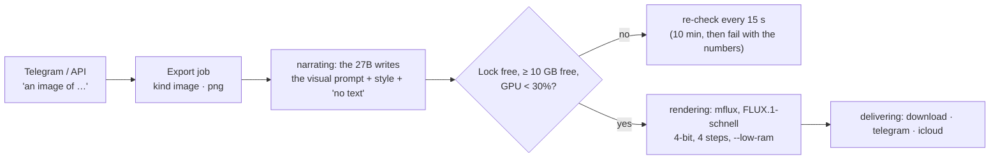

# Image Generation Implementation Plan

> **For agentic workers:** REQUIRED SUB-SKILL: Use superpowers:subagent-driven-development (recommended) or superpowers:executing-plans to implement this plan task-by-task. Steps use checkbox (`- [ ]`) syntax for tracking.

**Goal:** Text-to-image as a new export kind (`image` / `png`), drawn locally by FLUX.1-schnell through `mflux`, one process per image behind a memory and GPU gate, delivered like any export.

**Architecture:** Three small services (presets, prompt builder, generator) plus system helpers; the export job store gains image fields; the export API validates and dispatches image jobs to their own runner, which shares the job store, delivery and retention with documents. An MCP tool `create_image` exposes it to Hermes. A setup script installs `mflux` in `.venv-image` and saves a quantized model under `data/models/`.

**Tech Stack:** TypeScript ESM (Node16, strict), Express, better-sqlite3, Jest (ESM), `yaml`, zod (MCP), bash, `uv` (Python venv), `mflux` (MLX).

**Spec:** `docs/superpowers/specs/2026-10-04-image-generation-design.md`

**Worktree:** `.worktrees/image-generation`, branch `feature/image-generation`. Run every command there.

## Global Constraints

- Every model call stays local; only the one-time model download touches the network.
- Model: FLUX.1-schnell (Apache-2.0). FLUX.1-dev is excluded (non-commercial licence).
- Every final prompt ends with: `no text, no letters, no words, no logos, no watermark`.
- One image at a time; gate before every start: free memory ≥ `resources.image.min_free_gb` and GPU < 30% (`GPU_BUSY_PERCENT` from `src/services/health.ts`); re-check every 15 s; give up after `wait_minutes`.
- Limits live in `config/host.yaml` `resources.image`: `min_free_gb: 10`, `wait_minutes: 10`, `timeout_seconds: 300`, `steps: 4`, `quantize: 4`.
- Sizes (multiples of 16, no cropping): `square` 1088×1088, `portrait` 1088×1360, `linkedin` 1200×624, `slide` 1280×720.
- `prompt` 1–1,000 characters; `png` only with `image` and `image` only with `png`; images do not require an audience (omitted → stored `internal`); documents still require one.
- Image filenames never contain the audience.
- Tests never spawn `mflux`, download a model, read live memory/GPU, touch `data/` or the live job database. Spawning a trivial local `sh` in a temp context is allowed.
- No `any`; `unknown` + guards; kebab-case files; comments in English; ESM imports end in `.js`.
- Run `npm run typecheck` after every code change; `npm run typecheck:tests` before each commit that touches tests.
- Commit prefixes: `feat:` `fix:` `test:` `docs:`; end every commit message with `Co-Authored-By: Claude Opus 5.5 <noreply@anthropic.com>`.

## Plan-level refinements of the spec (recorded, decided)

1. **MCP:** a dedicated tool `create_image` instead of widening `create_artifact`: a model reads one clear schema per job, and `create_artifact`'s required `audience` stays required. The scheduled-runs server (`pharmaitchat_cron`) excludes it: no image is drawn by a cron job.
2. **Chat:** the web chat's renderer (`public/app.js` `formatMessage`) draws no images or links, and the download route is behind the API token, so the web chat does not get image wording in piece 1. Images are requested from Telegram (Hermes picks `create_image`, `destination: telegram` sends the PNG to the chat) or the API. The web chat gets images with piece 2, which needs a UI for documents anyway. The spec's "chat and Hermes recognise image wording" is satisfied for Hermes by the tool description.
3. **Model folder:** `data/models/flux-schnell-<quantize>bit` (`flux-schnell-4bit` by default), so changing `quantize` means re-running setup into a new folder rather than mixing weights.

## Review Focus

1. A prompt containing quotes, newlines or shell metacharacters must reach `mflux` as one argv element, never through a shell (spawn without `shell: true`). Pinned in Task 5 (`mfluxArgs` keeps the prompt as one element) and Task 4 (`runProcess` uses `spawn` with an args array).
2. A crashed app leaves `data/run/image.lock` behind; the next image must take it over, not wait forever. Pinned in Task 4 (stale-pid takeover test).
3. The 27B prompt expansion failing or returning an empty string must not fail the image; it falls back to the user's prompt. Pinned in Task 3.
4. `mflux` writes no file or a truncated file with exit 0: the job fails with `bad image output`, never delivers garbage. Pinned in Task 5.
5. A document request that says `format: "png"`, or an image request with `format: "pdf"`, is a 400 up front. Pinned in Task 7.

---

### Task 1: Image limits in the host profile

**Files:**
- Modify: `src/platform/host-config.ts` (interface `HostResources`, `parseHostConfig`)
- Modify: `config/host.yaml` (`resources:` block)
- Modify: `__tests__/fixtures/host.yaml` (`resources:` block)
- Modify: `scripts/lib/host-env.ts` (export `IMAGE_QUANTIZE`)
- Test: `__tests__/host-config.test.ts`, `__tests__/host-config-live-file.test.ts`, `__tests__/host-env.test.ts`

**Interfaces:**
- Produces: `HostResources.image: { minFreeGb: number; waitMinutes: number; timeoutSeconds: number; steps: number; quantize: number }`; shell export `IMAGE_QUANTIZE`.

- [ ] **Step 1: Write the failing tests**

In `__tests__/host-config.test.ts`, inside `describe("parseHostConfig", …)`, after the first `it`:

```ts
  // Image generation (2026-10-04): FLUX.1-schnell runs next to the 27B, so its
  // gate and limits are machine-sized like every other resource
  it("reads the image limits, and refuses a quantize mflux cannot use", () => {
    const host = parseHostConfig(fixture, "fixture.yaml");
    expect(host.resources.image).toEqual({ minFreeGb: 10, waitMinutes: 10, timeoutSeconds: 300, steps: 4, quantize: 4 });
    expect(problemsOf(fixture.replace("quantize: 4", "quantize: 5"))).toEqual([
      "resources.image.quantize must be one of 3, 4, 6, 8, got 5",
    ]);
    expect(problemsOf(fixture.replace(/^  image: .*\n/m, ""))).toEqual(["resources.image is missing or not a mapping"]);
  });
```

In `__tests__/host-config-live-file.test.ts`, extend the `toEqual` in "keeps the 2026-09-28/29 memory limits":

```ts
      ollama: { numParallel: 1 },
      image: { minFreeGb: 10, waitMinutes: 10, timeoutSeconds: 300, steps: 4, quantize: 4 },
```

In `__tests__/host-env.test.ts`, add `"IMAGE_QUANTIZE"` to the names list of the first test and `"IMAGE_QUANTIZE=4",` to its expected lines (keep the existing order the test uses: names are printed in the order requested).

- [ ] **Step 2: Run them to verify they fail**

Run: `npm test -- __tests__/host-config.test.ts __tests__/host-config-live-file.test.ts __tests__/host-env.test.ts`
Expected: FAIL (`host.resources.image` undefined; `IMAGE_QUANTIZE` empty).

- [ ] **Step 3: Implement**

`src/platform/host-config.ts`: add to `HostResources`:

```ts
  image: { minFreeGb: number; waitMinutes: number; timeoutSeconds: number; steps: number; quantize: number };
```

In `parseHostConfig`, next to the other `section(res, …)` calls:

```ts
  const image = section(res, "image", "resources.", problems);
```

and in the `resources` object literal, after `ollama`:

```ts
    image: {
      minFreeGb: readPositive(image, "min_free_gb", "resources.image", problems),
      waitMinutes: readPositive(image, "wait_minutes", "resources.image", problems),
      timeoutSeconds: readPositive(image, "timeout_seconds", "resources.image", problems),
      steps: readPositive(image, "steps", "resources.image", problems),
      quantize: readQuantize(image, problems),
    },
```

and above `parseHostConfig`:

```ts
// mflux quantizes FLUX to 3, 4, 6 or 8 bits; anything else fails at setup time
const QUANTIZE_BITS = [3, 4, 6, 8];
function readQuantize(raw: Record<string, unknown>, problems: string[]): number {
  const value = raw.quantize;
  if (typeof value === "number" && QUANTIZE_BITS.includes(value)) return value;
  problems.push(`resources.image.quantize must be one of ${QUANTIZE_BITS.join(", ")}, got ${JSON.stringify(value)}`);
  return 0;
}
```

`config/host.yaml`, at the end of `resources:`:

```yaml
  image:
    # Text to image (FLUX.1-schnell via mflux), one process per image next to the
    # 27B. A job starts only with this much free memory (vm_stat free + inactive
    # + purgeable) and the GPU under 30% busy; set from the first measured peak.
    min_free_gb: 10
    # How long a job waits for that gate before failing with the numbers.
    wait_minutes: 10
    # The image process is killed (whole process group) after this.
    timeout_seconds: 300
    # FLUX.1-schnell is distilled for 4 steps.
    steps: 4
    # Bits of the saved model (data/models/flux-schnell-<quantize>bit); changing
    # it means re-running scripts/setup-image-model.sh.
    quantize: 4
```

`__tests__/fixtures/host.yaml`, at the end of `resources:`:

```yaml
  image: { min_free_gb: 10, wait_minutes: 10, timeout_seconds: 300, steps: 4, quantize: 4 }
```

`scripts/lib/host-env.ts`, in the returned array after `["OMLX_CACHE_MAX_GB", r.omlx.ssdCacheMaxGb],`:

```ts
    ["IMAGE_QUANTIZE", r.image.quantize],
```

- [ ] **Step 4: Run tests and typecheck**

Run: `npm test -- __tests__/host-config.test.ts __tests__/host-config-live-file.test.ts __tests__/host-env.test.ts && npm run typecheck`
Expected: PASS, no type errors.

- [ ] **Step 5: Commit**

```bash
git add src/platform/host-config.ts config/host.yaml __tests__/fixtures/host.yaml scripts/lib/host-env.ts __tests__/host-config.test.ts __tests__/host-config-live-file.test.ts __tests__/host-env.test.ts
git commit -m "feat: image generation limits in the host profile

Co-Authored-By: Claude Opus 5.5 <noreply@anthropic.com>"
```

---

### Task 2: Style presets and sizes

**Files:**
- Create: `src/services/image-presets.ts`
- Create: `config/image-presets.yaml`
- Test: `__tests__/image-presets.test.ts`

**Interfaces:**
- Produces: `IMAGE_SIZES: Record<ImageSize, { width: number; height: number }>`, `type ImageSize = "square" | "portrait" | "linkedin" | "slide"`, `isImageSize(v: unknown): v is ImageSize`, `interface ImagePreset { name: string; style: string }`, `parseImagePresets(yaml: string): Map<string, ImagePreset>`, `loadImagePresets(root?: string): Map<string, ImagePreset>`, `IMAGE_PRESETS_FILE = "config/image-presets.yaml"`.

- [ ] **Step 1: Write the failing test**

`__tests__/image-presets.test.ts`:

```ts
import { describe, expect, it } from "@jest/globals";
import { IMAGE_SIZES, isImageSize, loadImagePresets, parseImagePresets } from "../src/services/image-presets.js";

// Style presets are phrases appended to an image prompt; sizes are the
// platform specs rounded to multiples of 16 (FLUX's constraint), never cropped.

describe("image sizes", () => {
  it("are the four presets, every side a multiple of 16", () => {
    expect(IMAGE_SIZES).toEqual({
      square: { width: 1088, height: 1088 },
      portrait: { width: 1088, height: 1360 },
      linkedin: { width: 1200, height: 624 },
      slide: { width: 1280, height: 720 },
    });
    for (const { width, height } of Object.values(IMAGE_SIZES)) {
      expect(width % 16).toBe(0);
      expect(height % 16).toBe(0);
    }
    expect(isImageSize("slide")).toBe(true);
    expect(isImageSize("banner")).toBe(false);
  });
});

describe("parseImagePresets", () => {
  it("reads named style phrases and always has 'none'", () => {
    const presets = parseImagePresets('presets:\n  photo:\n    style: "photorealistic, natural light"\n');
    expect([...presets.keys()].sort()).toEqual(["none", "photo"]);
    expect(presets.get("none")).toEqual({ name: "none", style: "" });
    expect(presets.get("photo")).toEqual({ name: "photo", style: "photorealistic, natural light" });
  });

  it("refuses a bad name, a missing style, or a redefined 'none'", () => {
    expect(() => parseImagePresets("presets:\n  Photo!:\n    style: x\n")).toThrow('config/image-presets.yaml: preset name "Photo!" must be lowercase letters, digits and dashes');
    expect(() => parseImagePresets("presets:\n  photo: {}\n")).toThrow("config/image-presets.yaml: presets.photo.style must be a non-empty string");
    expect(() => parseImagePresets("presets:\n  none:\n    style: x\n")).toThrow("config/image-presets.yaml: 'none' is built in");
    expect(() => parseImagePresets("- photo\n")).toThrow("config/image-presets.yaml: presets must be a mapping");
  });

  it("parses the committed config/image-presets.yaml with house, photo, abstract and brand", () => {
    expect([...loadImagePresets().keys()].sort()).toEqual(["abstract", "brand", "house", "none", "photo"]);
  });
});
```

- [ ] **Step 2: Run it to verify it fails**

Run: `npm test -- __tests__/image-presets.test.ts`
Expected: FAIL (cannot find module `image-presets.js`).

- [ ] **Step 3: Implement**

`src/services/image-presets.ts`:

```ts
// Style presets and sizes for generated images (spec 2026-10-04).
//
// A preset is a style phrase appended to the prompt; "none" is built in and
// adds nothing. Sizes are the platform specs rounded to multiples of 16, which
// FLUX requires, so no image is ever cropped and no image library is needed.

import { readFileSync } from "node:fs";
import { join } from "node:path";
import { parse } from "yaml";

export const IMAGE_PRESETS_FILE = "config/image-presets.yaml";

export const IMAGE_SIZES = {
  square: { width: 1088, height: 1088 }, // LinkedIn feed post, spec 1080 × 1080
  portrait: { width: 1088, height: 1360 }, // LinkedIn 4:5, spec 1080 × 1350
  linkedin: { width: 1200, height: 624 }, // LinkedIn landscape, spec 1200 × 627
  slide: { width: 1280, height: 720 }, // 16:9 PowerPoint
} as const;

export type ImageSize = keyof typeof IMAGE_SIZES;

export function isImageSize(value: unknown): value is ImageSize {
  return typeof value === "string" && Object.prototype.hasOwnProperty.call(IMAGE_SIZES, value);
}

export interface ImagePreset {
  name: string;
  style: string;
}

function isRecord(value: unknown): value is Record<string, unknown> {
  return typeof value === "object" && value !== null && !Array.isArray(value);
}

export function parseImagePresets(yaml: string): Map<string, ImagePreset> {
  const fail = (message: string): never => {
    throw new Error(`${IMAGE_PRESETS_FILE}: ${message}`);
  };
  const doc: unknown = parse(yaml) ?? {};
  const raw = isRecord(doc) ? doc.presets ?? {} : null;
  if (!isRecord(raw)) return fail("presets must be a mapping");
  const presets = new Map<string, ImagePreset>([["none", { name: "none", style: "" }]]);
  for (const [name, entry] of Object.entries(raw)) {
    if (name === "none") fail("'none' is built in");
    if (!/^[a-z0-9-]+$/.test(name)) fail(`preset name ${JSON.stringify(name)} must be lowercase letters, digits and dashes`);
    const style = isRecord(entry) && typeof entry.style === "string" ? entry.style.trim() : "";
    if (style === "") fail(`presets.${name}.style must be a non-empty string`);
    presets.set(name, { name, style });
  }
  return presets;
}

export function loadImagePresets(root: string = process.cwd()): Map<string, ImagePreset> {
  return parseImagePresets(readFileSync(join(root, IMAGE_PRESETS_FILE), "utf-8"));
}
```

`config/image-presets.yaml`:

```yaml
# Style presets for generated images: each style phrase is appended to the
# prompt (after the 27B's expansion), followed by "no text, no letters, ...".
# "none" is built in and adds nothing. Edit freely; add your own presets.
# Words, numbers and logos never come from the image model: decks and PDFs
# render all text themselves.
presets:
  house:
    style: "clean modern corporate illustration, flat vector shapes, palette of deep navy, teal and warm grey, generous empty space, soft shadows"
  photo:
    style: "photorealistic editorial photograph, natural light, shallow depth of field, 35mm lens, high detail"
  abstract:
    style: "abstract technology background, flowing data streams, soft light and geometric shapes, low contrast, dark blue tones, wide empty areas"
  # Describe your employer's palette and mood in words (colours by name or hex).
  brand:
    style: "professional corporate look, restrained palette of navy, white and one bright accent colour, clean composition, calm and confident mood"
```

- [ ] **Step 4: Run test and typecheck**

Run: `npm test -- __tests__/image-presets.test.ts && npm run typecheck`
Expected: PASS.

- [ ] **Step 5: Commit**

```bash
git add src/services/image-presets.ts config/image-presets.yaml __tests__/image-presets.test.ts
git commit -m "feat: image style presets and platform sizes

Co-Authored-By: Claude Opus 5.5 <noreply@anthropic.com>"
```

---

### Task 3: Prompt builder

**Files:**
- Create: `src/services/image-prompt.ts`
- Test: `__tests__/image-prompt.test.ts`

**Interfaces:**
- Consumes: `ImagePreset` (Task 2).
- Produces: `NO_TEXT: string`, `MAX_PROMPT_CHARS = 1000`, `type CompleteFn = (prompt: string, maxTokens: number) => Promise<string>`, `buildImagePrompt(input: { prompt: string; preset: ImagePreset; raw: boolean }, complete: CompleteFn): Promise<string>`.

- [ ] **Step 1: Write the failing test**

`__tests__/image-prompt.test.ts`:

```ts
import { describe, expect, it } from "@jest/globals";
import { NO_TEXT, buildImagePrompt, type CompleteFn } from "../src/services/image-prompt.js";

// The 27B turns a short request into a visual prompt; the preset's style and
// the no-text clause are added by code, so they are there whatever the model says.

const photo = { name: "photo", style: "photorealistic editorial photograph" };
const none = { name: "none", style: "" };

function model(reply: string | Error) {
  const prompts: string[] = [];
  const complete: CompleteFn = async (prompt) => {
    prompts.push(prompt);
    if (reply instanceof Error) throw reply;
    return reply;
  };
  return { complete, prompts };
}

describe("buildImagePrompt", () => {
  it("expands with the 27B, then appends the preset style and the no-text clause", async () => {
    const m = model('  "A modern pharma plant at dawn, robots on a clean line"\n');
    const out = await buildImagePrompt({ prompt: "AI in pharma manufacturing", preset: photo, raw: false }, m.complete);
    expect(out).toBe(`A modern pharma plant at dawn, robots on a clean line, photorealistic editorial photograph, ${NO_TEXT}`);
    expect(m.prompts).toHaveLength(1);
    expect(m.prompts[0]).toContain("AI in pharma manufacturing");
  });

  it("raw: no model call, the prompt as written plus style and no-text", async () => {
    const m = model("unused");
    const out = await buildImagePrompt({ prompt: "a lab bench", preset: none, raw: true }, m.complete);
    expect(out).toBe(`a lab bench, ${NO_TEXT}`);
    expect(m.prompts).toEqual([]);
    expect(NO_TEXT).toBe("no text, no letters, no words, no logos, no watermark");
  });

  // Review focus 3: an expansion failure must not cost the image
  it("falls back to the user's prompt when the expansion fails or comes back empty", async () => {
    expect(await buildImagePrompt({ prompt: "a lab bench", preset: none, raw: false }, model(new Error("stack down")).complete)).toBe(`a lab bench, ${NO_TEXT}`);
    expect(await buildImagePrompt({ prompt: "a lab bench", preset: none, raw: false }, model("   ").complete)).toBe(`a lab bench, ${NO_TEXT}`);
  });

  it("trims a long expansion but never the style or the no-text clause", async () => {
    const out = await buildImagePrompt({ prompt: "x", preset: photo, raw: false }, model("word ".repeat(600)).complete);
    expect(out.length).toBeLessThanOrEqual(1500);
    expect(out.endsWith(`photorealistic editorial photograph, ${NO_TEXT}`)).toBe(true);
  });
});
```

- [ ] **Step 2: Run it to verify it fails**

Run: `npm test -- __tests__/image-prompt.test.ts`
Expected: FAIL (module not found).

- [ ] **Step 3: Implement**

`src/services/image-prompt.ts`:

```ts
// The final prompt for one image: the 27B's visual expansion of the user's
// request (unless raw), then the preset's style, then the no-text clause.
// Style and clause are appended by code so no model reply can drop them.
// Diffusion models garble words and numbers: text belongs to the documents.

import type { ImagePreset } from "./image-presets.js";

export const NO_TEXT = "no text, no letters, no words, no logos, no watermark";
export const MAX_PROMPT_CHARS = 1000;
// FLUX reads about 500 tokens of prompt; past that, words are ignored anyway
const MAX_FINAL_CHARS = 1500;

export type CompleteFn = (prompt: string, maxTokens: number) => Promise<string>;

function expansionPrompt(request: string): string {
  return `Rewrite this image request as one detailed visual description for an image generator: subject, setting, composition, lighting, colours. One paragraph, at most 80 words, no lists. Describe only what is seen. Never ask for text, words, numbers, labels or logos in the image.

Request: ${request}`;
}

function clean(text: string): string {
  return text.replace(/\s+/g, " ").trim().replace(/^["'“”]+|["'“”]+$/g, "").trim();
}

export async function buildImagePrompt(input: { prompt: string; preset: ImagePreset; raw: boolean }, complete: CompleteFn): Promise<string> {
  const request = clean(input.prompt);
  let base = request;
  if (!input.raw) {
    try {
      base = clean(await complete(expansionPrompt(request), 200)) || request;
    } catch {
      // The image is still worth drawing from the user's own words
      base = request;
    }
  }
  const tail = [input.preset.style, NO_TEXT].filter((part) => part !== "").join(", ");
  const room = MAX_FINAL_CHARS - tail.length - 2;
  const trimmed = base.length > room ? base.slice(0, room).replace(/\s+\S*$/, "") : base;
  return `${trimmed}, ${tail}`;
}
```

- [ ] **Step 4: Run test and typecheck**

Run: `npm test -- __tests__/image-prompt.test.ts && npm run typecheck`
Expected: PASS.

- [ ] **Step 5: Commit**

```bash
git add src/services/image-prompt.ts __tests__/image-prompt.test.ts
git commit -m "feat: image prompt builder (27B expansion, preset style, no-text clause)

Co-Authored-By: Claude Opus 5.5 <noreply@anthropic.com>"
```

---

### Task 4: System helpers (memory, lock, process, PNG, time stats)

**Files:**
- Create: `src/services/image-system.ts`
- Test: `__tests__/image-system.test.ts`

**Interfaces:**
- Produces:
  - `parseFreeGb(vmStat: string): number`
  - `readFreeMemoryGb(): Promise<number>` (live: runs `vm_stat`)
  - `parsePeakBytes(stderr: string): number | null`
  - `toolError(stderr: string): string`
  - `pngDimensions(png: Buffer): { width: number; height: number } | null`
  - `interface ImageLock { acquire(): boolean; release(): void }`
  - `fileLock(path: string, isAlive?: (pid: number) => boolean): ImageLock`
  - `interface ProcessResult { code: number | null; signal: string | null; stderr: string; timedOut: boolean }`
  - `runProcess(cmd: string, args: string[], timeoutMs: number): Promise<ProcessResult>`
  - `imageModelPath(root: string, quantize: number): string`, `mfluxBinary(root: string): string`

- [ ] **Step 1: Write the failing test**

`__tests__/image-system.test.ts`:

```ts
import { afterEach, describe, expect, it } from "@jest/globals";
import { existsSync, mkdtempSync, readFileSync, rmSync, writeFileSync } from "node:fs";
import { tmpdir } from "node:os";
import { join } from "node:path";
import {
  fileLock,
  imageModelPath,
  mfluxBinary,
  parseFreeGb,
  parsePeakBytes,
  pngDimensions,
  runProcess,
  toolError,
} from "../src/services/image-system.js";

// The pieces the image generator reads the machine through. Live readers
// (vm_stat, ioreg, mflux) are never called here: parsers get captured text,
// the process runner gets a trivial local `sh`.

const dirs: string[] = [];
afterEach(() => {
  for (const dir of dirs.splice(0)) rmSync(dir, { recursive: true, force: true });
});
const temp = () => {
  const dir = mkdtempSync(join(tmpdir(), "image-system-"));
  dirs.push(dir);
  return dir;
};

const VM_STAT = `Mach Virtual Memory Statistics: (page size of 16384 bytes)
Pages free:                               65536.
Pages active:                            900000.
Pages inactive:                          131072.
Pages speculative:                         1000.
Pages purgeable:                          65536.
`;

const TIME_STDERR = `loading model
Error: something broke in mflux
        42.17 real        30.01 user         5.02 sys
          7516192768  maximum resident set size
                   0  average shared memory size
`;

function png(width: number, height: number): Buffer {
  const header = Buffer.from([0x89, 0x50, 0x4e, 0x47, 0x0d, 0x0a, 0x1a, 0x0a, 0, 0, 0, 13, 0x49, 0x48, 0x44, 0x52]);
  const dims = Buffer.alloc(8);
  dims.writeUInt32BE(width, 0);
  dims.writeUInt32BE(height, 4);
  return Buffer.concat([header, dims, Buffer.alloc(16)]);
}

describe("parsers", () => {
  it("free memory counts free + inactive + purgeable pages at the stated page size", () => {
    // (65536 + 131072 + 65536) × 16384 bytes = 4 GiB
    expect(parseFreeGb(VM_STAT)).toBeCloseTo(4, 5);
  });

  it("reads peak memory and the tool's own last error line from /usr/bin/time -l output", () => {
    expect(parsePeakBytes(TIME_STDERR)).toBe(7516192768);
    expect(parsePeakBytes("no stats")).toBeNull();
    expect(toolError(TIME_STDERR)).toBe("Error: something broke in mflux");
    expect(toolError("")).toBe("no error output");
  });

  it("reads a PNG's size from its header, and nothing from a non-PNG or truncated file", () => {
    expect(pngDimensions(png(1088, 1360))).toEqual({ width: 1088, height: 1360 });
    expect(pngDimensions(Buffer.from("not a png at all, not at all"))).toBeNull();
    expect(pngDimensions(png(1088, 1088).subarray(0, 20))).toBeNull();
  });

  it("names the model folder after its quantization and the venv's mflux-generate", () => {
    expect(imageModelPath("/r", 4)).toBe("/r/data/models/flux-schnell-4bit");
    expect(mfluxBinary("/r")).toBe("/r/.venv-image/bin/mflux-generate");
  });
});

describe("fileLock", () => {
  it("is held by one owner at a time and released", () => {
    const path = join(temp(), "image.lock");
    const a = fileLock(path, () => true);
    const b = fileLock(path, () => true);
    expect(a.acquire()).toBe(true);
    expect(readFileSync(path, "utf-8").trim()).toBe(String(process.pid));
    expect(b.acquire()).toBe(false);
    a.release();
    expect(existsSync(path)).toBe(false);
    expect(b.acquire()).toBe(true);
    b.release();
  });

  // Review focus 2: a crash leaves the file behind
  it("takes over a lock whose owner is dead", () => {
    const path = join(temp(), "image.lock");
    writeFileSync(path, "999999\n");
    expect(fileLock(path, (pid) => pid !== 999999).acquire()).toBe(true);
  });
});

describe("runProcess", () => {
  // Review focus 1: args are argv elements, never shell text
  it("passes each argument as-is, collects stderr and the exit code", async () => {
    const result = await runProcess("/bin/sh", ["-c", 'printf "%s" "$1" >&2; exit 3', "sh", `quote " ; $(rm -rf /) end`], 5000);
    expect(result).toEqual({ code: 3, signal: null, stderr: `quote " ; $(rm -rf /) end`, timedOut: false });
  });

  it("kills the whole process group at the timeout", async () => {
    const result = await runProcess("/bin/sh", ["-c", "sleep 30 & sleep 30"], 300);
    expect(result.timedOut).toBe(true);
    expect(result.code).toBeNull();
  });
});
```

- [ ] **Step 2: Run it to verify it fails**

Run: `npm test -- __tests__/image-system.test.ts`
Expected: FAIL (module not found).

- [ ] **Step 3: Implement**

`src/services/image-system.ts`:

```ts
// How the image generator reads and drives the machine: free memory, a lock
// shared by every process that may draw, the mflux process itself, and the
// checks on what it produced. Kept apart from the generator so the generator
// can be tested with fakes and these with captured text.

import { execFile, spawn } from "node:child_process";
import { closeSync, openSync, readFileSync, unlinkSync, writeSync } from "node:fs";
import { join } from "node:path";

const GIB = 1024 ** 3;

export function imageModelPath(root: string, quantize: number): string {
  return join(root, "data", "models", `flux-schnell-${quantize}bit`);
}

export function mfluxBinary(root: string): string {
  return join(root, ".venv-image", "bin", "mflux-generate");
}

/** GiB the system can hand out now: free + inactive + purgeable pages (vm_stat). */
export function parseFreeGb(vmStat: string): number {
  const pageSize = Number(/page size of (\d+) bytes/.exec(vmStat)?.[1] ?? 16384);
  const pages = (label: string) => Number(new RegExp(`Pages ${label}:\\s+(\\d+)`).exec(vmStat)?.[1] ?? 0);
  return ((pages("free") + pages("inactive") + pages("purgeable")) * pageSize) / GIB;
}

export function readFreeMemoryGb(): Promise<number> {
  return new Promise((resolveGb, reject) => {
    execFile("vm_stat", [], { timeout: 3000 }, (err, stdout) => (err ? reject(err) : resolveGb(parseFreeGb(stdout))));
  });
}

// /usr/bin/time -l appends "  <n>  maximum resident set size" (bytes on macOS)
export function parsePeakBytes(stderr: string): number | null {
  const match = /^\s*(\d+)\s+maximum resident set size/m.exec(stderr);
  return match ? Number(match[1]) : null;
}

/** The tool's own last stderr line, before /usr/bin/time's statistics. */
export function toolError(stderr: string): string {
  const lines = stderr.split("\n");
  const statsAt = lines.findIndex((line) => /^\s*[\d.]+ real\s/.test(line));
  const own = (statsAt >= 0 ? lines.slice(0, statsAt) : lines).map((l) => l.trim()).filter((l) => l !== "");
  return own.at(-1) ?? "no error output";
}

const PNG_SIGNATURE = Buffer.from([0x89, 0x50, 0x4e, 0x47, 0x0d, 0x0a, 0x1a, 0x0a]);

export function pngDimensions(png: Buffer): { width: number; height: number } | null {
  if (png.length < 24 || !png.subarray(0, 8).equals(PNG_SIGNATURE) || png.toString("ascii", 12, 16) !== "IHDR") return null;
  return { width: png.readUInt32BE(16), height: png.readUInt32BE(20) };
}

export interface ImageLock {
  acquire(): boolean;
  release(): void;
}

function processAlive(pid: number): boolean {
  try {
    process.kill(pid, 0);
    return true;
  } catch {
    return false;
  }
}

/** One drawer at a time across the app and the scripts; a dead owner's lock is taken over. */
export function fileLock(path: string, isAlive: (pid: number) => boolean = processAlive): ImageLock {
  let held = false;
  const create = (): boolean => {
    try {
      const fd = openSync(path, "wx");
      writeSync(fd, `${process.pid}\n`);
      closeSync(fd);
      return true;
    } catch {
      return false;
    }
  };
  return {
    acquire() {
      if (held) return true;
      if (create()) return (held = true);
      let owner = Number.NaN;
      try {
        owner = Number(readFileSync(path, "utf-8").trim());
      } catch {
        // Gone between our attempt and this read: try once more below
      }
      if (Number.isInteger(owner) && owner > 0 && isAlive(owner)) return false;
      try {
        unlinkSync(path);
      } catch {
        // Another process took it over first
      }
      return (held = create());
    },
    release() {
      if (!held) return;
      held = false;
      try {
        unlinkSync(path);
      } catch {
        // Already gone
      }
    },
  };
}

export interface ProcessResult {
  code: number | null;
  signal: string | null;
  stderr: string;
  timedOut: boolean;
}

/**
 * Runs cmd with args as argv (never through a shell), in its own process
 * group, and kills the whole group at the timeout so no child outlives it.
 */
export function runProcess(cmd: string, args: string[], timeoutMs: number): Promise<ProcessResult> {
  return new Promise((resolveResult) => {
    const child = spawn(cmd, args, { detached: true, stdio: ["ignore", "ignore", "pipe"] });
    let stderr = "";
    let timedOut = false;
    child.stderr.on("data", (chunk: Buffer) => {
      stderr += chunk.toString("utf-8");
    });
    const timer = setTimeout(() => {
      timedOut = true;
      try {
        if (child.pid !== undefined) process.kill(-child.pid, "SIGKILL");
      } catch {
        // Already exited
      }
    }, timeoutMs);
    child.on("close", (code, signal) => {
      clearTimeout(timer);
      resolveResult({ code: timedOut ? null : code, signal: timedOut ? null : signal, stderr, timedOut });
    });
    child.on("error", (err) => {
      clearTimeout(timer);
      resolveResult({ code: null, signal: null, stderr: err.message, timedOut: false });
    });
  });
}
```

- [ ] **Step 4: Run test and typecheck**

Run: `npm test -- __tests__/image-system.test.ts && npm run typecheck`
Expected: PASS.

- [ ] **Step 5: Commit**

```bash
git add src/services/image-system.ts __tests__/image-system.test.ts
git commit -m "feat: image system helpers (free memory, lock, process group, PNG and time-stat checks)

Co-Authored-By: Claude Opus 5.5 <noreply@anthropic.com>"
```

---

### Task 5: Generator (gate, draw, checks, log)

**Files:**
- Create: `src/services/image-generator.ts`
- Test: `__tests__/image-generator.test.ts`

**Interfaces:**
- Consumes: `ImageLock`, `ProcessResult`, `parsePeakBytes`, `toolError`, `pngDimensions` (Task 4); `GPU_BUSY_PERCENT` from `src/services/health.ts`; `HostResources["image"]` (Task 1).
- Produces:
  - `interface ImageSpec { jobId: string; prompt: string; preset: string; size: string; width: number; height: number; seed: number; outputPath: string }`
  - `interface GeneratedImage { png: Buffer; ms: number; peakBytes: number | null }`
  - `interface GeneratorDeps { limits: { minFreeGb: number; waitMinutes: number; timeoutSeconds: number; steps: number }; modelPath: string; mfluxBin: string; freeMemoryGb(): Promise<number>; gpuBusyPercent(): Promise<number | null>; lock: ImageLock; run(cmd: string, args: string[], timeoutMs: number): Promise<ProcessResult>; readFile(path: string): Promise<Buffer>; sleep(ms: number): Promise<void>; now(): number; log(line: string): void }`
  - `mfluxArgs(spec: ImageSpec, deps: Pick<GeneratorDeps, "limits" | "modelPath" | "mfluxBin">): string[]`
  - `generateImage(spec: ImageSpec, deps: GeneratorDeps): Promise<GeneratedImage>`

- [ ] **Step 1: Write the failing test**

`__tests__/image-generator.test.ts`:

```ts
import { describe, expect, it } from "@jest/globals";
import { generateImage, mfluxArgs, type GeneratorDeps, type ImageSpec } from "../src/services/image-generator.js";
import type { ProcessResult } from "../src/services/image-system.js";

// The generator with every machine reading faked: no mflux, no vm_stat, no ioreg.

const SPEC: ImageSpec = {
  jobId: "job-1",
  prompt: 'a lab "bench"; $(echo hi)',
  preset: "photo",
  size: "square",
  width: 1088,
  height: 1088,
  seed: 42,
  outputPath: "/work/job-1.png",
};

function png(width: number, height: number): Buffer {
  const header = Buffer.from([0x89, 0x50, 0x4e, 0x47, 0x0d, 0x0a, 0x1a, 0x0a, 0, 0, 0, 13, 0x49, 0x48, 0x44, 0x52]);
  const dims = Buffer.alloc(8);
  dims.writeUInt32BE(width, 0);
  dims.writeUInt32BE(height, 4);
  return Buffer.concat([header, dims, Buffer.alloc(16)]);
}

const OK_RUN: ProcessResult = { code: 0, signal: null, stderr: "        40.0 real\n  7000000000  maximum resident set size\n", timedOut: false };

function harness(over: { free?: number[]; gpu?: Array<number | null>; lockFree?: boolean[]; run?: ProcessResult; file?: Buffer | Error } = {}) {
  let clock = 0;
  const free = [...(over.free ?? [32])];
  const gpu = [...(over.gpu ?? [5])];
  const lockFree = [...(over.lockFree ?? [true])];
  const calls: Array<{ cmd: string; args: string[]; timeoutMs: number }> = [];
  const logs: string[] = [];
  let held = false;
  let releases = 0;
  const deps: GeneratorDeps = {
    limits: { minFreeGb: 10, waitMinutes: 1, timeoutSeconds: 300, steps: 4 },
    modelPath: "/models/flux-schnell-4bit",
    mfluxBin: "/venv/bin/mflux-generate",
    freeMemoryGb: async () => (free.length > 1 ? free.shift()! : free[0]),
    gpuBusyPercent: async () => (gpu.length > 1 ? gpu.shift()! : gpu[0]),
    lock: {
      acquire: () => {
        const ok = lockFree.length > 1 ? lockFree.shift()! : lockFree[0];
        if (ok) held = true;
        return ok;
      },
      release: () => {
        if (held) releases++;
        held = false;
      },
    },
    run: async (cmd, args, timeoutMs) => {
      calls.push({ cmd, args, timeoutMs });
      clock += 40_000;
      return over.run ?? OK_RUN;
    },
    readFile: async () => {
      const file = over.file ?? png(1088, 1088);
      if (file instanceof Error) throw file;
      return file;
    },
    sleep: async (ms) => {
      clock += ms;
    },
    now: () => clock,
    log: (line) => logs.push(line),
  };
  return { deps, calls, logs, releases: () => releases, held: () => held };
}

describe("mfluxArgs", () => {
  // Review focus 1: the prompt is one argv element, whatever it contains
  it("runs mflux-generate under /usr/bin/time -l with the saved model, steps, size, seed and --low-ram", () => {
    const { deps } = harness();
    expect(mfluxArgs(SPEC, deps)).toEqual([
      "-l",
      "/venv/bin/mflux-generate",
      "--model", "schnell",
      "--path", "/models/flux-schnell-4bit",
      "--prompt", 'a lab "bench"; $(echo hi)',
      "--steps", "4",
      "--seed", "42",
      "--width", "1088",
      "--height", "1088",
      "--output", "/work/job-1.png",
      "--low-ram",
    ]);
  });
});

describe("generateImage", () => {
  it("draws when the gate is open, checks the PNG, logs duration and peak memory, releases the lock", async () => {
    const h = harness();
    const image = await generateImage(SPEC, h.deps);
    expect(image.peakBytes).toBe(7000000000);
    expect(image.ms).toBe(40_000);
    expect(h.calls[0]).toMatchObject({ cmd: "/usr/bin/time", timeoutMs: 300_000 });
    expect(h.releases()).toBe(1);
    const entry = JSON.parse(h.logs[0]) as Record<string, unknown>;
    expect(entry).toMatchObject({ jobId: "job-1", preset: "photo", size: "square", seed: 42, ms: 40000, peakGb: 6.52, outcome: "ok" });
    expect(entry.prompt).toBe(SPEC.prompt);
  });

  it("waits for memory, the GPU and the lock, re-checking every 15 s", async () => {
    // the GPU is read only once the lock is held and memory was read: 0 (with low memory), then 80, then 5
    const h = harness({ lockFree: [false, true, true, true], free: [4, 32, 32], gpu: [0, 80, 5] });
    await generateImage(SPEC, h.deps);
    expect(h.calls).toHaveLength(1);
    // lock busy, then low memory, then GPU busy, then go: three 15 s waits
    expect(h.deps.now()).toBe(45_000 + 40_000);
  });

  it("an unreadable GPU does not block: memory still gates", async () => {
    const h = harness({ gpu: [null] });
    await generateImage(SPEC, h.deps);
    expect(h.calls).toHaveLength(1);
  });

  it("gives up after wait_minutes with the numbers, without drawing", async () => {
    const h = harness({ free: [6.8] });
    await expect(generateImage(SPEC, h.deps)).rejects.toThrow("gave up after 1 min: not enough memory: 6.8 GB free, need 10");
    expect(h.calls).toEqual([]);
    expect(h.releases()).toBeGreaterThan(0);
    expect(h.held()).toBe(false);
  });

  it("reports a timeout, a failed exit with mflux's own error line, and bad output; always releases the lock", async () => {
    const timeout = harness({ run: { code: null, signal: null, stderr: "", timedOut: true } });
    await expect(generateImage(SPEC, timeout.deps)).rejects.toThrow("image model timed out after 300 s");
    expect(timeout.held()).toBe(false);

    const failed = harness({ run: { code: 1, signal: null, stderr: "Error: out of memory\n        3.0 real\n", timedOut: false } });
    await expect(generateImage(SPEC, failed.deps)).rejects.toThrow("image model failed: Error: out of memory");
    expect(JSON.parse(failed.logs[0])).toMatchObject({ outcome: "image model failed: Error: out of memory" });

    // Review focus 4: exit 0 with no file, a non-PNG, or the wrong size
    for (const file of [new Error("ENOENT"), Buffer.from("garbage garbage garbage"), png(1024, 1024)]) {
      const bad = harness({ file });
      await expect(generateImage(SPEC, bad.deps)).rejects.toThrow("bad image output");
      expect(bad.held()).toBe(false);
    }
  });
});
```

- [ ] **Step 2: Run it to verify it fails**

Run: `npm test -- __tests__/image-generator.test.ts`
Expected: FAIL (module not found).

- [ ] **Step 3: Implement**

`src/services/image-generator.ts`:

```ts
// Draws one image with FLUX.1-schnell (mflux), one process per image.
//
// The risk this guards against is the one this Mac has shown: the GPU runs
// out of memory under a burst, the 27B's generation thread dies and every
// request hangs until the watchdog restarts it. So an image starts only when
// it holds the lock, enough memory is free and the GPU is not busy; it waits
// (re-checking every 15 s) up to wait_minutes, then fails with the numbers.
// The process runs under /usr/bin/time -l so every image reports its peak
// memory, which is what min_free_gb gets tuned from.

import { GPU_BUSY_PERCENT } from "./health.js";
import { parsePeakBytes, pngDimensions, toolError, type ImageLock, type ProcessResult } from "./image-system.js";

const RECHECK_MS = 15_000;
const GIB = 1024 ** 3;

export interface ImageSpec {
  jobId: string;
  prompt: string;
  preset: string;
  size: string;
  width: number;
  height: number;
  seed: number;
  outputPath: string;
}

export interface GeneratedImage {
  png: Buffer;
  ms: number;
  peakBytes: number | null;
}

export interface GeneratorDeps {
  limits: { minFreeGb: number; waitMinutes: number; timeoutSeconds: number; steps: number };
  modelPath: string;
  mfluxBin: string;
  freeMemoryGb(): Promise<number>;
  // null when unreadable: the memory gate still applies
  gpuBusyPercent(): Promise<number | null>;
  lock: ImageLock;
  run(cmd: string, args: string[], timeoutMs: number): Promise<ProcessResult>;
  readFile(path: string): Promise<Buffer>;
  sleep(ms: number): Promise<void>;
  now(): number;
  log(line: string): void;
}

/** argv for /usr/bin/time: the prompt stays one element, whatever it contains. */
export function mfluxArgs(spec: ImageSpec, deps: Pick<GeneratorDeps, "limits" | "modelPath" | "mfluxBin">): string[] {
  return [
    "-l",
    deps.mfluxBin,
    "--model", "schnell",
    "--path", deps.modelPath,
    "--prompt", spec.prompt,
    "--steps", String(deps.limits.steps),
    "--seed", String(spec.seed),
    "--width", String(spec.width),
    "--height", String(spec.height),
    "--output", spec.outputPath,
    "--low-ram",
  ];
}

async function draw(spec: ImageSpec, deps: GeneratorDeps): Promise<GeneratedImage> {
  const start = deps.now();
  const result = await deps.run("/usr/bin/time", mfluxArgs(spec, deps), deps.limits.timeoutSeconds * 1000);
  if (result.timedOut) throw new Error(`image model timed out after ${deps.limits.timeoutSeconds} s`);
  if (result.code !== 0) throw new Error(`image model failed: ${toolError(result.stderr)}`);
  let png: Buffer;
  try {
    png = await deps.readFile(spec.outputPath);
  } catch {
    throw new Error("bad image output: no file written");
  }
  const size = pngDimensions(png);
  if (size === null || size.width !== spec.width || size.height !== spec.height) {
    throw new Error(`bad image output: expected a ${spec.width}×${spec.height} PNG`);
  }
  return { png, ms: deps.now() - start, peakBytes: parsePeakBytes(result.stderr) };
}

export async function generateImage(spec: ImageSpec, deps: GeneratorDeps): Promise<GeneratedImage> {
  const deadline = deps.now() + deps.limits.waitMinutes * 60_000;
  const record = (outcome: string, image?: GeneratedImage): void => {
    deps.log(
      JSON.stringify({
        at: new Date().toISOString(),
        jobId: spec.jobId,
        preset: spec.preset,
        size: spec.size,
        seed: spec.seed,
        ms: image?.ms ?? null,
        peakGb: image?.peakBytes != null ? Math.round((image.peakBytes / GIB) * 100) / 100 : null,
        outcome,
        prompt: spec.prompt,
      }),
    );
  };

  for (;;) {
    let reason = "another image is being drawn";
    if (deps.lock.acquire()) {
      try {
        const free = await deps.freeMemoryGb();
        const gpu = await deps.gpuBusyPercent();
        if (free >= deps.limits.minFreeGb && (gpu === null || gpu < GPU_BUSY_PERCENT)) {
          try {
            const image = await draw(spec, deps);
            record("ok", image);
            return image;
          } catch (err) {
            record(err instanceof Error ? err.message : String(err));
            throw err;
          }
        }
        reason =
          free < deps.limits.minFreeGb
            ? `not enough memory: ${free.toFixed(1)} GB free, need ${deps.limits.minFreeGb}`
            : `GPU busy (${gpu}%)`;
      } finally {
        deps.lock.release();
      }
    }
    if (deps.now() >= deadline) throw new Error(`gave up after ${deps.limits.waitMinutes} min: ${reason}`);
    await deps.sleep(RECHECK_MS);
  }
}
```

- [ ] **Step 4: Run test and typecheck**

Run: `npm test -- __tests__/image-generator.test.ts && npm run typecheck`
Expected: PASS. If the "waits" test's clock assertion is off by one recheck, re-read the loop: lock busy (wait 1), memory low (wait 2), GPU busy (wait 3), draw.

- [ ] **Step 5: Commit**

```bash
git add src/services/image-generator.ts __tests__/image-generator.test.ts
git commit -m "feat: image generator with memory, GPU and lock gate

Co-Authored-By: Claude Opus 5.5 <noreply@anthropic.com>"
```

---

### Task 6: Image jobs in the export job store

**Files:**
- Modify: `src/services/export-jobs.ts`
- Test: `__tests__/export-jobs.test.ts`

**Interfaces:**
- Consumes: `ImageSize`, `isImageSize` (Task 2); `ARTIFACT_KINDS`, `ArtifactKind`, `isArtifactKind` (existing).
- Produces:
  - `EXPORT_FORMATS = ["xlsx", "pdf", "pptx", "png"] as const`; `type DocumentFormat = Exclude<ExportFormat, "png">`
  - `type ExportKind = ArtifactKind | "image"`; `isExportKind(v: unknown): v is ExportKind`
  - `interface ImageRequest { prompt: string; preset: string; size: ImageSize; raw: boolean; seed: number }`
  - `ExportRequest.kind: ExportKind`; `ExportRequest.image?: ImageRequest` (present exactly when `kind === "image"`); same on `ExportJob`.

- [ ] **Step 1: Write the failing tests**

Append to `__tests__/export-jobs.test.ts` (add the needed imports at the top: `Database` from `better-sqlite3`, `mkdtempSync`, `rmSync` from `node:fs`, `tmpdir` from `node:os`, `join` from `node:path`, if not already imported):

```ts
// Image jobs (2026-10-04): kind "image", format "png", and the request's
// prompt, preset, size, raw and seed stored on the row
describe("image jobs", () => {
  const image = { prompt: "a lab bench", preset: "photo", size: "square" as const, raw: false, seed: 42 };

  it("stores and returns the image request", () => {
    const jobs = openExportJobs(":memory:");
    const id = jobs.create({ kind: "image", format: "png", audience: "internal", destination: "telegram", image });
    expect(jobs.get(id)).toMatchObject({ kind: "image", format: "png", image });
  });

  it("refuses png without image, image without png, and image without its request", () => {
    const jobs = openExportJobs(":memory:");
    expect(() => jobs.create({ kind: "account-brief", format: "png", audience: "internal", destination: "download" })).toThrow('format "png" is only for kind "image"');
    expect(() => jobs.create({ kind: "image", format: "pdf", audience: "internal", destination: "download", image })).toThrow('kind "image" is only for format "png"');
    expect(() => jobs.create({ kind: "image", format: "png", audience: "internal", destination: "download" })).toThrow("an image job needs its prompt, preset, size, raw and seed");
  });

  it("leaves document jobs without an image request", () => {
    const jobs = openExportJobs(":memory:");
    const id = jobs.create({ kind: "account-brief", format: "pdf", audience: "internal", destination: "download", account: "roche" });
    expect(jobs.get(id)?.image).toBeUndefined();
  });

  it("migrates a jobs database created before images, keeping its rows", () => {
    const dir = mkdtempSync(join(tmpdir(), "export-jobs-"));
    try {
      const path = join(dir, "export-jobs.db");
      const old = new Database(path);
      old.exec(`CREATE TABLE export_jobs (id TEXT PRIMARY KEY, kind TEXT NOT NULL, format TEXT NOT NULL, audience TEXT NOT NULL,
        destination TEXT NOT NULL, account TEXT, vendor TEXT, stage TEXT NOT NULL, location TEXT, error TEXT, created_at TEXT NOT NULL)`);
      old.prepare(`INSERT INTO export_jobs VALUES ('old-1','account-brief','pdf','internal','download','roche',NULL,'done','/x',NULL,'2026-09-30T10:00:00.000Z')`).run();
      old.close();

      const jobs = openExportJobs(path);
      expect(jobs.get("old-1")).toMatchObject({ kind: "account-brief", stage: "done", account: "roche" });
      const id = jobs.create({ kind: "image", format: "png", audience: "internal", destination: "download", image });
      expect(jobs.get(id)?.image).toEqual(image);
      jobs.close();
    } finally {
      rmSync(dir, { recursive: true, force: true });
    }
  });
});
```

- [ ] **Step 2: Run them to verify they fail**

Run: `npm test -- __tests__/export-jobs.test.ts`
Expected: FAIL (`unknown kind "image"`, type errors on `image`).

- [ ] **Step 3: Implement**

In `src/services/export-jobs.ts`:

Imports, replace the `isArtifactKind` import line with:

```ts
import { ARTIFACT_KINDS, isArtifactKind, type ArtifactKind } from "./export-artifacts.js";
import { isImageSize, type ImageSize } from "./image-presets.js";
```

Replace the `EXPORT_FORMATS` declaration with:

```ts
export const EXPORT_FORMATS = ["xlsx", "pdf", "pptx", "png"] as const;
export type ExportFormat = (typeof EXPORT_FORMATS)[number];
// The formats a document renderer produces; png is drawn by the image runner
export type DocumentFormat = Exclude<ExportFormat, "png">;

export const EXPORT_KINDS = [...ARTIFACT_KINDS, "image"] as const;
export type ExportKind = ArtifactKind | "image";

export function isExportKind(value: unknown): value is ExportKind {
  return value === "image" || isArtifactKind(value);
}

export interface ImageRequest {
  prompt: string;
  preset: string;
  size: ImageSize;
  raw: boolean;
  seed: number;
}
```

(keep `isExportFormat` as it is: it reads `EXPORT_FORMATS`).

In `ExportRequest`, change `kind: ArtifactKind;` to `kind: ExportKind;` and add:

```ts
  // Present exactly when kind is "image"
  image?: ImageRequest;
```

In `JobRow` add:

```ts
  prompt: string | null;
  preset: string | null;
  size: string | null;
  raw: number | null;
  seed: number | null;
```

After the `db.exec(CREATE TABLE …)` block, add the migration:

```ts
  // v1 (2026-10-04): image jobs carry their request on the row. Guarded by
  // user_version like watchlist-store.ts: a database from before images gains
  // the nullable columns once; document rows leave them null.
  const schemaVersion = db.pragma("user_version", { simple: true }) as number;
  if (schemaVersion < 1) {
    const columns = (db.prepare(`PRAGMA table_info(export_jobs)`).all() as Array<{ name: string }>).map((c) => c.name);
    for (const [name, type] of [["prompt", "TEXT"], ["preset", "TEXT"], ["size", "TEXT"], ["raw", "INTEGER"], ["seed", "INTEGER"]] as const) {
      if (!columns.includes(name)) db.exec(`ALTER TABLE export_jobs ADD COLUMN ${name} ${type}`);
    }
    db.pragma("user_version = 1");
  }
```

Replace `insertStmt` with:

```ts
  const insertStmt = db.prepare(`
    INSERT INTO export_jobs (id, kind, format, audience, destination, account, vendor, stage, location, error, created_at, prompt, preset, size, raw, seed)
    VALUES (@id, @kind, @format, @audience, @destination, @account, @vendor, 'queued', NULL, NULL, @createdAt, @prompt, @preset, @size, @raw, @seed)
  `);
```

In `assertKnownRequest`, replace the kind check and add the pairing rules:

```ts
    if (!isExportKind(request.kind)) {
      throw new Error(`unknown kind "${request.kind}"`);
    }
```

and at the end of `assertKnownRequest`:

```ts
    if (request.format === "png" && request.kind !== "image") throw new Error(`format "png" is only for kind "image"`);
    if (request.kind === "image" && request.format !== "png") throw new Error(`kind "image" is only for format "png"`);
    if (request.kind === "image") {
      const i = request.image;
      if (i === undefined || i.prompt.trim() === "" || i.preset === "" || !isImageSize(i.size) || !Number.isInteger(i.seed)) {
        throw new Error("an image job needs its prompt, preset, size, raw and seed");
      }
    }
```

In `hydrateJob`, change `kind: row.kind as ArtifactKind,` to `kind: row.kind as ExportKind,` and add before the closing brace of the returned object:

```ts
      ...(row.prompt !== null
        ? { image: { prompt: row.prompt, preset: row.preset ?? "none", size: (row.size ?? "square") as ImageSize, raw: row.raw === 1, seed: row.seed ?? 0 } }
        : {}),
```

In `create`, add to the `insertStmt.run({...})` object:

```ts
        prompt: request.image?.prompt ?? null,
        preset: request.image?.preset ?? null,
        size: request.image?.size ?? null,
        raw: request.image === undefined ? null : request.image.raw ? 1 : 0,
        seed: request.image?.seed ?? null,
```

- [ ] **Step 4: Run tests and typecheck**

Run: `npm test -- __tests__/export-jobs.test.ts && npm run typecheck`
Expected: the new tests PASS. `npm run typecheck` will now FAIL in `export-pipeline.ts` (`gather(job.kind)` gets `ExportKind`; `deps.render[job.format]` gets `png`) and in `src/api/export.ts` (`CONTENT_TYPES` lacks `png`). Fix both minimally here so the tree type-checks:

In `src/services/export-pipeline.ts`, change `render: Record<ExportFormat, …>` in `PipelineDeps` to `render: Record<DocumentFormat, (artifact: Artifact) => Promise<Buffer>>;` (import `DocumentFormat` instead of `ExportFormat` if `ExportFormat` is then unused), and at the top of `runExport`, right after `if (job === null) return;`:

```ts
  // Images have their own runner (export-image.ts); a png job reaching the
  // document pipeline is a wiring bug, recorded as such rather than rendered
  if (job.kind === "image" || job.format === "png") {
    deps.jobs.fail(id, "queued", "image jobs run in the image runner, not the document pipeline");
    return;
  }
```

In `src/api/export.ts`, add `png: "image/png",` to `CONTENT_TYPES`.

Run: `npm run typecheck && npm test -- __tests__/export-jobs.test.ts __tests__/export-pipeline.test.ts __tests__/export-route.test.ts`
Expected: PASS.

- [ ] **Step 5: Commit**

```bash
git add src/services/export-jobs.ts src/services/export-pipeline.ts src/api/export.ts __tests__/export-jobs.test.ts
git commit -m "feat: export jobs carry image requests (kind image, format png, migration)

Co-Authored-By: Claude Opus 5.5 <noreply@anthropic.com>"
```

---

### Task 7: Request validation and the route

**Files:**
- Modify: `src/api/export.ts` (`validateExportRequest`, `ExportRouterDeps`, POST handler, `attachmentName`)
- Test: `__tests__/export-route.test.ts`

**Interfaces:**
- Consumes: `ExportKind`, `ImageRequest`, `isExportKind` (Task 6); `ImagePreset`, `isImageSize`, `loadImagePresets` (Task 2); `MAX_PROMPT_CHARS` (Task 3).
- Produces: `validateExportRequest(body: unknown, presets?: Map<string, ImagePreset>, randomSeed?: () => number): ValidationResult`; `ExportRouterDeps.imageModelReady(): boolean`.

- [ ] **Step 1: Write the failing tests**

Append to `__tests__/export-route.test.ts`. First, in its `startApp` helper, add `imageModelReady: () => true,` to the `deps` object (before `...overrides`), so every existing route test keeps an installed model:

```ts
// Image requests (2026-10-04)
describe("validateExportRequest for images", () => {
  const presets = new Map([
    ["none", { name: "none", style: "" }],
    ["photo", { name: "photo", style: "photorealistic" }],
  ]);
  const seed = () => 7;

  it("accepts a prompt, with preset none, size square, raw false, a seed, and no audience required", () => {
    expect(validateExportRequest({ kind: "image", format: "png", prompt: "a lab bench" }, presets, seed)).toEqual({
      ok: true,
      value: {
        kind: "image",
        format: "png",
        audience: "internal",
        destination: "download",
        image: { prompt: "a lab bench", preset: "none", size: "square", raw: false, seed: 7 },
      },
    });
    const full = validateExportRequest(
      { kind: "image", format: "png", prompt: "x", preset: "photo", size: "slide", raw: true, seed: 99, destination: "telegram", audience: "external" },
      presets,
      seed,
    );
    expect(full).toMatchObject({ ok: true, value: { audience: "external", destination: "telegram", image: { preset: "photo", size: "slide", raw: true, seed: 99 } } });
  });

  it("refuses a missing or over-long prompt, an unknown preset or size, a bad seed", () => {
    const bad = (body: Record<string, unknown>) => validateExportRequest({ kind: "image", format: "png", prompt: "x", ...body }, presets, seed);
    expect(bad({ prompt: "  " })).toEqual({ ok: false, error: "prompt is required (1 to 1000 characters)" });
    expect(bad({ prompt: "x".repeat(1001) })).toEqual({ ok: false, error: "prompt is required (1 to 1000 characters)" });
    expect(bad({ preset: "cartoon" })).toEqual({ ok: false, error: 'unknown preset "cartoon" (known: none, photo)' });
    expect(bad({ size: "banner" })).toEqual({ ok: false, error: 'unknown size "banner" (known: square, portrait, linkedin, slide)' });
    expect(bad({ seed: -1 })).toEqual({ ok: false, error: "seed must be an integer from 0 to 4294967295" });
  });

  // Review focus 5
  it("refuses png for a document and any other format for an image", () => {
    expect(validateExportRequest({ kind: "account-brief", format: "png", audience: "internal" }, presets, seed)).toEqual({ ok: false, error: 'format "png" is only for kind "image"' });
    expect(validateExportRequest({ kind: "image", format: "pdf", prompt: "x" }, presets, seed)).toEqual({ ok: false, error: 'kind "image" is only for format "png"' });
  });

  it("still requires an audience for documents", () => {
    expect(validateExportRequest({ kind: "account-brief", format: "pdf" }, presets, seed)).toEqual({ ok: false, error: 'audience is required and must be "internal" or "external"' });
  });
});
```

And a route test with the file's own `startApp` / `postExport` helpers:

```ts
describe("POST /api/export for an image", () => {
  it("answers 503 when the model is not installed, without creating or starting a job", async () => {
    const fixture = await startApp({ imageModelReady: () => false });
    const { status, body } = await postExport(fixture.url, { kind: "image", format: "png", prompt: "a lab bench" });
    expect(status).toBe(503);
    expect(body).toEqual({ error: "image model not installed: run scripts/setup-image-model.sh" });
    expect(fixture.started).toEqual([]);
  });

  it("queues an image job when the model is installed", async () => {
    const fixture = await startApp();
    const { status, body } = await postExport(fixture.url, { kind: "image", format: "png", prompt: "a lab bench", size: "slide" });
    expect(status).toBe(202);
    expect(fixture.jobs.get(body.jobId as string)).toMatchObject({ kind: "image", format: "png", stage: "queued", image: { size: "slide" } });
  });
});
```

- [ ] **Step 2: Run them to verify they fail**

Run: `npm test -- __tests__/export-route.test.ts`
Expected: FAIL.

- [ ] **Step 3: Implement**

In `src/api/export.ts`, imports:

```ts
import { randomInt } from "node:crypto";
import { isExportFormat, isExportKind, openExportJobs } from "../services/export-jobs.js";
import { IMAGE_SIZES, isImageSize, loadImagePresets, type ImagePreset } from "../services/image-presets.js";
import { MAX_PROMPT_CHARS } from "../services/image-prompt.js";
```

(keep the other existing imports; remove `isArtifactKind` from the export-artifacts import only if it becomes unused).

Replace the start of `validateExportRequest` up to and including the format check with:

```ts
const MAX_SEED = 4294967295;

export function validateExportRequest(
  body: unknown,
  presets: Map<string, ImagePreset> = loadImagePresets(),
  randomSeed: () => number = () => randomInt(0, 2 ** 31),
): ValidationResult {
  const b = (typeof body === "object" && body !== null ? body : {}) as Record<string, unknown>;

  if (!isExportKind(b.kind)) {
    return { ok: false, error: `unknown artifact kind ${JSON.stringify(b.kind)}` };
  }
  if (!isExportFormat(b.format)) {
    return { ok: false, error: `unknown format ${JSON.stringify(b.format)} (expected xlsx, pdf, pptx or png)` };
  }
  if (b.format === "png" && b.kind !== "image") return { ok: false, error: `format "png" is only for kind "image"` };
  if (b.kind === "image" && b.format !== "png") return { ok: false, error: `kind "image" is only for format "png"` };

  if (b.kind === "image") {
    const prompt = typeof b.prompt === "string" ? b.prompt.trim() : "";
    if (prompt === "" || prompt.length > MAX_PROMPT_CHARS) return { ok: false, error: `prompt is required (1 to ${MAX_PROMPT_CHARS} characters)` };
    const preset = b.preset ?? "none";
    if (typeof preset !== "string" || !presets.has(preset)) {
      return { ok: false, error: `unknown preset ${JSON.stringify(preset)} (known: ${[...presets.keys()].join(", ")})` };
    }
    const size = b.size ?? "square";
    if (!isImageSize(size)) return { ok: false, error: `unknown size ${JSON.stringify(size)} (known: ${Object.keys(IMAGE_SIZES).join(", ")})` };
    const seed = b.seed ?? randomSeed();
    if (typeof seed !== "number" || !Number.isInteger(seed) || seed < 0 || seed > MAX_SEED) {
      return { ok: false, error: `seed must be an integer from 0 to ${MAX_SEED}` };
    }
    // An image carries no account text: the audience is optional and only
    // recorded (the column is NOT NULL); it never reaches the file name
    const audience = b.audience ?? "internal";
    if (!isAudience(audience)) return { ok: false, error: `audience must be "internal" or "external"` };
    const destination = b.destination ?? "download";
    if (!isDestination(destination)) return { ok: false, error: `unknown destination ${JSON.stringify(destination)}` };
    return {
      ok: true,
      value: { kind: "image", format: "png", audience, destination, image: { prompt, preset, size, raw: b.raw === true, seed } },
    };
  }
```

The rest of the function (audience required, external form, destination, return) stays as it is; TypeScript now knows `b.kind` is an `ArtifactKind` there. If `hasExternalForm(b.kind)` complains about the type, narrow with `isArtifactKind(b.kind)` first — it already holds at that point.

In `ExportRouterDeps` add:

```ts
  // False until scripts/setup-image-model.sh has saved the model: an image
  // request is then refused at once instead of queuing a job bound to fail
  imageModelReady(): boolean;
```

In the POST handler, after the validation `if (!result.ok)` block:

```ts
    if (result.value.kind === "image" && !deps.imageModelReady()) {
      res.status(503).json({ error: "image model not installed: run scripts/setup-image-model.sh" });
      return;
    }
```

Replace `attachmentName` body's first line with an image branch:

```ts
function attachmentName(job: ExportJob): string {
  // Images never carry the audience in their name (spec 2026-10-04)
  if (job.kind === "image") return `image-${job.image?.preset ?? "none"}-${job.id.slice(0, 8)}.png`;
  const parts = [job.kind, job.account ?? job.vendor ?? "", job.audience].filter((p) => p !== "");
```

In the default `createExportRouter({...})` at the bottom, add:

```ts
  imageModelReady: () => existsSync(imageModelPath(process.cwd(), loadHostConfig().resources.image.quantize)),
```

with imports `import { imageModelPath } from "../services/image-system.js";` and `import { loadHostConfig } from "../platform/host-config.js";`.

- [ ] **Step 4: Run tests and typecheck**

Run: `npm test -- __tests__/export-route.test.ts && npm run typecheck && npm run typecheck:tests`
Expected: PASS.

- [ ] **Step 5: Commit**

```bash
git add src/api/export.ts __tests__/export-route.test.ts
git commit -m "feat: export API accepts image requests (prompt, preset, size, raw, seed)

Co-Authored-By: Claude Opus 5.5 <noreply@anthropic.com>"
```

---

### Task 8: Image runner, dispatch and wiring

**Files:**
- Create: `src/services/export-image.ts`
- Modify: `src/services/export-pipeline.ts` (export `slugify`)
- Modify: `src/services/export-wiring.ts` (extract `liveDeliveryDeps`, add `buildImageDeps`)
- Modify: `src/api/export.ts` (`createPipelineRunner` generic; dispatch by kind)
- Modify: `.gitignore` (`.venv-image/`)
- Test: `__tests__/export-image.test.ts`, `__tests__/export-route.test.ts` (runner dispatch)

**Interfaces:**
- Consumes: `generateImage`, `ImageSpec`, `GeneratedImage` (Task 5); `buildImagePrompt`, `CompleteFn` (Task 3); `IMAGE_SIZES`, `ImagePreset`, `loadImagePresets` (Task 2); `ExportJobStore`, `ExportJob` (Task 6); `deliver`, `DeliveryDeps` (existing); `fileLock`, `runProcess`, `readFreeMemoryGb`, `imageModelPath`, `mfluxBinary` (Task 4); `readGpuUtilization` (`health.ts`).
- Produces:
  - `interface ImageRunnerDeps { jobs: ExportJobStore; presets: Map<string, ImagePreset>; complete: CompleteFn; generate(spec: ImageSpec): Promise<GeneratedImage>; workDir: string; deliver: typeof deliverFn; deliveryDeps: DeliveryDeps; removeFile(path: string): Promise<void> }`
  - `imageFilename(job: ExportJob): string`
  - `runImageExport(id: string, deps: ImageRunnerDeps): Promise<void>`
  - `buildImageDeps(jobs: ExportJobStore): Promise<ImageRunnerDeps>` (export-wiring)
  - `createPipelineRunner<D>(deps: { jobs; buildPipelineDeps: () => Promise<D>; runExport: (id: string, deps: D) => Promise<void>; sweep? })`

- [ ] **Step 1: Write the failing test**

`__tests__/export-image.test.ts`:

```ts
import { describe, expect, it } from "@jest/globals";
import { imageFilename, runImageExport, type ImageRunnerDeps } from "../src/services/export-image.js";
import { openExportJobs, type ExportRequest } from "../src/services/export-jobs.js";
import type { ImageSpec } from "../src/services/image-generator.js";

// The image runner with fakes: no 27B, no mflux, no files.

const REQUEST: ExportRequest = {
  kind: "image",
  format: "png",
  audience: "internal",
  destination: "telegram",
  image: { prompt: "AI factory at a pharma plant", preset: "photo", size: "linkedin", raw: false, seed: 42 },
};

function harness(over: Partial<ImageRunnerDeps> = {}) {
  const jobs = openExportJobs(":memory:");
  const specs: ImageSpec[] = [];
  const delivered: Array<{ filename: string; destination: string; bytes: Buffer }> = [];
  const removed: string[] = [];
  const stages: string[] = [];
  const realSetStage = jobs.setStage.bind(jobs);
  jobs.setStage = (id, stage) => {
    stages.push(stage);
    realSetStage(id, stage);
  };
  const deps: ImageRunnerDeps = {
    jobs,
    presets: new Map([
      ["none", { name: "none", style: "" }],
      ["photo", { name: "photo", style: "photorealistic" }],
    ]),
    complete: async () => "a bright modern plant with robots",
    generate: async (spec) => {
      specs.push(spec);
      return { png: Buffer.from("PNG"), ms: 40_000, peakBytes: 7e9 };
    },
    workDir: "/work",
    deliver: async (file, destination) => {
      delivered.push({ filename: file.filename, destination, bytes: file.bytes });
      return destination;
    },
    deliveryDeps: { downloadDir: "/d", icloudDir: "/i", writeFile: async () => {}, sendDocument: async () => {} },
    removeFile: async (path) => {
      removed.push(path);
    },
    ...over,
  };
  return { deps, jobs, specs, delivered, removed, stages };
}

describe("runImageExport", () => {
  it("expands, draws at the preset size with the job's seed, delivers and completes", async () => {
    const h = harness();
    const id = h.jobs.create(REQUEST);
    await runImageExport(id, h.deps);

    expect(h.stages).toEqual(["narrating", "rendering", "delivering"]);
    expect(h.specs[0]).toMatchObject({
      jobId: id,
      width: 1200,
      height: 624,
      seed: 42,
      preset: "photo",
      size: "linkedin",
      outputPath: `/work/${id}.png`,
    });
    expect(h.specs[0].prompt).toBe("a bright modern plant with robots, photorealistic, no text, no letters, no words, no logos, no watermark");
    expect(h.delivered).toEqual([{ filename: imageFilename(h.jobs.get(id)!), destination: "telegram", bytes: Buffer.from("PNG") }]);
    expect(h.jobs.get(id)).toMatchObject({ stage: "done", location: "telegram" });
    expect(h.removed).toEqual([`/work/${id}.png`]);
  });

  it("records the stage that failed and still removes the work file", async () => {
    const h = harness({
      generate: async () => {
        throw new Error("gave up after 10 min: not enough memory: 6.8 GB free, need 10");
      },
    });
    const id = h.jobs.create(REQUEST);
    await runImageExport(id, h.deps);
    expect(h.jobs.get(id)).toMatchObject({ stage: "failed", error: "rendering: gave up after 10 min: not enough memory: 6.8 GB free, need 10" });
    expect(h.removed).toEqual([`/work/${id}.png`]);
  });

  it("fails a job whose preset was removed from the config since it was queued", async () => {
    const h = harness();
    const id = h.jobs.create({ ...REQUEST, image: { ...REQUEST.image!, preset: "gone" } });
    await runImageExport(id, h.deps);
    expect(h.jobs.get(id)).toMatchObject({ stage: "failed", error: 'narrating: unknown preset "gone"' });
  });
});

describe("imageFilename", () => {
  it("is the job id for downloads, and a prompt slug without the audience elsewhere", () => {
    const jobs = openExportJobs(":memory:");
    const download = jobs.get(jobs.create({ ...REQUEST, destination: "download" }))!;
    expect(imageFilename(download)).toBe(`${download.id}.png`);
    const telegram = jobs.get(jobs.create({ ...REQUEST, audience: "external" }))!;
    expect(imageFilename(telegram)).toBe(`image-ai-factory-at-a-pharma-plant-${telegram.id}.png`);
    expect(imageFilename(telegram)).not.toContain("external");
  });
});
```

- [ ] **Step 2: Run it to verify it fails**

Run: `npm test -- __tests__/export-image.test.ts`
Expected: FAIL (module not found).

- [ ] **Step 3: Implement the runner**

In `src/services/export-pipeline.ts`, change `function slugify(` to `export function slugify(`.

`src/services/export-image.ts`:

```ts
// The image runner: an export job of kind "image" goes narrating (the 27B
// expands the prompt) -> rendering (FLUX draws it) -> delivering, through the
// same job store, delivery and retention as documents (spec 2026-10-04). No
// Artifact is built: an image has no sections.

import { join } from "node:path";
import type { DeliveryDeps, deliver as deliverFn } from "./export-delivery.js";
import type { ExportJob, ExportJobStore, Stage } from "./export-jobs.js";
import { downloadFilename, slugify } from "./export-pipeline.js";
import type { GeneratedImage, ImageSpec } from "./image-generator.js";
import { IMAGE_SIZES, type ImagePreset } from "./image-presets.js";
import { buildImagePrompt, type CompleteFn } from "./image-prompt.js";

export interface ImageRunnerDeps {
  jobs: ExportJobStore;
  presets: Map<string, ImagePreset>;
  complete: CompleteFn;
  generate(spec: ImageSpec): Promise<GeneratedImage>;
  // Where mflux writes its output before delivery
  workDir: string;
  deliver: typeof deliverFn;
  deliveryDeps: DeliveryDeps;
  removeFile(path: string): Promise<void>;
}

/** "<id>.png" for downloads; "image-<prompt slug>-<id>.png" elsewhere. Never the audience. */
export function imageFilename(job: ExportJob): string {
  if (job.destination === "download") return downloadFilename(job);
  const slug = slugify(job.image?.prompt ?? "").slice(0, 40).replace(/-+$/, "") || "image";
  return `image-${slug}-${job.id}.png`;
}

export async function runImageExport(id: string, deps: ImageRunnerDeps): Promise<void> {
  const job = deps.jobs.get(id);
  if (job === null) return;
  const request = job.image;
  const outputPath = join(deps.workDir, `${job.id}.png`);
  let stage: Stage = "narrating";
  try {
    if (job.kind !== "image" || request === undefined) throw new Error("not an image job");
    deps.jobs.setStage(id, stage);
    const preset = deps.presets.get(request.preset);
    if (preset === undefined) throw new Error(`unknown preset ${JSON.stringify(request.preset)}`);
    const prompt = await buildImagePrompt({ prompt: request.prompt, preset, raw: request.raw }, deps.complete);

    stage = "rendering";
    deps.jobs.setStage(id, stage);
    const { width, height } = IMAGE_SIZES[request.size];
    const image = await deps.generate({ jobId: id, prompt, preset: request.preset, size: request.size, width, height, seed: request.seed, outputPath });

    stage = "delivering";
    deps.jobs.setStage(id, stage);
    const location = await deps.deliver({ jobId: id, filename: imageFilename(job), bytes: image.png }, job.destination, deps.deliveryDeps);
    deps.jobs.complete(id, location);
  } catch (err) {
    deps.jobs.fail(id, stage, err instanceof Error ? err.message : String(err));
  } finally {
    await deps.removeFile(outputPath).catch(() => undefined);
  }
}
```

- [ ] **Step 4: Run the runner test**

Run: `npm test -- __tests__/export-image.test.ts && npm run typecheck`
Expected: PASS.

- [ ] **Step 5: Wire it (export-wiring and route dispatch)**

In `src/services/export-wiring.ts`, extract the `deliveryDeps` object literal from `buildPipelineDeps` into:

```ts
export function liveDeliveryDeps(): DeliveryDeps {
  return {
    downloadDir: join(process.cwd(), "data", "exports"),
    icloudDir: join(homedir(), "Documents", "PharmaITChat_Artifacts"),
    async writeFile(path, bytes) {
      await mkdir(dirname(path), { recursive: true });
      await writeFile(path, bytes);
    },
    async sendDocument(filename, bytes) {
      const botToken = process.env.TELEGRAM_BOT_TOKEN ?? "";
      const chatId = process.env.TELEGRAM_CHAT_ID ?? "";
      if (!botToken || !chatId) throw new Error("telegram delivery needs TELEGRAM_BOT_TOKEN and TELEGRAM_CHAT_ID");
      await sendTelegramDocument(filename, bytes, { botToken, chatId });
    },
  };
}
```

and use `deliveryDeps: liveDeliveryDeps(),` in `buildPipelineDeps`. Then add:

```ts
/** The image runner's live collaborators; nothing here opens a database. */
export async function buildImageDeps(jobs: ExportJobStore): Promise<ImageRunnerDeps> {
  const root = process.cwd();
  const limits = loadHostConfig().resources.image;
  const workDir = join(root, "data", "run", "images");
  await mkdir(workDir, { recursive: true });
  return {
    jobs,
    presets: loadImagePresets(root),
    complete: (prompt, maxTokens) => getLlmClient().chat([{ role: "user", content: prompt }], { temperature: 0.7, maxTokens }),
    generate: (spec) =>
      generateImage(spec, {
        limits,
        modelPath: imageModelPath(root, limits.quantize),
        mfluxBin: mfluxBinary(root),
        freeMemoryGb: readFreeMemoryGb,
        gpuBusyPercent: readGpuUtilization,
        lock: fileLock(join(root, "data", "run", "image.lock")),
        run: runProcess,
        readFile: (path) => readFile(path),
        sleep: (ms) => new Promise((done) => setTimeout(done, ms)),
        now: () => Date.now(),
        log: (line) => appendFileSync(join(root, "data", "logs", `image-${new Date().toISOString().slice(0, 10)}.log`), `${line}\n`),
      }),
    workDir,
    deliver,
    deliveryDeps: liveDeliveryDeps(),
    removeFile: (path) => rm(path, { force: true }),
  };
}
```

with imports: `appendFileSync` from `node:fs`; `readFile`, `rm` added to the `node:fs/promises` import; `DeliveryDeps` type from `./export-delivery.js`; `ImageRunnerDeps` type from `./export-image.js`; `generateImage` from `./image-generator.js`; `loadImagePresets` from `./image-presets.js`; `fileLock, imageModelPath, mfluxBinary, readFreeMemoryGb, runProcess` from `./image-system.js`; `readGpuUtilization` from `./health.js`; `loadHostConfig` from `../platform/host-config.js`. Ensure `data/logs` exists (it does on a live machine; add `mkdirSync(join(root, "data", "logs"), { recursive: true })` before returning).

In `src/api/export.ts`, make `PipelineRunnerDeps` and `createPipelineRunner` generic:

```ts
export interface PipelineRunnerDeps<D = PipelineDeps> {
  jobs: ExportJobStore;
  buildPipelineDeps: () => Promise<D>;
  runExport: (id: string, deps: D) => Promise<void>;
  sweep?: () => Promise<unknown>;
}

export function createPipelineRunner<D = PipelineDeps>(deps: PipelineRunnerDeps<D>): (jobId: string) => Promise<void> {
```

(body unchanged). Replace the module-level `runPipeline` construction and the default router's `runPipeline` with:

```ts
const sweep = () =>
  sweepExpiredExports({ jobs: exportJobs, downloadDir: join(process.cwd(), "data", "exports"), now: new Date(), unlink });
const runDocument = createPipelineRunner({ jobs: exportJobs, buildPipelineDeps: () => buildPipelineDeps(exportJobs), runExport, sweep });
// Images skip the document wiring (Neo4j, watchlist): a graph outage must not stop a picture
const runImage = createPipelineRunner({ jobs: exportJobs, buildPipelineDeps: () => buildImageDeps(exportJobs), runExport: runImageExport, sweep });
```

and in the default `createExportRouter({...})`:

```ts
  runPipeline: (jobId) => {
    void (exportJobs.get(jobId)?.kind === "image" ? runImage : runDocument)(jobId);
  },
```

with imports `runImageExport` from `../services/export-image.js` and `buildImageDeps` from `../services/export-wiring.js`.

Add to `.gitignore` under the python venv lines:

```
.venv-image/
```

Add to `__tests__/export-route.test.ts`, inside `describe("createPipelineRunner", …)`:

```ts
  it("records a wiring failure for any runner, the image runner included", async () => {
    const jobs = openExportJobs(":memory:");
    const id = jobs.create({
      kind: "image",
      format: "png",
      audience: "internal",
      destination: "download",
      image: { prompt: "a lab bench", preset: "none", size: "square", raw: false, seed: 1 },
    });
    const runner = createPipelineRunner<unknown>({
      jobs,
      buildPipelineDeps: async () => {
        throw new Error("no model");
      },
      runExport: async () => {},
    });
    await runner(id);
    expect(jobs.get(id)).toMatchObject({ stage: "failed", error: "queued: export could not be started: no model" });
  });
```

- [ ] **Step 6: Run tests and typecheck**

Run: `npm run typecheck && npm run typecheck:tests && npm test -- __tests__/export-image.test.ts __tests__/export-route.test.ts __tests__/export-wiring.test.ts __tests__/export-pipeline.test.ts`
Expected: PASS.

- [ ] **Step 7: Commit**

```bash
git add src/services/export-image.ts src/services/export-pipeline.ts src/services/export-wiring.ts src/api/export.ts .gitignore __tests__/export-image.test.ts __tests__/export-route.test.ts
git commit -m "feat: image export runner, dispatched by kind, wired to the live generator

Co-Authored-By: Claude Opus 5.5 <noreply@anthropic.com>"
```

---

### Task 9: MCP tool `create_image` (and keep it out of cron)

**Files:**
- Modify: `mcp/src/tools/export.ts`
- Modify: `hermes/config.template.yaml` (`pharmaitchat_cron` excludes `create_image`)
- Test: `mcp/__tests__/export-tools.test.ts`, `mcp/__tests__/other-tools.test.ts` (tool list), `__tests__/hermes-config.test.ts`

**Interfaces:**
- Consumes: `POST /api/export` with `kind: "image"` (Task 7).
- Produces: MCP tool `create_image` with input `{ prompt: string (1–1000); preset?: string; size?: "square" | "portrait" | "linkedin" | "slide"; raw?: boolean; seed?: number (int ≥ 0); destination?: "download" | "telegram" | "icloud" }`.

- [ ] **Step 1: Write the failing tests**

Append to `mcp/__tests__/export-tools.test.ts` inside `describe("export tools", …)`:

```ts
  it("requests an image as an export of kind image, format png", async () => {
    harness.pharma.on("POST", "/api/export", (_req, res) => sendJson(res, 202, { jobId: "img-1" }));

    const result = await call("create_image", { prompt: "AI factory at a pharma plant", preset: "photo", size: "linkedin", destination: "telegram" });

    expect(JSON.parse(toolText(result))).toEqual({ jobId: "img-1" });
    expect(harness.pharma.requests[0].body).toEqual({
      kind: "image",
      format: "png",
      prompt: "AI factory at a pharma plant",
      preset: "photo",
      size: "linkedin",
      destination: "telegram",
    });
  });

  it("refuses an empty prompt before calling PharmaITChat", async () => {
    const result = await call("create_image", { prompt: "" });
    expect(isToolError(result)).toBe(true);
    expect(harness.pharma.requests).toHaveLength(0);
  });
```

In `mcp/__tests__/other-tools.test.ts`, add `"create_image",` to the expected tool-name list next to `"create_artifact",` (keep the list's existing ordering rule).

In `__tests__/hermes-config.test.ts`, change the cron exclude expectation to:

```ts
    expect(at("mcp_servers.pharmaitchat_cron.tools.exclude")).toEqual(["start_reindex", "add_knowledge", "my_role", "create_image"]);
```

- [ ] **Step 2: Run them to verify they fail**

Run: `npm --prefix mcp test -- __tests__/export-tools.test.ts __tests__/other-tools.test.ts && npm test -- __tests__/hermes-config.test.ts`
Expected: FAIL.

- [ ] **Step 3: Implement**

In `mcp/src/tools/export.ts`, after the `create_artifact` registration:

```ts
  server.registerTool(
    "create_image",
    {
      // The model reads this to decide when to draw and how to describe the
      // request; text in images is unreliable, so it is told not to ask for it.
      description:
        "Generate an image from a text description, locally (FLUX.1-schnell on this machine). Use it for visuals: " +
        "slide hero images, backgrounds, LinkedIn post images. Images contain no text, words, numbers or logos: put " +
        "those in the message or document instead. `preset` is a style (none, house, photo, abstract, brand); " +
        "`size` is square (LinkedIn post), portrait (LinkedIn 4:5), linkedin (landscape link image) or slide (16:9). " +
        "`destination` defaults to 'download'; use 'telegram' to send the image to the user's chat. " +
        "Returns a job id; an image takes about a minute, longer while the language model is busy. Poll with artifact_status; " +
        "its `image.seed` lets the user ask for the same image again with changes.",
      inputSchema: {
        prompt: z.string().min(1).max(1000),
        preset: z.string().optional(),
        size: z.enum(["square", "portrait", "linkedin", "slide"]).optional(),
        raw: z.boolean().optional(),
        seed: z.number().int().min(0).optional(),
        destination: z.enum(["download", "telegram", "icloud"]).optional(),
      },
    },
    async (args) => runTool("create_image", log, () => client.post("/api/export", { kind: "image", format: "png", ...args }))
  );
```

In `hermes/config.template.yaml`, add `- create_image` to the `pharmaitchat_cron` server's `tools.exclude` list (after `my_role`), with a comment line above it: `# no scheduled job draws images: the GPU belongs to the 27B overnight`.

- [ ] **Step 4: Run tests and typecheck**

Run: `npm --prefix mcp test && npm --prefix mcp run typecheck && npm test -- __tests__/hermes-config.test.ts`
Expected: PASS.

- [ ] **Step 5: Commit**

```bash
git add mcp/src/tools/export.ts mcp/__tests__/export-tools.test.ts mcp/__tests__/other-tools.test.ts hermes/config.template.yaml __tests__/hermes-config.test.ts
git commit -m "feat: MCP create_image tool; scheduled runs cannot draw

Co-Authored-By: Claude Opus 5.5 <noreply@anthropic.com>"
```

---

### Task 10: Setup script

**Files:**
- Create: `scripts/setup-image-model.sh` (executable)
- Test: `__tests__/setup-image-model.test.ts`

**Interfaces:**
- Consumes: `IMAGE_QUANTIZE` from `scripts/lib/host.sh` (Task 1).
- Produces: `.venv-image/bin/mflux-generate`, `data/models/flux-schnell-<q>bit/`; env overrides for tests: `IMAGE_ROOT` (project root, default the repo), `UV_BIN` (default `uv`).

- [ ] **Step 1: Write the failing test**

`__tests__/setup-image-model.test.ts`:

```ts
import { afterEach, describe, expect, it } from "@jest/globals";
import { spawnSync } from "node:child_process";
import { chmodSync, existsSync, mkdirSync, mkdtempSync, readFileSync, rmSync, writeFileSync } from "node:fs";
import { tmpdir } from "node:os";
import { join } from "node:path";
import { hostTestEnv } from "./helpers/host-env.js";

// The setup script with `uv` and the mflux commands stubbed: no venv is really
// created, nothing is downloaded. The stubs record what they were asked.

const dirs: string[] = [];
afterEach(() => {
  for (const dir of dirs.splice(0)) rmSync(dir, { recursive: true, force: true });
});

function box(opts: { helpLacks?: string } = {}) {
  const root = mkdtempSync(join(tmpdir(), "setup-image-"));
  dirs.push(root);
  const bin = join(root, "stub-bin");
  mkdirSync(bin);
  const calls = join(root, "calls.log");
  // uv: "venv <dir> ..." creates the venv's bin with mflux stubs; "pip install ..." is recorded
  const help = ["--model", "--path", "--prompt", "--steps", "--seed", "--width", "--height", "--output", "--low-ram"]
    .filter((f) => f !== opts.helpLacks)
    .join(" ");
  writeFileSync(
    join(bin, "uv"),
    `#!/bin/bash
echo "uv $*" >> "${calls}"
if [ "$1" = venv ]; then
  mkdir -p "$2/bin"
  printf '#!/bin/bash\\necho "${help}"\\n' > "$2/bin/mflux-generate"
  printf '#!/bin/bash\\necho "mflux-save $*" >> "${calls}"\\nwhile [ $# -gt 0 ]; do [ "$1" = --path ] && mkdir -p "$2" && touch "$2/model.safetensors"; shift; done\\n' > "$2/bin/mflux-save"
  chmod +x "$2/bin/mflux-generate" "$2/bin/mflux-save"
fi
`,
  );
  chmodSync(join(bin, "uv"), 0o755);
  const run = () =>
    spawnSync("bash", [join(process.cwd(), "scripts", "setup-image-model.sh")], {
      encoding: "utf-8",
      env: { ...hostTestEnv(), PATH: `${bin}:/usr/bin:/bin`, IMAGE_ROOT: root, UV_BIN: join(bin, "uv"), HOME: root },
    });
  return { root, calls, run };
}

describe("scripts/setup-image-model.sh", () => {
  it("creates .venv-image, installs mflux, checks its flags and saves the quantized model", () => {
    const b = box();
    const result = b.run();
    expect(result.status).toBe(0);
    const log = readFileSync(b.calls, "utf-8");
    expect(log).toContain(`uv venv ${join(b.root, ".venv-image")} --python 3.12`);
    expect(log).toMatch(/uv pip install --python .*\.venv-image\/bin\/python mflux/);
    expect(log).toContain(`mflux-save --model schnell --quantize 4 --path ${join(b.root, "data", "models", "flux-schnell-4bit")}`);
    expect(existsSync(join(b.root, "data", "models", "flux-schnell-4bit", "model.safetensors"))).toBe(true);
    expect(result.stdout).toContain("image model ready");
  });

  it("is a no-op the second time", () => {
    const b = box();
    expect(b.run().status).toBe(0);
    const second = b.run();
    expect(second.status).toBe(0);
    expect(second.stdout).toContain("already set up");
    expect(readFileSync(b.calls, "utf-8").match(/mflux-save/g)).toHaveLength(1);
  });

  it("stops before downloading when the installed mflux lacks a flag the generator uses", () => {
    const b = box({ helpLacks: "--low-ram" });
    const result = b.run();
    expect(result.status).toBe(1);
    expect(result.stderr).toContain("mflux-generate does not support --low-ram");
    expect(readFileSync(b.calls, "utf-8")).not.toContain("mflux-save");
  });
});
```

- [ ] **Step 2: Run it to verify it fails**

Run: `npm test -- __tests__/setup-image-model.test.ts`
Expected: FAIL (script missing, exit 127).

- [ ] **Step 3: Implement**

`scripts/setup-image-model.sh`:

```bash
#!/bin/bash
# Installs the local image model (spec 2026-10-04): mflux in its own venv
# (.venv-image, separate from open-jev's) and FLUX.1-schnell saved quantized
# under data/models/flux-schnell-<bits>bit, so every later image is offline.
#
#   scripts/setup-image-model.sh
#
# The first run downloads FLUX.1-schnell once (~24 GB, Apache-2.0) and saves a
# quantized copy (~6 GB at 4 bits); re-running is a no-op. The bit depth comes
# from config/host.yaml resources.image.quantize.
set -euo pipefail

SCRIPT_DIR="$(cd "$(dirname "${BASH_SOURCE[0]}")" && pwd)"
ROOT="${IMAGE_ROOT:-$(cd "$SCRIPT_DIR/.." && pwd)}"
UV="${UV_BIN:-uv}"
# shellcheck source=lib/host.sh
source "$SCRIPT_DIR/lib/host.sh"
BITS="${IMAGE_QUANTIZE:?IMAGE_QUANTIZE missing from config/host.yaml resources.image}"

VENV="$ROOT/.venv-image"
MODEL_DIR="$ROOT/data/models/flux-schnell-${BITS}bit"

if [ -x "$VENV/bin/mflux-generate" ] && [ -n "$(ls -A "$MODEL_DIR" 2>/dev/null)" ]; then
  echo "image model already set up: $MODEL_DIR"
  exit 0
fi

if [ ! -x "$VENV/bin/mflux-generate" ]; then
  # 3.12: MLX and mflux publish wheels for it; Homebrew's newest Python may be ahead of them
  "$UV" venv "$VENV" --python 3.12
  "$UV" pip install --python "$VENV/bin/python" mflux
fi

# The generator passes exactly these flags (src/services/image-generator.ts):
# refuse to download 24 GB for an mflux that would reject them
HELP="$("$VENV/bin/mflux-generate" --help 2>&1 || true)"
for flag in --model --path --prompt --steps --seed --width --height --output --low-ram; do
  if ! grep -q -- "$flag" <<<"$HELP"; then
    echo "mflux-generate does not support $flag: pin an mflux version that does, then re-run" >&2
    exit 1
  fi
done

mkdir -p "$ROOT/data/models"
"$VENV/bin/mflux-save" --model schnell --quantize "$BITS" --path "$MODEL_DIR"
echo "image model ready: $MODEL_DIR"
```

Then: `chmod +x scripts/setup-image-model.sh`.

- [ ] **Step 4: Run test**

Run: `npm test -- __tests__/setup-image-model.test.ts`
Expected: PASS. If `source lib/host.sh` fails in the test, check that the test passes `...hostTestEnv()` (fixture host profile) — that is what supplies `IMAGE_QUANTIZE=4`.

- [ ] **Step 5: Commit**

```bash
git add scripts/setup-image-model.sh __tests__/setup-image-model.test.ts
git commit -m "feat: setup script for the local image model (mflux venv, quantized FLUX.1-schnell)

Co-Authored-By: Claude Opus 5.5 <noreply@anthropic.com>"
```

---

### Task 11: Documentation

**Files:**
- Modify: `README.md` (new "Image generation" section after "Artifact export"; tool counts; config table rows; scripts table; logs list; project tree)
- Modify: `CLAUDE.md` (Architecture bullet; Commands; MCP tool count; logs)
- Modify: `hermes/README.md` (cron server tool count)
- Modify: `mcp/README.md` if it lists tools (add `create_image`)

**Interfaces:** none.

- [ ] **Step 1: Write the README section**

Add after the "Artifact export" section (before the `---` that precedes "Hermes Agent on Telegram"), following the README style rule (detailed, mermaid, tables):

````markdown
## Image generation

"Generate an image of an AI factory at a pharma plant, photo style, for LinkedIn" — from Telegram (Hermes picks `create_image`) or `POST /api/export` with `kind: "image"`, `format: "png"`. The image is drawn **on this Mac** by FLUX.1-schnell (Apache-2.0, so fine for customer decks and LinkedIn) through [mflux](https://github.com/filipstrand/mflux), one process per image, and delivered like any export: download, Telegram or iCloud.



| Field | Values |
|---|---|
| `prompt` | 1–1,000 characters |
| `preset` | `none` (default), `house`, `photo`, `abstract`, `brand` — style phrases in `config/image-presets.yaml`, editable |
| `size` | `square` 1088² (LinkedIn post), `portrait` 1088×1360 (LinkedIn 4:5), `linkedin` 1200×624, `slide` 1280×720 |
| `raw` | `true` skips the 27B's rewrite |
| `seed` | Reported back; re-run the same seed with a changed prompt to vary one image |
| `audience` | Optional for images (no account text in a picture); still required for documents |

- **No words in pictures.** Every prompt ends with "no text, no letters, no words, no logos, no watermark": image models garble text. Titles, numbers and charts belong to decks and PDFs.
- **The 27B comes first.** One image at a time (`data/run/image.lock`), started only with enough free memory and an idle GPU (limits in `config/host.yaml` `resources.image`), killed after 300 s. Scheduled Hermes runs cannot draw (`create_image` is excluded from `pharmaitchat_cron`).
- **Measured, not guessed.** Each image logs prompt, seed, duration and peak memory to `data/logs/image-<date>.log`.
- **Setup once:** `scripts/setup-image-model.sh` (downloads ~24 GB once, keeps a ~6 GB 4-bit copy in `data/models/`). Until then an image request answers 503 with that command.
````

- [ ] **Step 2: Update counts and tables**

- README: every "20 tools" → "21 tools"; "19 of the 20" → "20 of the 21"; the cron server count "17" → "17" stays (it excludes `create_image`, so it is 17 of 21: update the sentence to say "17 of 21 … no `create_image`"). Use `grep -n "20 tools\|19 of the 20\|17:" README.md` to find each.
- README config table: add rows `config/image-presets.yaml` (committed; image style presets) and the `resources.image` keys under `config/host.yaml`.
- README scripts table: `scripts/setup-image-model.sh` | installs mflux in `.venv-image` and saves FLUX.1-schnell quantized | writes `.venv-image/`, `data/models/`.
- README logs list: add `image-<date>.log`.
- README project tree: add `image-*.ts · export-image.ts` next to the export services.
- CLAUDE.md: add an Architecture bullet:

```markdown
- **Image generation** (`image-presets.ts`, `image-prompt.ts`, `image-generator.ts`, `image-system.ts`, `export-image.ts`,
  MCP `create_image`): export kind `image` / format `png`; the 27B expands the prompt, FLUX.1-schnell (mflux, `.venv-image`,
  `data/models/flux-schnell-<q>bit`) draws it, one process per image behind `data/run/image.lock` and a free-memory /
  GPU gate (`config/host.yaml` `resources.image`). No text in images. Setup: `scripts/setup-image-model.sh`.
```

  and in Commands: `scripts/setup-image-model.sh   # one-time: mflux venv + quantized FLUX.1-schnell (~24 GB download)`; change `20 tools` to `21 tools`; add `image-<date>.log` to the logs list.
- `hermes/README.md`: cron server "17 tools, no `my_role`, also no `add_knowledge`" → add "no `create_image`"; interactive server "19 tools" → "20 tools".

- [ ] **Step 3: Verify**

Run: `npm test 2>&1 | tail -5 && npm --prefix mcp test 2>&1 | tail -5 && npm run typecheck && npm run typecheck:tests`
Expected: all suites PASS (tests that pin README or tool counts, if any, updated in this task).

- [ ] **Step 4: Commit**

```bash
git add README.md CLAUDE.md hermes/README.md mcp/README.md
git commit -m "docs: image generation

Co-Authored-By: Claude Opus 5.5 <noreply@anthropic.com>"
```

---

## After merge (manual, with the user's go-ahead)

1. `scripts/hermes-setup.sh config` to re-render `~/.hermes/config.yaml` (cron excludes `create_image`), then `scripts/check-services.sh`.
2. `scripts/setup-image-model.sh` (one-time ~24 GB download).
3. Four images (one per preset, one per size) with chat idle; record durations and peak memory in the README.
4. One image while a long chat answer runs: it waits at the gate, then draws.
5. Set `min_free_gb` from the measured peak.
