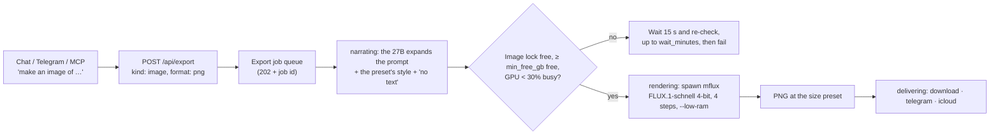

# Image generation (text to image, local)

**Date:** 2026-10-04
**Status:** approved design, not yet planned
**Follows:** `2026-09-22-artifact-export-design.md`, whose "Out of scope" deferred generated images because a second
model on the GPU risked `[metal::malloc] Resource limit exceeded`. This spec answers that risk rather than ignoring it.
**Part of:** a three-piece request (2026-10-04): PowerPoint, PDF and images for customer-facing, internal and LinkedIn
communication, text to image included. Piece 1 (this spec) is the image service. Piece 2 (free-form decks and PDFs for
any topic and audience) and piece 3 (LinkedIn posts, images and carousel PDFs) get their own specs and build on this one.

## Why

The export pipeline renders account briefs, incumbency matrices and vendor comparisons as xlsx, pdf or pptx, but every
visual in them is text, a table or a chart. Customer decks, internal communication and LinkedIn posts need pictures:
hero slides, backgrounds, post images. The user's requirement is that images are generated from text, locally, like
every other model call in the project (memory: everything local except fetching and delivery).

## Decisions

| Decision | Choice | Rationale |
|---|---|---|
| Where the model runs | **Local**, on this Mac now, unchanged on the Mac Studio (~mid-Nov 2026) | User's choice; prompts can carry account context |
| How it runs | **One process per image** (spawn, draw, exit), queued one at a time | Nothing stays resident to leak or wedge the GPU; memory is freed after every image. A resident server is the better shape once the Studio has room, and is a contained change then |
| Model | **FLUX.1-schnell**, 4-bit, 4 steps, via `mflux` (MLX) | Apache-2.0, so commercial use (customer decks, LinkedIn) is allowed. FLUX.1-dev is non-commercial and is therefore excluded |
| Text in images | **Never.** Every expanded prompt adds "no text, no letters, no logos" | Diffusion models garble words and numbers; titles, figures and charts are rendered by the document renderers (pieces 2 and 3) |
| Integration | A new export **kind** `image`, **format** `png` | Reuses the job store, async polling, delivery (download, telegram, icloud) and 30-day retention |
| Style | Per prompt: named presets or none | User's answer: "all of it, depends on the prompt" |
| Audience | **Optional for images**, still required for every other kind | An image carries no account text, so asking "internal or external?" for every picture is friction without protection |
| Variants | One image per job; alternatives come from another request or another seed | YAGNI until batch picking is actually needed |

## Flow

The existing stages are reused: `narrating` is the prompt expansion, `rendering` is the drawing. An image job does not
build an `Artifact`: the pipeline dispatches `kind: "image"` to its own runner, which shares the job store, the stage
updates, delivery and retention with the document runner.

## Request

`POST /api/export` accepts, for `kind: "image"`, the fields below; the MCP tool `create_image` sends the same fields
(it fills in `kind` and `format`). A separate tool rather than a widened `create_artifact` keeps `create_artifact`'s
required `audience` required and gives the model one clear schema per job. The scheduled-runs MCP server
(`pharmaitchat_cron`) excludes `create_image`: no cron job draws.

| Field | Rule |
|---|---|
| `kind` / `format` | `image` / `png`. `png` is accepted only with `image`, and `image` only with `png` |
| `prompt` | Required, 1 to 1,000 characters |
| `preset` | Optional, default `none`; a name not in `config/image-presets.yaml` is a 400 |
| `size` | Optional, default `square`; a name not in the size table is a 400 |
| `raw` | Optional, default `false`; `true` skips the prompt expansion and sends the prompt as written (the "no text" clause and the preset style are still added) |
| `seed` | Optional integer. When omitted, a random seed is chosen. It is stored on the job and reported by `GET /api/export/:id`, so an image can be re-drawn or varied |
| `destination` | As for documents: `download` (default), `telegram`, `icloud` |
| `audience` | Optional for images. When omitted, the job row stores `internal` (the column is NOT NULL); image filenames do not include the audience |

When the model is not installed (`data/models/flux-schnell-<quantize>bit`, by default `flux-schnell-4bit`, missing), the request is refused at once with a 503
saying to run `scripts/setup-image-model.sh`, instead of queuing a job that is bound to fail.

Hermes recognises image wording ("make / draw / generate an image / a picture / a visual of …") through the
`create_image` tool description and maps style words to presets ("a photo of", "in our house style", "abstract
background"); `destination: telegram` sends the PNG to the chat. The **web chat** does not get image wording in this
piece: its renderer draws no images or links and the download route is behind the API token. It gets images with
piece 2, which needs a document UI anyway.

### Style presets

`config/image-presets.yaml` (committed, editable): each preset is a style phrase appended to the prompt.

| Preset | Look | Typical use |
|---|---|---|
| `none` | Only the prompt | Anything free-form |
| `house` | Clean modern corporate illustration, a fixed palette, generous empty space | A recognisable series of decks and posts |
| `photo` | Photorealistic editorial photo, natural light, shallow depth of field | Hero slides, LinkedIn: labs, plants, data centres, people at work |
| `abstract` | Abstract technology background (flowing data, light, geometry), low contrast | Slide backgrounds behind text |
| `brand` | The user's corporate palette and mood, described in words (filled in by the user) | Customer-facing material in the employer's look |

### Sizes

FLUX needs dimensions that are multiples of 16; each preset is the closest multiple of 16 to the platform's spec. No
cropping, so no image-processing dependency.

| Size | Pixels | For |
|---|---|---|
| `square` | 1088 × 1088 | LinkedIn feed post (spec 1080 × 1080) |
| `portrait` | 1088 × 1360 | LinkedIn 4:5 (spec 1080 × 1350) |
| `linkedin` | 1200 × 624 | LinkedIn landscape / link image (spec 1200 × 627) |
| `slide` | 1280 × 720 | 16:9 PowerPoint full-bleed or hero image |

## Components

| Unit | Does | Depends on |
|---|---|---|
| `src/services/image-presets.ts` | Parses and validates `config/image-presets.yaml`; the size table | `yaml` |
| `src/services/image-prompt.ts` | Builds the final prompt: 27B expansion (unless `raw`), preset style, "no text, no letters, no logos", length cap | an injected `complete` |
| `src/services/image-generator.ts` | Lock, memory and GPU gate, spawn, timeout, output check, log line | injected spawn, memory reader, GPU reader, lock, clock |
| `export-jobs.ts` | Image fields on the job (migration) | — |
| `export-pipeline.ts` | Dispatches `image` to the image runner | the three units above, delivery |
| `api/export.ts`, `mcp/src/tools/export.ts` | Request validation and documentation for the new kind | — |
| `scripts/setup-image-model.sh` | Creates `.venv-image` (Python 3.12 via `uv`), installs `mflux`, checks that `mflux-generate` supports every flag the generator passes, downloads FLUX.1-schnell once and saves a quantized copy to `data/models/flux-schnell-<quantize>bit` | `uv`, network once |
| `src/services/image-system.ts` | Free memory (`vm_stat`), the lock file, the process-group runner, PNG header and `/usr/bin/time` parsing | `node:*` |
| `src/services/export-image.ts` | The image runner: narrating → rendering → delivering on the shared job store | the units above |

`.venv-image` is separate from open-jev's environment so the two cannot break each other's dependencies.

## Memory safety and failure

The risk is the one this Mac has shown: the GPU runs out of memory under a burst, the 27B's generation thread dies and
requests hang until the watchdog restarts it. Images must never cause that.

- **One image at a time.** `data/run/image.lock` (pid inside; a lock whose pid is dead is taken over) is shared by the
  app and the scripts.
- **Gate before every start.** Free memory (`vm_stat`: free + inactive + purgeable pages) must be at least
  `resources.image.min_free_gb`, and GPU utilisation (`ioreg` "Device Utilization %", the reading the watchdog uses)
  under 30%. Otherwise the job re-checks every 15 s and fails after `wait_minutes` with the numbers:
  `not enough memory: 6.8 GB free, need 10` or `GPU busy for 10 min`.
- **Limits in `config/host.yaml` `resources.image`**, read through `src/platform/host-config.ts` like every other
  machine-sized limit:

  | Key | Default | Meaning |
  |---|---|---|
  | `min_free_gb` | 10 | Free memory required to start (tuned from the first measured peak) |
  | `wait_minutes` | 10 | How long a job waits for the gate |
  | `timeout_seconds` | 300 | Kill the process group after this |
  | `steps` | 4 | FLUX.1-schnell is distilled for 4 |
  | `quantize` | 4 | Bits of the saved model; changing it means re-running setup into `flux-schnell-<bits>bit` |

- **Hard stops.** `mflux` runs with `--low-ram`, in its own process group, killed at the timeout. A non-zero exit fails
  the job with stderr's last line. The output must be a PNG (signature) whose header width and height match the size
  preset, or the job fails with `bad image output`.
- **The lock is released on every path**: success, failure, timeout, exception.
- **Measured from the first image.** Each run is spawned under `/usr/bin/time -l` and appends one line to
  `data/logs/image-<date>.log`: job id, preset, size, seed, duration, peak memory, outcome. The prompt itself is logged
  too (the log stays on the machine).
- **The 27B keeps serving** while an image draws; answers are slower. The MLX watchdog already treats a probe timeout
  with the GPU at 30% or more as busy, not wedged, so it does not restart MLX mid-image.

## Data

`export_jobs` gains nullable `prompt`, `preset`, `size`, `raw` and `seed` columns, added by a guarded `ALTER TABLE`
behind `PRAGMA user_version` (the pattern `watchlist-store.ts` uses). Existing rows and the three document kinds are
unaffected; document jobs leave the new columns null.

## Testing

No test spawns `mflux`, downloads a model, reads live memory or GPU state, or touches the live job database.

| Area | Tests |
|---|---|
| Presets and sizes | YAML parses; unknown names refused; every size a multiple of 16; the committed `config/image-presets.yaml` parses |
| Request validation | `image` needs `prompt` (≤ 1,000 chars) and does not require an audience (an omitted one is stored as `internal`); `png` only with `image`; documents still require an audience; a missing model is a 503 |
| Prompt | Fake 27B: preset style and "no text, no letters, no logos" always present; `raw` makes no model call; over-long expansion trimmed |
| Generator | Fakes for spawn, memory, GPU, lock, clock: waits then runs; gives up after `wait_minutes` with the numbers; kills the process group at the timeout; non-zero exit reports stderr; rejects non-PNG and wrong-size output (PNG header); releases the lock on every path; exact `mflux` arguments (model path, steps, quantize, width, height, seed, `--low-ram`, output path); the log line with peak memory |
| Pipeline | Fakes: narrating → rendering → delivering → done; seed stored and reported; download, telegram and icloud delivery of a PNG; image filenames without audience |
| Migration | An existing jobs database gains the columns; old rows still read |
| Setup script | Stub `python3` / `pip` / `hf` on PATH: creates the venv, idempotent, "already set up" path; no download |

### First real image (manual, after merge, with the user's go-ahead)

1. `scripts/setup-image-model.sh`: installs `mflux`, downloads FLUX.1-schnell once (~24 GB), saves the 4-bit copy
   (~6 GB) under `data/models/`.
2. Four images, one per preset (`house`, `photo`, `abstract`, `none`) and one per size, with chat idle; durations and
   peak memory recorded in the README.
3. One image requested while a long chat answer runs: the job waits at the gate, then draws.
4. `min_free_gb` set from the measured peak.

## Risks accepted

- **Image quality.** FLUX.1-schnell at 4-bit and 4 steps is fast but below FLUX.1-dev or cloud models. Accepted for the
  licence and the local rule; the Studio can run larger models later.
- **Waiting.** While the 27B is busy (nightly ingest 02:30–03:45, a digest at 07:30, a long chat answer) an image can
  wait up to `wait_minutes` and then fail. Accepted: a failed image is cheap to re-request; a wedged 27B is not.
- **One-time download** of ~24 GB from Hugging Face. Fetching is allowed under the local rule; inference is not.

## Out of scope

- Free-form decks and PDFs on any topic and audience (piece 2) and LinkedIn posts and carousels (piece 3): separate
  specs that consume this service.
- Image editing, in-painting, upscaling, logos and text rendering inside images.
- Posting to LinkedIn: the output is a file for the user to post.
- A resident image server: revisit on the Studio.
